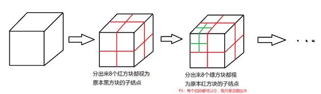
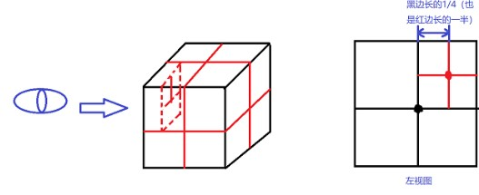
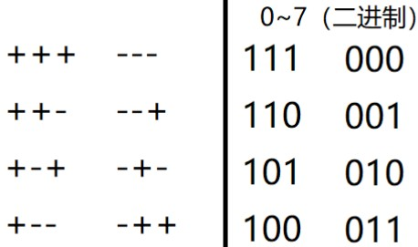
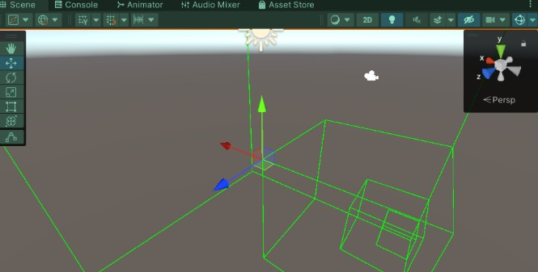
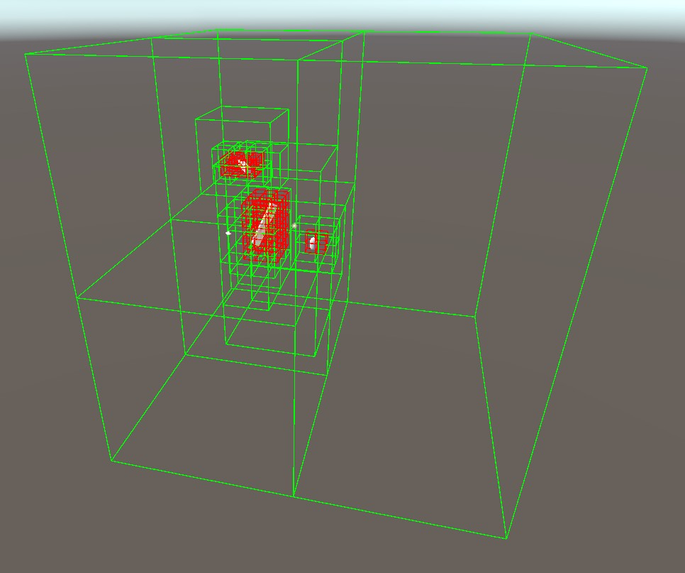
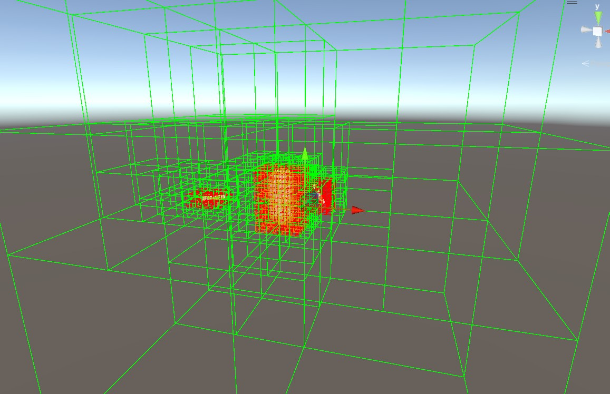
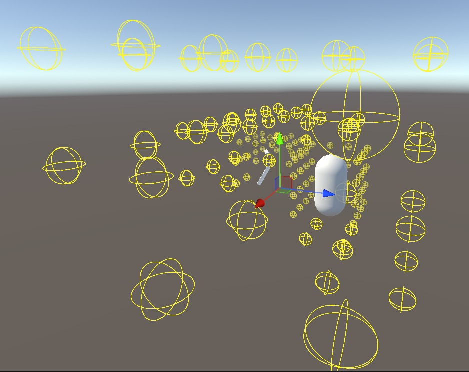
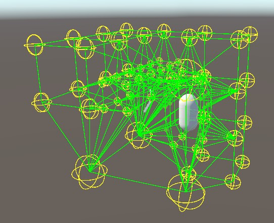
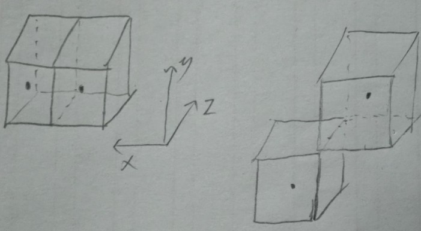
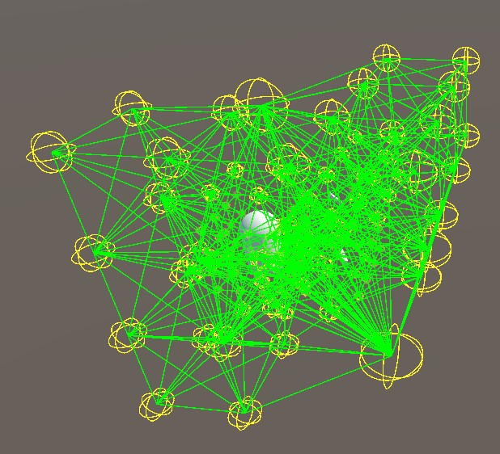

转载：https://www.cnblogs.com/OwlCat/p/18226894

如果我们只是在一个平面进行寻路，我们可以直接用A*寻路，铺好一个地面网格，就可以在网格点上设置目标点来寻路了。假设我们要在一个500x500大小的网格寻路，就算一个单位设置一个网格点，勉强是可以接受的。

现在我们算上“领空”，就算取100得到的数值500x500x100也是挺大的……有办法**减少结点**又**保证网格连接合理**吗？

这就可以通过八叉树来实现！

### 寻路中八叉树的作用

利用八叉树的寻路，并不是说要用八叉树做一个像A*那样的寻路算法，而是利用它来生成寻路区域。可以认为它是另一种**寻路网格**，八叉树最终会生成更少的结点，最后在八叉树生成的网格里可以依然使用原本的寻路算法。

PS：八叉树还有其它的正经工作，比如碰撞检测。

### 生成寻路网格

如何用八叉树来生成寻路结点？先说八叉树本身，其实并不复杂，它就是这么一个结构：



给它设置一个最小尺寸来限制，只有当前方块尺寸比最小尺寸大时才分裂，至此，我们可以初步构建八叉树结点：

```c#
public class OctreeNode
{
    private const float MIN_CUBE_SIZE = 1f; // 最小方格尺寸
    public OctreeNode Parent{ get; set; } //父结点 
    public OctreeNode[] Children; //子结点
    public Bounds NodeCube; //用包围盒作为结点方块，方便后续检测

    public OctreeNode(Bounds nodeCube, OctreeNode parent)
    {
        Parent = parent;
        NodeCube = nodeCube;
    }
    public void Divide()
    {
        //因为是正方体，所以用一条边来判断尺寸即可
        if(NodeCube.size.x >= MIN_CUBE_SIZE) 
        {
            // 子方块的半尺寸， 用半尺寸是因为构建Bounds需要
            float childHalfSize = NodeCube.size.x / 4;
            if (Children == null)
                Children = new OctreeNode[8];
            Vector3 offset; //子结点偏移
            for(int i = 0; i < 8; ++i)
            {
                //待补充
                var childBounds = new Bounds();
                //

                if(Children[i] == null)
                    Children[i] = new OctreeNode(childBounds, this);
                Children[i].Divide(); // 每个子结点继续分裂
            }
        }
    }
}
```

#### 子结点的方块布置



每个子方块的中心对于原本方块中心的各轴的偏移量都是原本边长的 $\frac{1}{4}$，无非是$+\frac{1}{4}$ 、 $-\frac{1}{4}$的差别。但好在，我们不关心子结点的顺序（也就是说在子节点中这八个方块谁先谁后都无所谓），可以通过**对0~7的数取3位二进制**来得到



假如二进制第一位代表x偏移正负，就用1的二进制与i进行与运算1 & i（i=0$\cdots$7）,取得i的二进制数的第一位的值，为1代表 偏移为正，反之0表示符

```
offset.x = (1 & i) != 0 ? childHalfSize : -childHalfSize; 
```

PS：也可以用数组记录这8个情况再遍历赋值（需要浪费一个数组）

完善的Divide方法如下：

```c#
public void Divide()//将父cube平均分割成8份
{
    //因为是正方体，所以用一条边来判断尺寸即可
    if(NodeCube.size.x >= MIN_CUBE_SIZE) 
    {
        // 子方块的半尺寸， 用半尺寸是因为构建Bounds需要
        float childHalfSize = NodeCube.size.x / 4;
        if (Children == null)
            Children = new OctreeNode[8];
        Vector3 offset; //子节点偏移
        for(int i = 0; i < 8; ++i)
        {
            //0~7的二进制位结构恰好满足我们所需要的组合形式
            offset.x = (1 & i) != 0 ? childHalfSize : -childHalfSize; //取二进制第0位
            offset.y = (2 & i) != 0 ? childHalfSize : -childHalfSize; //取二进制第1位
            offset.z = (4 & i) != 0 ? childHalfSize : -childHalfSize; //取二进制第2位
            var childBounds = new Bounds(NodeCube.center + offset, 2 * childHalfSize * Vector3.one);
            
            if(Children[i] == null)
                Children[i] = new OctreeNode(childBounds, this);
            Children[i].Divide(); // 每个子节点继续分裂
        }
    }
}
```

添加绘制函数，在OnDrawGizmos中调用

```c#
//isSeeOne为true，则只查看分裂后的一个，否则查看所有分裂后的方块
public void Draw(bool isSeeOne)
{
    Gizmos.color = Color.green;
    Gizmos.DrawWireCube(NodeCube.center, NodeCube.size);
    if (Children == null)
        return;
    foreach(var c in Children)
    {
        c.Draw(isSeeOne);
        if(isSeeOne)
        {
            break;
        }
    }
}
```

创建一个继承了MonoBehaviour的类OctreeBuilder，并将它挂在一个边长为8的Cube上：

```c#
using System.Collections;
using System.Collections.Generic;
using UnityEngine;

public class OctreeBuilder : MonoBehaviour
{
    public bool isSeeOne = true; //只看分裂后的一个
    private OctreeNode node;
    private void Awake()
    {
        //用Cube本身的包围盒做为起始尺寸进行划分
        node = new OcTreeNode(new Bounds(transform.position,Vector3.one*_size), node);
        node.Divide();
    }

    private void OnDrawGizmos()
    {
        if (Application.isPlaying)
        {
            node.Draw(isSeeOne);
        }
    }
}
```

我们设置的最小尺寸为1，从8减半到1，一共要3次



PS：我们也可以实现自适应包围盒大小，通过Bounds的Encapsulate，可以让包围盒自行扩大以容纳下场景中的所有物体。

```c#
 foreach(var o in allObjects)
{
    baseCube.Encapsulate(o.GetComponent<Collider>().bounds);
}
```

---

3. 剔除不必要节点

   方块分裂目的，其实就是：**检测出哪里有障碍物**，一个大方块不断分裂变小，就是**更进一步定位内部障碍物位置**的过程，如果它一开始就没碰到什么障碍物，那也没必要分裂。这就是八叉树节省性能的关键。

   这里需要优化下Divide函数，检测出没有障碍物的节点，就没必要继续分裂了

   ```
   public void Divide(Collider collider)//将父cube平均分割成8份
       {
           //因为是正方体，所以用一条边来判断尺寸即可
           if(NodeCube.size.x/2 >= MIN_CUBE_SIZE) 
           {
               // 子方块的半尺寸， 用半尺寸是因为构建Bounds需要
               float childHalfSize = NodeCube.size.x / 4;
               Vector3 offset; //子结点偏移
               if (Children == null)
               {
                   Children = new OcTreeNode[8];
               }
               
               for(int i = 0; i < 8; ++i)//创建分裂
               {
                   //0~7的二进制位结构恰好满足我们所需要的组合形式
                   offset.x = (1 & i) != 0 ? childHalfSize : -childHalfSize; //取二进制第0位
                   offset.y = (2 & i) != 0 ? childHalfSize : -childHalfSize; //取二进制第1位
                   offset.z = (4 & i) != 0 ? childHalfSize : -childHalfSize; //取二进制第2位
                   var childBounds = new Bounds(NodeCube.center + offset, 2 * childHalfSize * Vector3.one);
                   //
   
                   if(Children[i] == null&&childBounds.Intersects(collider.bounds))//检测到物体与子节点相交，才创建次子节点
                       Children[i] = new OcTreeNode(childBounds, this);
               }
               
               for(int i = 0; i < 8; ++i)
               {
                   if (Children[i] != null&&Children[i].NodeCube.Intersects(collider.bounds))//检测到物体与子节点相交，继续分裂
                   {
                       Children[i].Divide(collider);
                   }
               }
           }
       }
   ```

   遍历所有障碍物来处理分裂

   ```
   private void Awake()
       {
           //用Cube本身的包围盒做为起始尺寸进行划分
           node = new OcTreeNode(new Bounds(transform.position,Vector3.one*_size), node);
           Collider[] allObjects= FindObjectsOfType<Collider>();
           foreach (var obj in allObjects)
           {
               node.Divide(obj);  
           }
   
       }
   ```

   如果分裂到最小方块，那就是障碍物存在的位置，将其绘制成红色

   ```
   public void Draw(bool isSeeOne)
       {
           if (IsMinSize())
           {
               Gizmos.color = Color.red;
           }
           else
           {
               Gizmos.color = Color.green;   
           }
   
           Gizmos.DrawWireCube(NodeCube.center, NodeCube.size);
           if (Children == null)
               return;
           foreach(var c in Children)
           {
               if(c==null) continue;
               c.Draw(isSeeOne);
               if(isSeeOne)
               {
                   break;
               }
           }
       }
   
       public bool IsMinSize()//确定是最小节点
       {
           if (NodeCube.size.x / 2 <= MIN_CUBE_SIZE)
           {
               return true;
           }
           return false;
           
       }
   ```

效果如下：



这里还存在一个问题，右边因为没有障碍，就没有分裂，等于说最大的这个节点分裂的八叉树有一半是空的，这样看似节约了资源，但是因为我们需要将子节点最后添加到图，因此不能存在空的子节点（但是可以考虑将四个空的子节点合并成一个，这就是更进阶的考虑了）

这里优化下代码，只需要注释创捷节点的判定，保证子节点均不为空

```
public void Divide(Collider collider)//将父cube平均分割成8份
    {
        //因为是正方体，所以用一条边来判断尺寸即可
        if(NodeCube.size.x/2 >= MIN_CUBE_SIZE) 
        {
            // 子方块的半尺寸， 用半尺寸是因为构建Bounds需要
            float childHalfSize = NodeCube.size.x / 4;
            Vector3 offset; //子结点偏移
            if (Children == null)
            {
                Children = new OcTreeNode[8];
            }
            
            for(int i = 0; i < 8; ++i)//创建分裂
            {
                //0~7的二进制位结构恰好满足我们所需要的组合形式
                offset.x = (1 & i) != 0 ? childHalfSize : -childHalfSize; //取二进制第0位
                offset.y = (2 & i) != 0 ? childHalfSize : -childHalfSize; //取二进制第1位
                offset.z = (4 & i) != 0 ? childHalfSize : -childHalfSize; //取二进制第2位
                var childBounds = new Bounds(NodeCube.center + offset, 2 * childHalfSize * Vector3.one);

                //if(Children[i] == null&&childBounds.Intersects(collider.bounds))//检测到物体与子节点相交，才创建次子节点
                if (Children[i] == null)//子节点涵盖了之前对其他障碍体的检测信息，注意这个判定一定要有，别被覆盖了！！！！
                {
                    Children[i] = new OcTreeNode(childBounds, this);   
                }
            }
            
            for(int i = 0; i < 8; ++i)
            {
                if (Children[i] != null&&Children[i].NodeCube.Intersects(collider.bounds))//检测到物体与子节点相交，继续分裂
                {
                    Children[i].Divide(collider);
                }
            }
        }
    }
```

最后的效果，这样右侧分裂的子节点区域就算是四个节点了



---

如果一个节点存在分裂，那么必定有8个子节点且8子节点一起能完全覆盖其父节点的面积，因此我们只需要找到所有叶子节点，就可以按照尽可能细的划分表示整个八叉树cube涵盖区域，如果存在最小分裂，我们就可以认为这块是障碍物位置（比较粗放的判定，还需要优化）

```
public OcTreeNode[] GetAllUsableLeafs() //找到所有可用叶子节点(不能是障碍物相交节点，这里排除所有最小节点)
    {
        List<OcTreeNode> nodes = new List<OcTreeNode>();
        if (Children == null)
        {
            if(!IsMinSize())
                nodes.Add(this);
        }
        else
        {
            foreach (var child in Children)
            {
                nodes.AddRange(child.GetAllUsableLeafs()); 
            }
        }
        return nodes.ToArray();
    }
```

在OnDrawGizmos()将他们绘制出来

```
foreach (var leaf in _leafs)
            {
                Gizmos.color = Color.yellow;
                Gizmos.DrawWireSphere(leaf.NodeCube.center, leaf.NodeCube.size.y/6);   
            }
```

效果如下



这就是排除掉障碍位置剩下的所有节点

---

现在要将相邻节点连接起来，首先把图的数据结构实现

```
using System.Collections.Generic;
public class MyGraph<TNode, TEdge>
 {
     public readonly HashSet<TNode> NodeSet;//结点列表
     public readonly Dictionary<TNode, List<TNode>> NeighborList;//邻居列表
     public readonly Dictionary<(TNode, TNode), List<TEdge>> EdgeList;//边列表

     public MyGraph()
     {
         NodeSet = new HashSet<TNode>();
         NeighborList = new Dictionary<TNode, List<TNode>>();
         EdgeList = new Dictionary<(TNode, TNode), List<TEdge>>();
     }

     /// <summary>
     /// 寻找指定结点
     /// </summary>
     /// <returns>找到的结点，没找到时返回null</returns>
     public TNode FindNode(TNode node)
     {
         NodeSet.TryGetValue(node, out TNode res);
         return res;
     }

     /// <summary>
     /// 寻找指点起、终点之间直接连接的所有边
     /// </summary>
     /// <param name="source">起点</param>
     /// <param name="target">终点</param>
     /// <returns>找到的边，没找到时返回null</returns>
     public List<TEdge> FindEdge(TNode source, TNode target)
     {
         var s = FindNode(source);
         var t = FindNode(target);
         if (s != null && t != null)
         {
             var nodePairs = (s, t);
             if (EdgeList.ContainsKey(nodePairs))
             {
                 return EdgeList[nodePairs];
             }
         }
         return null;
     }

     /// <summary>
     /// 添加结点，用HashSet，包含重复检测
     /// </summary>
     public bool AddNode(TNode node)
     {
         return NodeSet.Add(node);
     }

     /// <summary>
     /// 添加指定边，含空结点判断、重复添加判断
     /// </summary>
     /// <param name="source">边起点</param>
     /// <param name="target">边终点</param>
     /// <param name="edge">指定边</param>
     /// <returns>添加成功与否</returns>
     public bool AddEdge(TNode source, TNode target, TEdge edge)
     {
         var s = FindNode(source);
         var t = FindNode(target);
         if (s == null || t == null)
             return false;
         var nodePairs = (s, t);
         if(!EdgeList.ContainsKey(nodePairs))
         {
             EdgeList.Add(nodePairs, new List<TEdge>());
         }
         var allEdges = EdgeList[nodePairs];
         if(!allEdges.Contains(edge))
         {
             allEdges.Add(edge);
             if(!NeighborList.ContainsKey(source))
             {
                 NeighborList.Add(source, new List<TNode>());
             }
             NeighborList[source].Add(target);
             return true;
         }
         return false;
     }

     /// <summary>
     /// 移除指定结点
     /// </summary>
     /// <returns>移除成功与否</returns>
     public bool RemoveNode(TNode node)
     {
         return NodeSet.Remove(node);
     }

     /// <summary>
     /// 移除指定起、终点的指定边
     /// </summary>
     /// <param name="source">边起点</param>
     /// <param name="target">边终点</param>
     /// <param name="edge">指定边</param>
     /// <returns>移除成功与否</returns>
     public bool RemoveEdge(TNode source, TNode target, TEdge edge)
     {
         var allEdges = FindEdge(source, target);
         return allEdges != null && allEdges.Remove(edge);
     }

     /// <summary>
     /// 移除指定起、终点的所有边
     /// </summary>
     /// <param name="source">边起点</param>
     /// <param name="target">边终点</param>
     /// <returns>移除成功与否</returns>
     public bool RemoveEdgeList(TNode source, TNode target)
     {
         return EdgeList.Remove((source, target));
     }

     /// <summary>
     /// 获取指定结点可抵达的所有邻居结点
     /// </summary>
     public List<TNode> GetNeighbor(TNode node)
     {
         return NeighborList[node];
     }

     /// <summary>
     /// 获取指定结点所延伸出的所有边
     /// </summary>
     public List<TEdge> GetConnectedEdge(TNode node)
     {
         var resEdge = new List<TEdge>();
         var neighbor = GetNeighbor(node);
         for(int i = 0; i < neighbor.Count; ++i)
         {
             var curEdgeList = EdgeList[(node, neighbor[i])];
             for(int j = 0; j < curEdgeList.Count; ++j)
             {
                 resEdge.Add(curEdgeList[j]);
             }
         }
         return resEdge;
     }
 }
```

然后我们遍历所有之前的所有可用叶子节点，找出他们相邻的节点并添加到图连上边，主要是通过检测bound的相交来实现

```
public OcTreeNode[] FindNeighborNodes(OcTreeNode[] otherNodes)
    {
        List<OcTreeNode> neighbors = new List<OcTreeNode>();
        float xOff,yOff,zOff;
        foreach (var node in otherNodes)
        {
            if (node!=this&&node.NodeCube.Intersects((this.NodeCube)))
            {
                xOff = Mathf.Abs(this.NodeCube.center.x - node.NodeCube.center.x);
                yOff = Mathf.Abs(this.NodeCube.center.y - node.NodeCube.center.y);
                zOff = Mathf.Abs(this.NodeCube.center.z - node.NodeCube.center.z);
                if( xOff>=this.NodeCube.size.x/2&& yOff>=this.NodeCube.size.x/2) continue;//排除所有对角线重合节点的边（两个cube在两个轴上的位置差超过了自身大小一半！说明没相接在一个面，自行想象下）
                if( xOff>=this.NodeCube.size.x/2&& zOff>=this.NodeCube.size.x/2) continue;
                if( yOff>=this.NodeCube.size.x/2&& zOff>=this.NodeCube.size.x/2) continue;
                
                neighbors.Add(node);
            }
        }
        
        return neighbors.ToArray();
    }
```

主函数为每个可用叶子节点找到相邻叶子节点，生成图的节点与边

```
OcTreeGraph=new MyGraph<OcTreeNode, GraphEdge>();
OcTreeNode[] neighbors; 
foreach (var node in _leafs)
{
    neighbors=node.FindNeighborNodes(_leafs);
    foreach (var neighbor in neighbors)
    {
        OcTreeGraph.AddNode(node);
        OcTreeGraph.AddNode(neighbor);
        OcTreeGraph.AddEdge(node,neighbor,new GraphEdge(node.NodeCube.center,neighbor.NodeCube.center));
    }
}
```

最后在OnDrawGizmos将所有边绘制出来

```
Gizmos.color = Color.green;
            foreach (var edgs in OcTreeGraph.EdgeList.Values)
            {
                foreach (var edg in edgs)
                {
                    Gizmos.DrawLine(edg._pos1,edg._pos2);
                }
            }
```

效果如下



注意找相邻点的这段判定

```
xOff = Mathf.Abs(this.NodeCube.center.x - node.NodeCube.center.x);
                yOff = Mathf.Abs(this.NodeCube.center.y - node.NodeCube.center.y);
                zOff = Mathf.Abs(this.NodeCube.center.z - node.NodeCube.center.z);
                if( xOff>=this.NodeCube.size.x/2&& yOff>=this.NodeCube.size.x/2) continue;//排除所有对角线重合节点的边（两个cube在两个轴上的位置差超过了自身大小一半！说明没相接在一个面，自行想象下）
                if( xOff>=this.NodeCube.size.x/2&& zOff>=this.NodeCube.size.x/2) continue;
                if( yOff>=this.NodeCube.size.x/2&& zOff>=this.NodeCube.size.x/2) continue;
```

是用来排除对角线相交的顶点，这样边会更少一些，虽然路径会变少，但更节省算力

可以想像以下



如果两个大小一样相邻的cube，他们的坐标差只有其中一个轴会大于边长的一半，因此便可以将两个轴以上偏差过大的相邻排除在外即可

如果没有这个判定，就会包含对角线的连线



---

接下来就是根据图进行A*寻路
