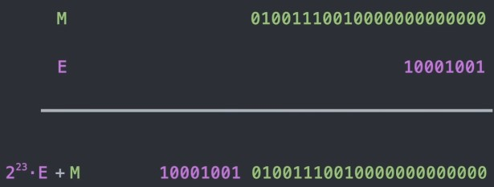

当我们在游戏引擎中实现物理光照或反射效果时,经常需要归一化的向量(单位向量)参与计算.
$$
即,用向量\   \vec a \ast \frac{1}{\sqrt{x^2+y^2+z^2}} (向量本身除以模长)\\
$$
但是,平方根运算是出了名的慢,除法也快不了多少.如果有数千个表面向量需要归一化,就会浪费大量算力

现在我们来看看雷神之锤3的开源代码带来的快速平方根算法:

```
float Q_rsqrt(float number )
{
	long i;//定义32位整形
	float x2, y;//定义32位浮点
	const float threehalfs = 1.5F;//3的一半,很直观的变量名

	x2 = number * 0.5F;
	y = number;
	i =* ( long * ) &y;		//evil floating point bit hack
	i =0x5f3759df-(i>>1);   //what the fuck?
    y =* ( float * ) &i; 
    y = y * ( threehalfs - (x2*y * y ) );		//1st iteration
    // y =y* ( threehalfs - (x2*y * y ) ) ;		//2nd iteration, can be removed

    return y;
}

```

---

这里我们要回顾下计算机数字表示原理.

代码第一行定义了32位整形的long,这意味着我们有32位二进制用于表示数字(应该都知道怎么表示一个数);

而第二行定义的是两个32位小数,如果让一个普通人来设计用32位表示十进制小数,那他可能会这样做:

首先在中间位设置小数点,低16为表示小数,高16为表示整数,如下面的示例,高16位100表示十进制4,低16为.100表示二分之一:
$$
00000000\ 00000100.10000000\ 00000000=4.5\\
$$
注意理解小数表示,我们知道十进制0.1可以表示$\frac{1}{10}$(因为一位小数可以表示0-9,把整数分成了10份),因此这里二进制的0.1就应该表示$\frac{1}{2}$,以此类推0.01表示$\frac{1}{4}$...

但这种设计利用率太低了,大大缩小了可表示数字范围(只能到32000左右)

更高效的方法是 把23'000表示为 $2.3*10^4$,0.0034表示为$3.4*10^{-3}$

同样在二进制下,11'000就可以将其表示为$1.1*2^4$,0.0101表示为$1.01*2^{-3}$

这种表示方式即为科学计数法;

---

这里就要介绍下IEEE754标准(念I Triple E 754) :

 该标准规定 ,通常有32位可用:

第一位是符号位(黄色),0为正,1为负,在计算平方根时,该数一定是正数,因此之后可以忽略此位;

接下来是 8位 定义指数 可以表示 $2^0,2^1,2^2,...2^{255}$,但这里需要负指数,因此实际表示的指数范围是[128到-127],因此该8位实际表示的数字,都需要-127,如"00000000"表示十进制的0,实际值为-127,"10000011"表示十进制131,减去127后实际表示的是4;


最后剩下23位叫尾数,可以表示0到$(2^{23}-1)$,我们希望用其表示为科学计数的第一个因子(下图绿色部分),在科学计数法中,这部分表示为1到10,而在二进制科学计数法中,其范围是1到2,我们可以在尾数第一位后面设置小数点,就能得到符合要求的数,但这里有更效率的方案:根据科学计数法的定义(如:$1.01\times 2^{-3}$)我们可以知道其第一位数字总是非零数,且二进制只有1一个非零数,如果我们知道一个数的第一位总是1,那我们就没必要储存它,所以我们将小数点放在首位数之前,即


如上图,".999"是23位尾数表示的数,在默认加上隐藏的1,这样我们就能得到多一位精度的科学计数.

---

现在我们定义尾数部分为M,指数部分为E,将E左移23位,其位的表示就是:$2^{23}\cdot E+M$



同时,IEEE浮点的规格化值,则表示为:$(1+\frac{M}{2^{23}})*2^{E-127}$

对齐取对数并化简:$\log_2((1+\frac{M}{2^{23}})*2^{E-127})=log_2(1+\frac{M}{2^{23}})+log_2(2^{E-127})=log_2(1+\frac{M}{2^{23}})+E-127$

根据定理:$log_2(1+x)\approx x$(关联等价无穷小+一阶泰勒展开)
