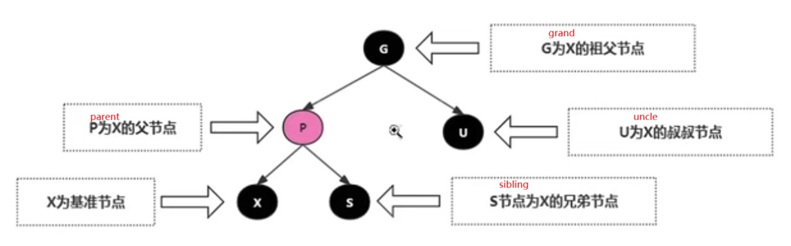
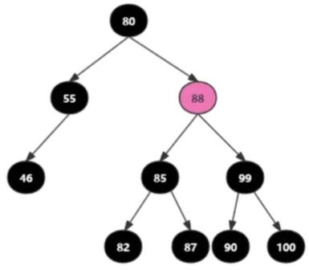
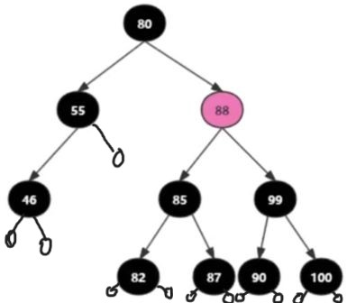
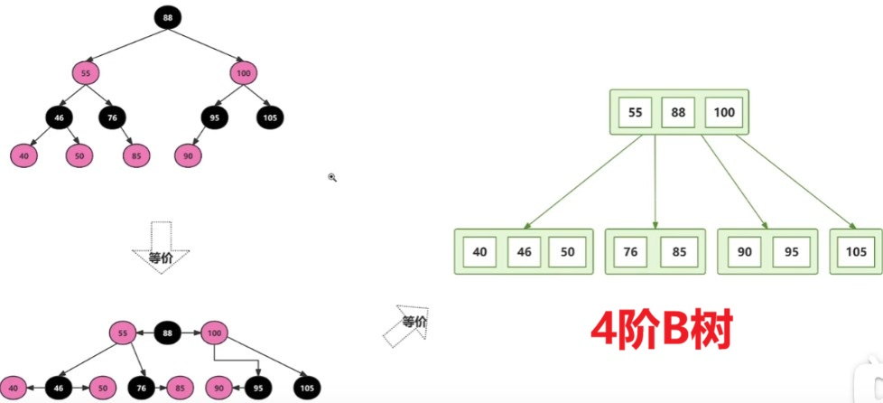
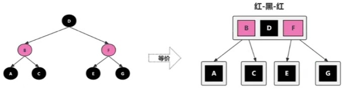
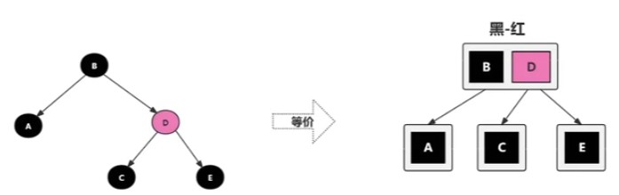
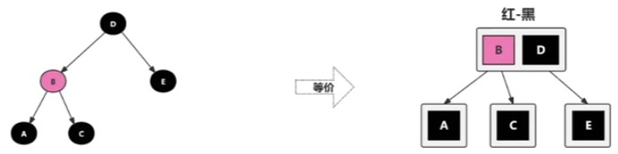
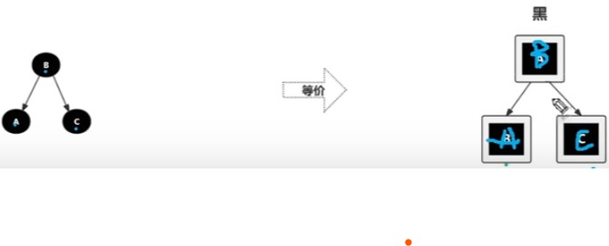
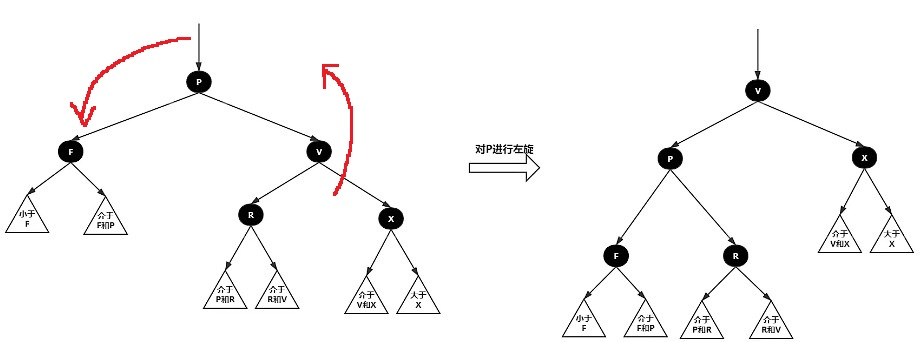
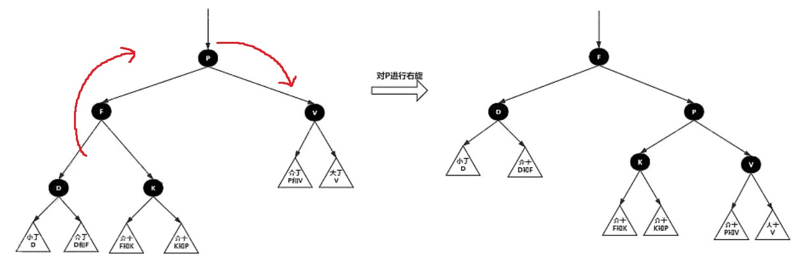

### 核心性质

性质1:每个节点要么是黑色,要么是红色。

性质2:根节点是黑色。

性质3:每个叶子节点(NIL)是黑色。（末端节点添加的虚拟节点，实际是不存在的，用于参与性质5计算）

性质4:不能有两个红色节点相连。(红色节点的两个子节点一定都是黑
色)

性质5:任意一节点到每个叶子节点的路径都包含
数量相同的黑结点。俗称:黑高!

### 红黑树的几个概念

### 基本案例

乍一看，此图是一颗符合要求的红黑树，但是如果给每个末端添加NIL节点，便不符合性质5了

可以看出“55”节点在添加了NIL节点后与其他路线的黑色节点树不同（其余路线都有4个黑色节点），而“55”节点右侧路线只有3个黑色节点；

由此也能看出**NIL节点的作用，就是填充节点的所有分支**，如“55”节点本身只有左侧分支，这时计算黑高就没问题，但为其填充了右侧分支后，就不满足黑高了；

### 红黑树效率

先说结论,红黑树的查找,插入和删除效率都是O(LogN)。

红黑树查找:与普通的二叉树没什么两样,红黑树在搜索上没啥新特性。只不过红黑树是一个自平衡的二叉树,在插入时会做自平衡操作,保证树是一个趋近于平衡的二叉树。
红黑树插入和删除:平均每次会进行一次旋转和变色,效率相对于普通二叉树稍慢一丢丢,但对于现代计算机来说根本没太大性能区别。

记住核心:红黑树在插入有序数据时,并不会导致树结构退化为链表结构,而是会维护一个趋近于平衡的树。

### 红黑树等价变换（重点理解）

我们把树的所有红色节点向上拉到跟父级黑色节点同一高度的话，就能看出其等价于一个4阶B树（也称2-3-4树）

4阶B树规定：一个节点最多有3个元素（一个绿框表示一个节点），如果父级节点有三个元素情况下，那必须有4个子节点，如果父级节点有2个元素，就必须有3个子节点，如果父级节点有1个元素，就必须有2个子节点.f

其中1号子节点（最左）的所有元素小于父节点左侧元素值；

2号子节点所有元素值大于父节点左侧元素，小于父节点中间元素；

3号子节点所有元素值大于父节点中间元素，小于父节点最右侧元素；

4号子节点元素值大于父节点最右侧元素；

其实仔细类比，红黑树规则就是对4阶B树的另一种表述，4阶B树如果失去平衡了，红黑树也就失去平衡了

由此,我们得到如下结论:

* 红黑树与4阶B树具备等价性。
* 黑色节点与它的红色子节点融合在一起,形成1个B树节点。
* 红黑树的黑色节点个数与4阶B树的节点总个数相等。
* 在所有的B树节点中,永远是黑色节点是父节点,红色节点是子节点。黑色节点在中间,红色节点在两边。

利用红黑树与4阶B树等价性质，可以对红黑树转换为4阶B树的情况分类：

父节点有3个元素时，子节点必须为4个

父节点有2个元素时，子节点必须为3个

父节点有1个元素时，子节点必须为2个

**总结**:

四阶B树这种对红黑树折叠的形式，实际上就是对红黑树规则的另一种表现，为什么父黑节点允许让红子节点抬升到同一高度并合并成为一个有两个元素的节点？其根本就是了更加直观的体现了红黑树每个分支黑色节点数量相同这一重要法则，将其与父级黑色节点合并后，四阶B树就等价于所有节点都是黑色节点，这就能更加直观的看出树是否满足黑高，即四阶B树所有分支高度看起来必须相等。（再回头看看上面的例子，是否都是满足这一要求的）

### 红黑树的旋转

红黑树的查找逻辑与普通二叉树没什么两样,主要是它的插入和删除操作会导致树失衡之后需要再进行旋转节点操作，依次达到平衡。

1. 左旋

   是指以父节点P为目标点，逆时针方向向下的旋转，此时V旋转到父级位置，替代P，P作为V的左子，替代R，R成为P的右子

2. 右旋

   是指以父节点P为目标点，顺时针方向向下的旋转，此时F旋转到父级位置，替代P，P作为F的右子，替代K，K成为P的左子

