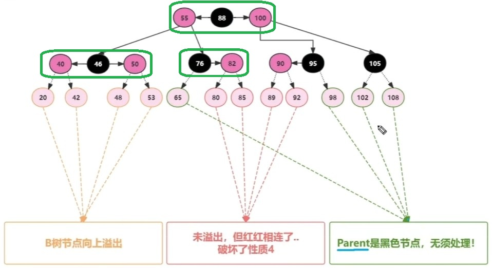
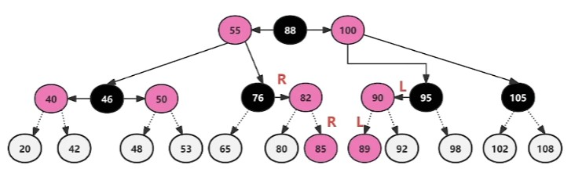
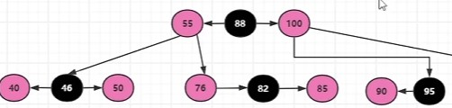
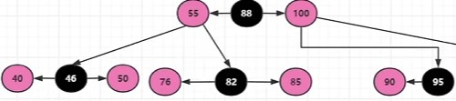
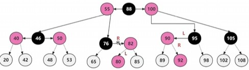
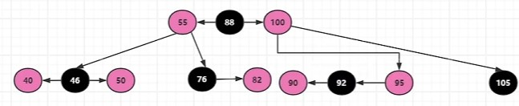
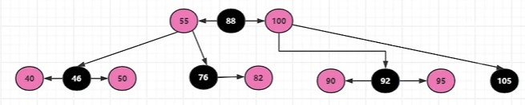

### 插入分析

在分析红黑树的各种插入情况时,我们将红黑树转换为等价B树,这样会更直观!

B树的性质:

* B树中,新元素必须添加到叶子节点。(即最底层节点)

* 4阶B树中的每个节点中包含的元素个数:1≤x≤3。

上图涵盖了红黑树转成B树后的所有情况，即：红黑红，黑红，红黑，黑

对应到插入，就是下图所有这些情况共12种插法，在此之中，一些插入会面临不同的问题

**注意插入的节点都是红色**，这也是红黑树的法则（这样黑色节点下插入不会破坏平衡）

 当我们把树看成4阶B树（即绿框为一个B树节点，最多包含红黑红三个元素），插入结果可分为三种情形：

* 父节点是黑色,红色新加节点加入之后不会破坏任何性质,无须处理。（绿色箭头）

* 新节点加入到了“红-黑-红”的4阶B树叶子节点中,导致溢出异常，因为新加入红色节点无法开辟新的层级节点。（黄色箭头）

* 新节点的加入导致原有“红-黑”或者“黑-红”B树节点出现了“红红双连”异常（并没有溢出B树节点，因为最多可以装三个元素）。（红色箭头）

而在红黑树中，不管是黄色还是红色箭头指出的插入异常，其实都只是表现为红红相连。

---

### 插入情况处理

（1）**LL和RR双红**（未溢出）

LL双红:父节点为祖父节点的左子节点(红色),新插节点(红色)为父节点的左子节点。

RR双红:父节点为祖父节点的右子节点(红色),新插节点(红色)为父节点右子节点。

判定条件:叔叔节点不是红色。(本例中,新插节点都不存在叔叔节点,也就不可能是红色喽)

如何修复红黑树?

(1)观察这棵树,如何才能让这个叶子节点恢复成符合4阶B树的限制呢?

红黑树等价B树节点:叶子节点最多3个元素。且中间节点应该是“黑色”,与上层链接。

(2)很明显,LL或者RR的情况为,父节点的大小适中。应将其当做“黑色”,之后将祖父节点和新插节点当做它的两个子节点,全部染成红色。

修复步骤：(插入85为例)

1. parent(82)染黑,grandParent(76)染红。

   

   

   修**改父节点的颜色为黑色**,因为它的大小适中,应该被当做领导节点。修**改祖父节点颜色为红色**,因为新插之后,父节点应该是领导,在b树节点中，领导节点的左右两边可有两个红色的秘书节点。

2. grandParent做旋转操作。（ RR双红,grandParent做左旋， LL双红,grandParent做右旋）

   

   如图对插入节点的祖父节点（76）进行左旋，完成修复。

修复结果如下：

（2）**LR和RL双红**（未溢出）

RL双红:父节点为祖父节点的右子节点(红色),新插节点(红色)为父节点的左子节点。

LR双红:父节点为祖父节点的左子节点(红色),新插节点(红色)为父节点右子节点。

判定条件:叔叔节点不是红色。(本例中,新插节点都不存在叔叔节点,也就不可能是红色喽)

如何修复？

(1)观察这棵树,如何才能让这个叶子节点恢复成符合4阶B树的限制呢?
红黑树等价B树节点:叶子节点最多3个元素。且中间节点应该是“黑色”,与上层链接。

(2)很明显,新插节点应该为B树节点的核心元素(中间位置,染黑),父节点和祖父节点应为左右子节点(染红)。

总结：因为是LR（或RL）形式，新插入节点大小必然在父节点和祖父节点之间，所以核心就是要将插入节点变黑，作为根节点，其父节点和祖父节点作为其子节点（染红）

修复步骤：（插入92为例）

左旋新插节点的父节点（90），让新插节点（92）来到中间（其实就是让不大不小的那个在中间）

此时变成了LL形式；

将新插节点染黑，其当前父节点（95）染红

最后右旋95，将92上提作为90，95的父节点。

