首先回顾下二叉树删除

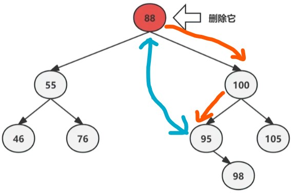

这里我们想删除88，因为这个节点有分支，那我们需要向下查找大于他的最小的那个数，来代替它的位置；

二叉树规定右子节点值比自身大，于是我们往右找第一个子节点，然后一直朝左找到叶子节点，就是大于自身的最小的那个数，然后将要删除节点（88）与之（95）交换，然后删除；

这里还存在右子节点，将其补到删除的位置即可；

小结：上述案例可以看出二叉树删除的一个规律，就是删除一定发生在相对底层位置，找到比删除节点大的最小的那个节点，这样就能很好的替代删除节点，同时也在替代后保证了左分支都比他小，右分支都比它大的规律，且这样一个节点（如95）要么是叶子节点，要么只有比它大的右子节点，这样就能在删除节点替换到该位置将其删除后，只需要将存在的子节点补充到该位置即可。

---

### 红黑树删除

在红黑树中，基础删除原理跟二叉树同理，在找到大于删除节点最小的那个节点，并完成交换（包含颜色修改），之后将交换到底层的要删除的那个节点进行删除处理

但此时删除分为几种情况

**情形1（删除节点为红色）**

特别当需要删除的底层节点是红色的时候，直接删除即可（如下面要删除88，按照二叉树删除方法，首先交换到底层变成红色，90替换原88位置并改成黑色，直接在新的88位置进行删除）。此时红黑树仍维持平衡。

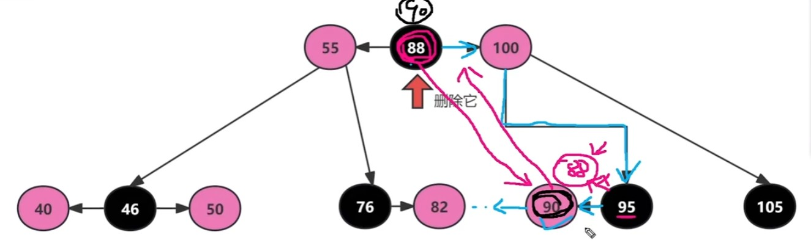

**情形2（删除节点为黑色）**

黑色节点有3种情况

* 被删除的黑色节点,拥有两个红色子节点。

* 被删除的黑色节点,拥有一个红色子节点。

* 被删除的黑色节点为黑色叶子节点,不存在任何子节点。

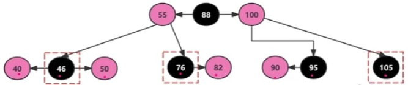

**2.1 删除的黑色节点,拥有一个红色子节点**（如删除 76）

只需要与82交换位置和颜色，然后将其删除即可（删除95同理，只是替代他的是比它小的90）

**2.2被删除的黑色节点,拥有两个红色子节点**（如删除46）

这里先找到大于46的最小节点50，交换位置颜色，然后删除。

**2.3被删除的黑色节点为黑色叶子节点**（无子节点，如删除105）

由于删除105节点,由于没有子节点来补充,会破坏红黑树平衡（等价4阶b树 3元素父节点必须有4个子节点）

​	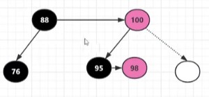

可以很明显看出，我们只需要在叔分支上找出那个不大不小的元素（98），作为父节点染红，之后将比他大的元素做为其右子节点，染黑，比他小的元素做其左子节点即可平衡。

具体操作分为如下几种情况：

​	**2.3.1被删除的是黑色节点，兄弟节点有一个红色右子节点**

​	

​	染红95，染黑98，左旋95（后面跟兄弟节点有一个红色左子节点相同）

​	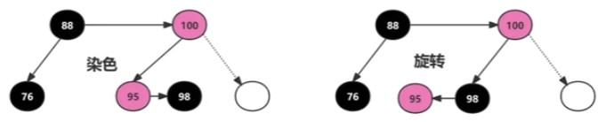

​	之后右旋100节点

​	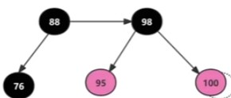

​	最后改色，即可完成

​	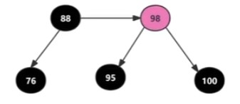

​	**2.3.2被删除的是黑色节点，兄弟节点有一个红色左子节点**

​	

​	100右旋，染黑90，100，染红95即可

​	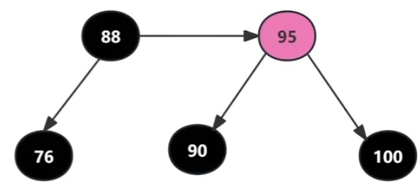

​	**2.3.3被删除的是黑色节点，兄弟节点有两个红色子节点**

​	

​	观察90、95、100这三个节点形成了LL链路,95、100、98这三个节点形成了LR链路（对应之前两种情形）,此时选择哪个链路进行修复都可以,但LR链路需要先让95左旋形成LL链路后,再右旋100比较麻烦。所以咱们既然有LL链路可用,那就选择简单的修复路径,即右旋100节点。

​	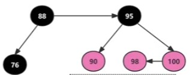

​	最后将95继承原100节点颜色，再将90和100染红即可

​	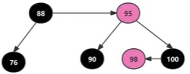

​	**2.3.4被删除的是黑色节点，兄弟节点没有红色子节点**

​	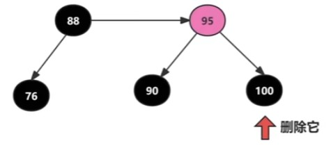

​	由于不能再向兄弟节点借取子节点来平衡，此情形需要一个**新操作，下溢**

​	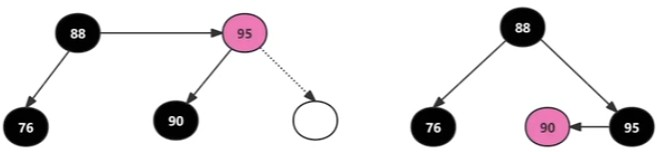

​	现在95节点的领导节点为黑色的“88”,它是领导节点的右子节点。也就是说95想要到下一层做官,必须得改头换面(改色:黑色),这样它就抛弃了“秘书(红色)”身份,来到老领导的下一级做领导。站在90的视角来看发生了什么?空降了一个领导,自己得转换身份为“秘书(红色)“,服务好新来的领导节点95。

​	
