**2.3.5被删除的是黑色节点，父节点为黑色**

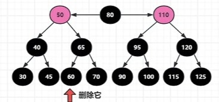

删除60后，其位置形成空洞，其兄弟节点节点也没有红色子节点，无法借用弥补空洞，只能上层往下塌陷，将65塌陷到底层，并将70染红(上层节点比下层节点地位高，来到下层做领导（黑色），下层领导节点就转为他的秘书（红色）)

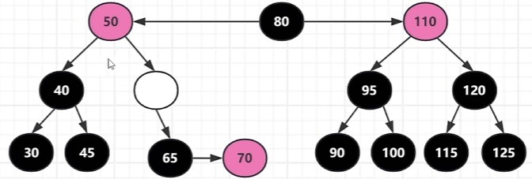

将原65位置看作删除，形成空洞，其兄弟节点仍无法帮助填补空洞，上层继续向下塌陷，并转换为黑色(上层节点比下层节点地位高，来到下层做领导（黑色）)

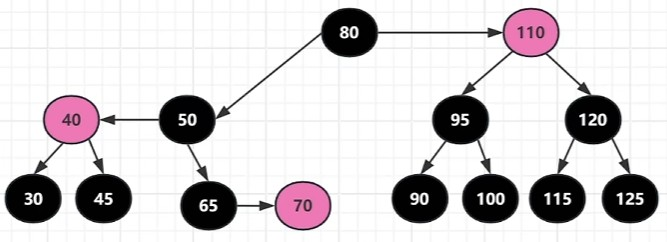

---

  **综合案例2**

这里我们想移除30

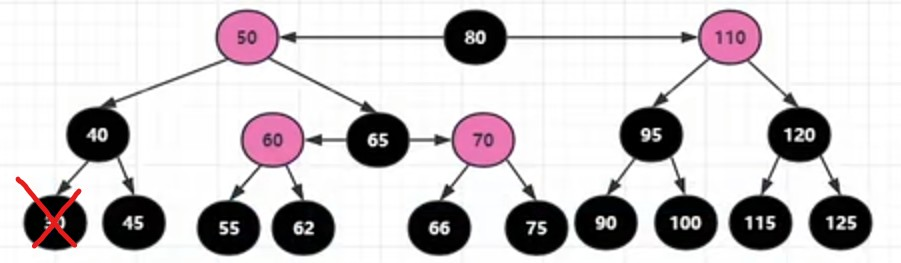

首先他的兄弟节点没有子节点，那么30移除后留下的空洞，只能由上级向下塌陷来弥补，既然上层领导节点下来了仍然是领导，那45就变成红色，做其秘书；

形成空洞，将45染红：

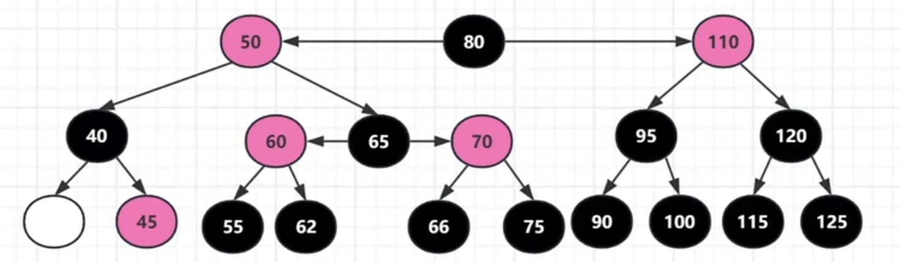

上层向下塌陷，继续在下层做领导节点

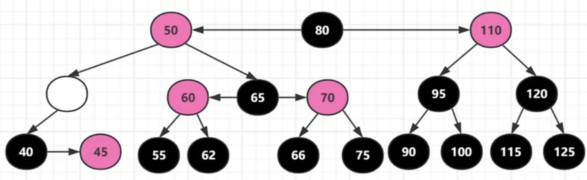

此时，当前空洞位置就当作是被删除元素，考察其兄弟发现其有红色子节点，因此上级无需再继续塌陷；

因为兄弟节点有左右两个子节点，通过RL或RR修复均可，这了选择更简单的RR；

于是50节点左旋下去（填补空洞），65上来，再让60做50的子节点；

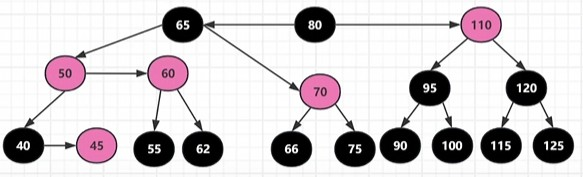

最后改色

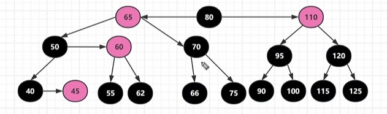

---

**2.3.6被删除的是黑色节点，兄弟节点为红色**

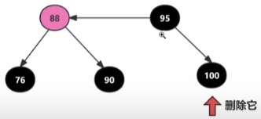

首先，如果删除节点为黑色，而他的兄弟节点为红色（88），根据234树的定义，234树一个节点如果有两个元素（这里将88，95看成一个234树节点的两个元素），那么必有234树三个子节点（这样黑高才平衡），除去黑色的100子节点，就可推断出，上层节点的红色元素下面必然有两个黑色子节点（这里是76，90）

 现在将95右旋，并改色

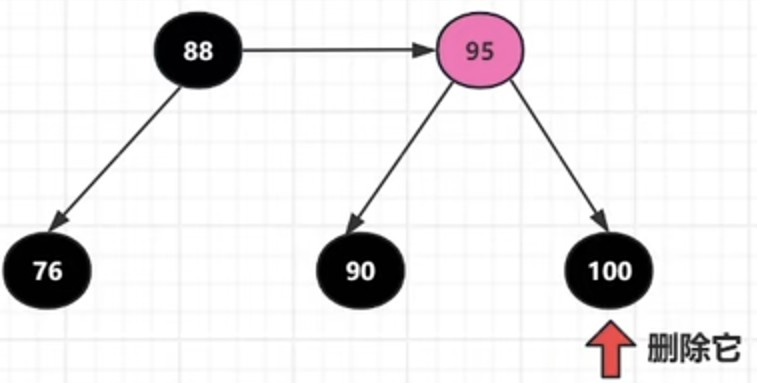

这里删除节点100就有了兄弟，执行删除，留下空洞，然后上层向下塌陷（上层下基层做领导），最后改色即可完成

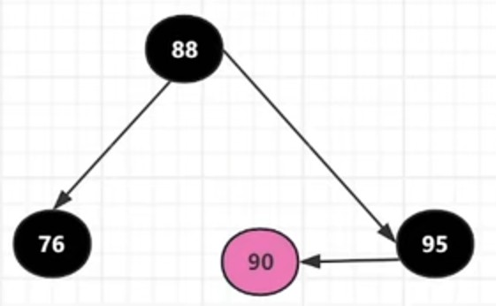

---

**复杂案例**

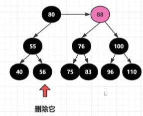

兄弟为黑且没有子节点，直接删除留下空洞，但后上层向下塌陷（到基层继续做领导）

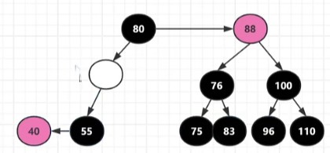

再考察当前的空洞，符合2.3.6的情形（删除节点为黑色且兄弟节点为红色），因此将80左旋，并改色

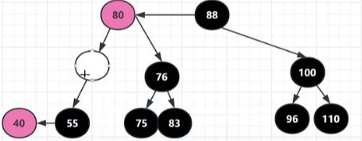

最后再将80染黑并下塌，76染红

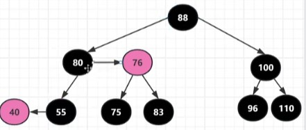

---

**复杂案例2**

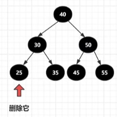

兄弟节点没有子节点，第一步肯定是上层塌陷下来做领导，下层节点变色做其秘书

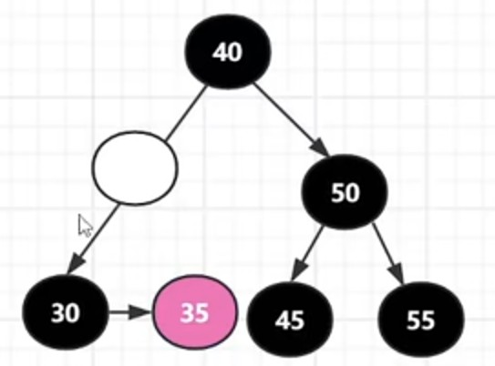

此时空洞的兄弟节点仍没有红色子节点，上层继续塌陷做下层领导

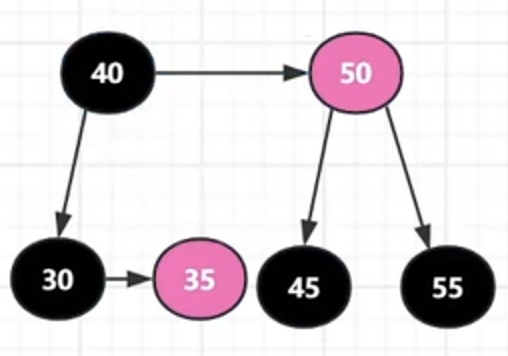

最后仍是下层节点（50）改红色，做塌陷下来的节点（40）的秘书

此时修复完成，红黑树的黑高-1
