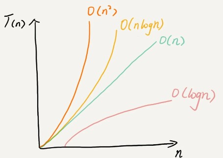

#  算法复杂度分析1

可以认为每行代码执行时间相同， 统一成为单位时间Unit_Time

```
 int cal(int n) {
   int sum = 0;
   int i = 1;
   int j = 1;
   for (; i <= n; ++i) {
     j = 1;
     for (; j <= n; ++j) {
       sum = sum +  i * j;
     }
   }
 }
```

2，3，4行执行了一次，5，6行循环了n次，7，8行循环了$n^2$,总时长就为$T(n)=(2n^2+2n+3)*UnitTime$

我们可以用大O表示代码执行时间随数据规模增长的变化趋势，也称渐进时间复杂度简称时间复杂度。

当n很大时，我们就可以忽略低阶等并不左右增长趋势的部分，取一个最大量级，因此上面的时间复杂度就可记为：$T(n)=O(n^2)$

## 时间复杂度定理

(1)只关注循环次数最多的一段代码。

(2)加法法则：总复杂度等于量级最大的那段代码的复杂度

如果$T1(n)=O(f(n))，T2(n)=O(g(n))；那么 T(n)=T1(n)+T2(n)=max(O(f(n)), O(g(n))) =O(max(f(n), g(n))).$

(3)乘法法则：嵌套代码的复杂度等于嵌套内外代码复杂度的乘积

$如果 T1(n)=O(f(n))，T2(n)=O(g(n))；那么 T(n)=T1(n)*T2(n)=O(f(n))*O(g(n))=O(f(n)*g(n)).$

## 常用时间复杂度

(1)O(1),执行代码数量为常数级

```
 int i = 8;
 int j = 6;
 int sum = i + j;
```

(2)$O(logn)、O(nlogn)$

```
 i=1;
 while (i <= n)  {
   i = i * 3;
 }
```

可以理解为，当$3^x=n执行结束,那么总执行时间为 x=log_3n$,不管底数为多少，统一计为$O(logn)$

$我们知道，对数之间是可以互相转换的，log3n 就等于 log32 * log2n，所以 O(log3n) = O(C * log2n)，$

$其中 C=log32 是一个常量。基于我们前面的一个理论：在采用大 O 标记复杂度的时候，可以忽略系数，即 O(Cf(n)) = O(f(n))。$

$所以，O(log2n) 就等于 O(log3n)。$

$因此，在对数阶时间复杂度的表示方法里，我们忽略对数的“底”，统一表示为 O(logn)。$

(3)$O(m+n)、O(m*n)$

```
int cal(int m, int n) {
  int sum_1 = 0;
  int i = 1;
  for (; i < m; ++i) {
    sum_1 = sum_1 + i;
  }

  int sum_2 = 0;
  int j = 1;
  for (; j < n; ++j) {
    sum_2 = sum_2 + j;
  }

  return sum_1 + sum_2;
}
```

m 和 n 是表示两个数据规模。我们无法事先评估 m 和 n 谁的量级大，所以我们在表示复杂度的时候，就不能简单地利用加法法则，省略掉其中一个。所以，上面代码的时间复杂度就是 O(m+n)。

针对这种情况，原来的加法法则就不正确了，我们需要将加法规则改为：T1(m) + T2(n) = O(f(m) + g(n))。但是乘法法则继续有效：T1(m)*T2(n) = O(f(m) * f(n))。



越高阶复杂度的算法，执行效率越低。常见的复杂度并不多，从低阶到高阶有：O(1)、O(logn)、O(n)、O(nlogn)、O(n2 )。等你学完整个专栏之后，你就会发现几乎所有的数据结构和算法的复杂度都跑不出这几个。