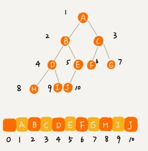

# 二叉树基础上

### 几种二叉树的描述

节点高度：节点到叶子节点的最长路径（从最下的叶子往上数）

节点的深度:根节点到这个节点的边数（从根部往下数）

节点层数：节点深度+1（从1开始数）


### 二叉树的定义

满二叉树：除了叶子节点（最底部节点）外，每个节点都有左右两个子节点；

完全二叉树：叶子节点都在最底下两层，**最后一层的叶子节点都靠左排列**，并且除了最后一层，其他层的节点个数都要达到最大，这种二叉树叫做完全二叉树。

### 二叉树存储法

1.链式存储法，每个节点有三字段，一个存数据，另两个存左右节点的指针。这种存储方式我们比较常用。大部分二叉树代码都是通过这种结构来实现的。


2.基于数组的顺序存储法

把根节点存储在下标 i = 1 的位置，那左子节点存储在下标 2 * i = 2 的位置，右子节点存储在 2 * i + 1 = 3 的位置。以此类推，B 节点的左子节点存储在 2 * i = 2 * 2 = 4 的位置，右子节点存储在 2 * i + 1 = 2 * 2 + 1 = 5 的位置。



如果是非完全二叉树，其实会浪费比较多的数组存储空间。


堆其实就是一种完全二叉树，最常用的存储方式就是数组。

### 二叉树遍历

前序遍历是指，对于树中的任意节点来说，先打印这个节点，然后再打印它的左子树，最后打印它的右子树。中序遍历是指，对于树中的任意节点来说，先打印它的左子树，然后再打印它本身，最后打印它的右子树。后序遍历是指，对于树中的任意节点来说，先打印它的左子树，然后再打印它的右子树，最后打印这个节点本身。

前、中、后序遍历的递推公式：

```
前序遍历的递推公式：
preOrder(r) = print r->preOrder(r->left)->preOrder(r->right)

中序遍历的递推公式：
inOrder(r) = inOrder(r->left)->print r->inOrder(r->right)

后序遍历的递推公式：
postOrder(r) = postOrder(r->left)->postOrder(r->right)->print r
```

三种遍历的代码：

```
void preOrder(Node* root) {
  if (root == null) return;
  print root // 此处为伪代码，表示打印root节点
  preOrder(root->left);
  preOrder(root->right);
}

void inOrder(Node* root) {
  if (root == null) return;
  inOrder(root->left);
  print root // 此处为伪代码，表示打印root节点
  inOrder(root->right);
}

void postOrder(Node* root) {
  if (root == null) return;
  postOrder(root->left);
  postOrder(root->right);
  print root // 此处为伪代码，表示打印root节点
}
```

每个节点最多会被访问两次，所以遍历操作的时间复杂度，跟节点的个数 n 成正比，也就是说二叉树遍历的时间复杂度是 O(n)。