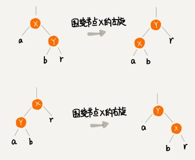
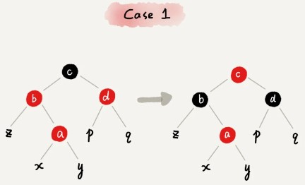
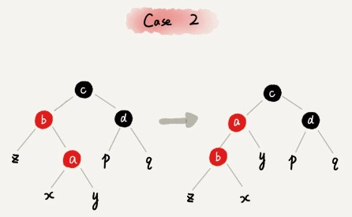
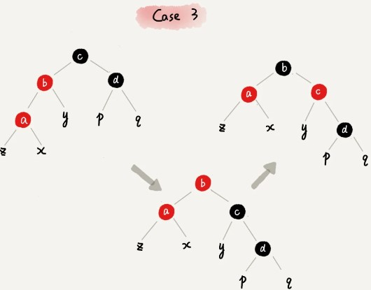

# 26红黑树下

### 实现红黑树的基本思想

不知道你有没有玩过魔方？其实魔方的复原解法是有固定算法的：遇到哪几面是什么样子，对应就怎么转几下。你只要跟着这个复原步骤，就肯定能将魔方复原。

红黑树的平衡过程跟魔方复原非常神似，大致过程就是：遇到什么样的节点排布，我们就对应怎么去调整。只要按照这些固定的调整规则来操作，就能将一个非平衡的红黑树调整成平衡的。

一棵合格的红黑树需要满足这样几个要求：

根节点是黑色的；

每个叶子节点都是黑色的空节点（NIL），也就是说，叶子节点不存储数据；

任何相邻的节点都不能同时为红色，也就是说，红色节点是被黑色节点隔开的；

每个节点，从该节点到达其可达叶子节点的所有路径，都包含相同数目的黑色节点。

在插入、删除节点的过程中，第三、第四点要求可能会被破坏，而我们今天要讲的“平衡调整”，实际上就是要把被破坏的第三、第四点恢复过来。

先介绍两个非常重要的操作，**左旋（rotate left）**、**右旋（rotate right）**。左旋全称其实是叫**围绕某个节点的左旋**，那右旋的全称估计你已经猜到了，就叫**围绕某个节点的右旋**。

### 插入操作的平衡调整

**红黑树规定，插入的节点必须是红色的。而且，二叉查找树中新插入的节点都是放在叶子节点上。**所以，关于插入操作的平衡调整，有这样两种特殊情况，但是也都非常好处理。

·如果插入节点的父节点是黑色的，那我们什么都不用做，它仍然满足红黑树的定义。

·如果插入的节点是根节点，那我们直接改变它的颜色，把它变成黑色就可以了。

除此之外，其他情况都会违背红黑树的定义，于是我们就需要进行调整，调整的过程包含两种基础的操作：**左右旋转**和**改变颜色**。

红黑树的平衡调整过程是一个迭代的过程。我们把正在处理的节点叫做**关注节点**。关注节点会随着不停地迭代处理，而不断发生变化。最开始的关注节点就是新插入的节点。

新节点插入之后，如果红黑树的平衡被打破，那一般会有下面三种情况。我们只需要根据每种情况的特点，不停地调整，就可以让红黑树继续符合定义，也就是继续保持平衡。

我们下面依次来看每种情况的调整过程。提醒你注意下，为了简化描述，我把父节点的兄弟节点叫做叔叔节点，父节点的父节点叫做祖父节点。

**CASE 1：如果关注节点是 a，它的叔叔节点 d 是红色**，我们就依次执行下面的操作：

* 将关注节点 a 的父节点 b、叔叔节点 d 的颜色都设置成黑色；
* 将关注节点 a 的祖父节点 c 的颜色设置成红色；
* 关注节点变成 a 的祖父节点 c；
* 跳到 CASE 2 或者 CASE 3。

**CASE 2：如果关注节点是 a，它的叔叔节点 d 是黑色，关注节点 a 是其父节点 b 的右子节点**，我们就依次执行下面的操作：

* 关注节点变成节点 a 的父节点 b；
* 围绕新的关注节点b 左旋；
* 跳到 CASE 3。

**CASE 3：如果关注节点是 a，它的叔叔节点 d 是黑色，关注节点 a 是其父节点 b 的左子节点**，我们就依次执行下面的操作：

* 围绕关注节点 a 的祖父节点 c 右旋；
* 将关注节点 a 的父节点 b、兄弟节点 c 的颜色互换。
* 调整结束。

