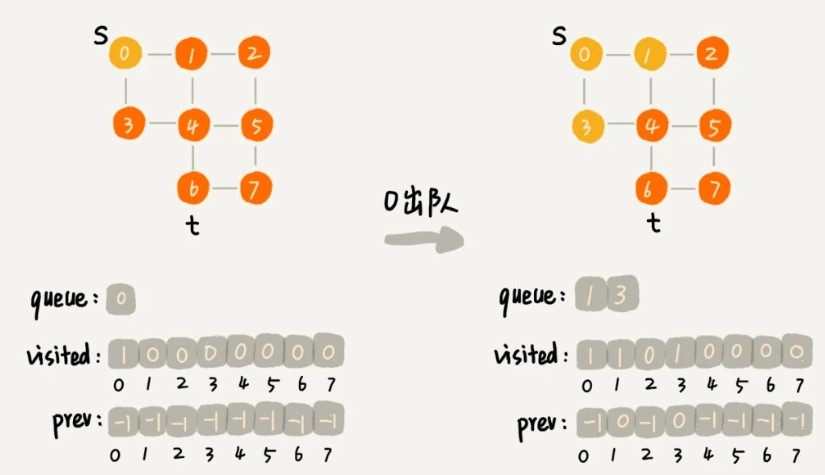
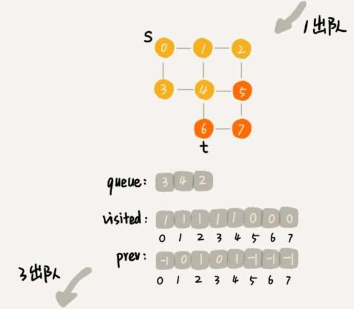
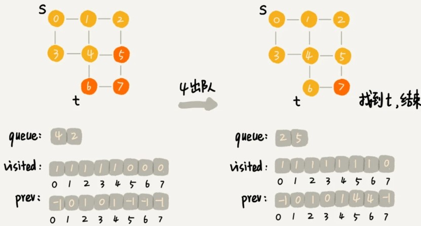
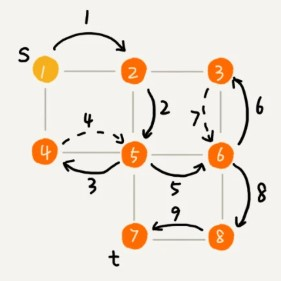

# 31图的广度优先和深度优先搜索

图上的搜索算法，最直接的理解就是，在图中找出从一个顶点出发，到另一个顶点的路径。具体方法有很多，比如今天要讲的两种最简单、最“暴力”的深度优先、广度优先搜索，还有 A *、IDA * 等启发式搜索算法。

需要说明一下，深度优先搜索算法和广度优先搜索算法，既可以用在无向图，也可以用在有向图上。在今天的讲解中，我都针对无向图来讲解。

今天我会用邻接表来存储图,给出图的代码实现。

```
public class Graph { // 无向图
  private int v; // 顶点的个数
  private LinkedList<Integer> adj[]; // 邻接表，数组的每一个元素都是与其相连元素集合的链表

  public Graph(int v) {
    this.v = v;
    adj = new LinkedList[v];
    for (int i=0; i<v; ++i) {
      adj[i] = new LinkedList<>();
    }
  }

  public void addEdge(int s, int t) { // 无向图相互连接的元素都要将彼此相互添加到各自的链表中
    adj[s].add(t);
    adj[t].add(s);
  }
}
```

### 广度优先搜索（BFS）

广度优先搜索（Breadth-First-Search），我们平常都简称 BFS。直观地讲，它其实就是一种“地毯式”层层推进的搜索策略，即先查找离起始顶点最近的，然后是次近的，依次往外搜索。

```
public void bfs(int s, int t) { //s表示起始点，t表示终点
  if (s == t) return;
  boolean[] visited = new boolean[v];//记录被访问的顶点
  visited[s]=true;
  Queue<Integer> queue = new LinkedList<>();//存储已经被访问、但相连的顶点还没有被访问的顶点
  queue.add(s);
  int[] prev = new int[v];//存储搜索出来的路径
  for (int i = 0; i < v; ++i) {//初始化
    prev[i] = -1;
  }
  while (queue.size() != 0) {
    int w = queue.poll();
   for (int i = 0; i < adj[w].size(); ++i) {//遍历w顶点的邻接表
      int q = adj[w].get(i);
      if (!visited[q]) {//如果遍历点q没有被访问，标记访问，prev[q]记录前驱节点为w，添加到队列中，等待后续出队遍历其邻接表
        prev[q] = w;//记录前驱节点，表示q点是从w走过来的
        if (q == t) {
          print(prev, s, t);
          return;
        }
        visited[q] = true;
        queue.add(q);
      }
    }
  }
}

private void print(int[] prev, int s, int t) { // 递归打印s->t的路径
  if (prev[t] != -1 && t != s) {
    print(prev, s, prev[t]);//找到当前t的前驱节点，继续递归打印t
  }
  System.out.print(t + " ");//先递归调用函数，再打印，最终将沿正向顺序打印出s到t的最短路径
}
```

其中 s 表示起始顶点，t 表示终止顶点。我们搜索一条从 s 到 t 的路径。实际上，这样求得的路径就是从 s 到 t 的最短路径。

**visited** 是用来记录已经被访问的顶点，用来避免顶点被重复访问。

**queue** 是一个队列，用来存储已经被访问、但相连的顶点还没有被访问的顶点。因为广度优先搜索是逐层访问的，也就是说，我们只有把第 k 层的顶点都访问完成之后，才能访问第 k+1 层的顶点。当我们访问到第 k 层的顶点的时候，我们需要把第 k 层的顶点记录下来，稍后才能通过第 k 层的顶点来找第 k+1 层的顶点。所以，我们用这个队列来实现记录的功能。

**prev** 用来记录搜索路径。当我们从顶点 s 开始，广度优先搜索到顶点 t 后，prev 数组中存储的就是搜索的路径。不过，这个路径是反向存储的。prev[w]存储的是，顶点 w 是从哪个前驱顶点遍历过来的。比如，我们通过顶点 2 的邻接表访问到顶点 3，那 prev[3]就等于 2。为了正向打印出路径，我们需要递归地来打印，你可以看下 print() 函数的实现方式。

为了方便你理解，我画了一个广度优先搜索的分解图，你可以结合着代码以及我的讲解一块儿看。

**笔记**：存在诸如顶点4这种有多个前驱点的节点，当遍历点1的连接表时就以及标记访问了，之后遍历点3的连接表将直接跳过，且不会影响最终获取的路径为最短路径，因为先入队出队的永远是距离起点更短的路径或相同路径长度的点，广度优先的诀窍就是根据距离起点的距离逐层访问（第一层访问距离点0距离为1的点1和3，再入队点1，3然后访问他们的邻接表中未被标记访问的点2和4，也就是第二层节点），假设现在点0与点4之间新增一条边，那么点4在遍历点0的链接表时就会被访问到，并标记前驱点为0，遍历点1，3的链接表的时候将不会再访问点4。







广度优先搜索的时间、空间复杂度是多少呢？

最坏情况下，终止顶点 t 离起始顶点 s 很远，需要遍历完整个图才能找到。这个时候，每个顶点都要进出一遍队列，每个边也都会被访问一次，所以，广度优先搜索的时间复杂度是 O(V+E)，其中，V 表示顶点的个数，E 表示边的个数。当然，对于一个连通图来说，也就是说一个图中的所有顶点都是连通的，E 肯定要大于等于 V-1，所以，广度优先搜索的时间复杂度也可以简写为 O(E)。

广度优先搜索的空间消耗主要在几个辅助变量 visited 数组、queue 队列、prev 数组上。这三个存储空间的大小都不会超过顶点的个数，所以空间复杂度是 O(V)。

### 深度优先搜索（DFS）

深度优先搜索（Depth-First-Search），简称 DFS。最直观的例子就是“走迷宫”。

假设你站在迷宫的某个岔路口，然后想找到出口。你随意选择一个岔路口来走，走着走着发现走不通的时候，你就回退到上一个岔路口，重新选择一条路继续走，直到最终找到出口。这种走法就是一种深度优先搜索策略。

如图，搜索的起始顶点是 s，终止顶点是 t，我们希望在图中寻找一条从顶点 s 到顶点 t 的路径。如果映射到迷宫那个例子，s 就是你起始所在的位置，t 就是出口。

这里面实线箭头表示遍历，虚线箭头表示回退。我们可以看出，深度优先搜索找出来的路径，并不是顶点 s 到顶点 t 的最短路径。



深度优先搜索用的是一种比较著名的算法思想，**回溯思想**。这种思想解决问题的过程，非常适合用递归来实现。

深度优先搜索代码实现也用到了 prev、visited 变量以及 print() 函数，它们跟广度优先搜索代码实现里的作用是一样的。不过，深度优先搜索代码实现里，有个比较特殊的变量 found，它的作用是，当我们已经找到终止顶点 t 之后，我们就不再递归地继续查找了。

```
boolean found = false; // 全局变量或者类成员变量

public void dfs(int s, int t) {
  found = false;
  boolean[] visited = new boolean[v];
  int[] prev = new int[v];
  for (int i = 0; i < v; ++i) {
    prev[i] = -1;
  }
  recurDfs(s, t, visited, prev);//递归深度优先查找
  print(prev, s, t);
}

private void recurDfs(int w, int t, boolean[] visited, int[] prev) {
  if (found == true) return;
  visited[w] = true;//标记访问当前循环出发点w
  if (w == t) {//找到t，返回
    found = true;
    return;
  }
  for (int i = 0; i < adj[w].size(); ++i) {//遍历当前循环出发点w的邻接表
    int q = adj[w].get(i);
    if (!visited[q]) {//如果当前遍历点未被访问，递归查找下一个深度的节点；
      prev[q] = w;//记录q的前驱点为w
      recurDfs(q, t, visited, prev);//递归查找下一个深度节点，如果邻接表所有节点均被访问（死胡同或者走了个循环），回退到上一层递归深度继续遍历（也就是路径回退）
    }
  }
}
```

**勘误**：注意代码的递归，存在问题，当找到终点后，递归会返回上一级继续for循环遍历，可在此增加found判定。


从我前面画的图可以看出，每条边最多会被访问两次，一次是遍历，一次是回退。所以，图上的深度优先搜索算法的时间复杂度是 O(E)，E 表示边的个数。

深度优先搜索算法的消耗内存主要是 visited、prev 数组和递归调用栈。visited、prev 数组的大小跟顶点的个数 V 成正比，递归调用栈的最大深度不会超过顶点的个数，所以总的空间复杂度就是 O(V)。

---

### 总结

广度优先搜索和深度优先搜索是图上的两种最常用、最基本的搜索算法，比起其他高级的搜索算法，比如 A*、IDA* 等，要简单粗暴，没有什么优化，所以，也被叫作暴力搜索算法。所以，这两种搜索算法仅适用于状态空间不大，也就是说图不大的搜索。