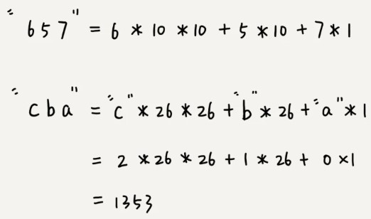
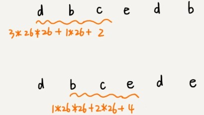
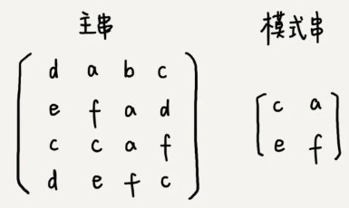

# 32字符串匹配算法（bf，rk）

### BF 算法

BF 算法中的 BF 是 Brute Force 的缩写，中文叫作暴力匹配算法，也叫朴素匹配算法。

比较简单、好懂，但相应的性能也不高。

我们在字符串 A 中查找字符串 B，那字符串 A 就是主串，字符串 B 就是模式串。我们把主串的长度记作 n，模式串的长度记作 m。因为我们是在主串中查找模式串，所以 n>m。

在主串中，检查起始位置分别是 0、1、2....n-m 且长度为 m 的 n-m+1 个子串，看有没有跟模式串匹配的。

在极端情况下，比如主串是“aaaaa....aaaaaa”（省略号表示有很多重复的字符 a），模式串是“aaaaab”。我们每次都比对 m 个字符，要比对 n-m+1 次，所以，这种算法的最坏情况时间复杂度是 O(n*m)。

BF 算法的时间复杂度很高，是 O(n*m)，但在实际的开发中，它却是一个比较常用的字符串匹配算法。

因为，1.大部分情况下，模式串和主串的长度都不会太长。2.朴素字符串匹配算法思想简单，代码实现也非常简单。简单意味着不容易出错。在工程中，在满足性能要求的前提下，简单是首选。这也是我们常说的**KISS（Keep it Simple and Stupid）**设计原则。

### RK 算法 

RK 算法的全称叫 Rabin-Karp 算法，是由它的两位发明者 Rabin 和 Karp 的名字来命名的。

我们对朴素的字符串匹配算法稍加改造，引入哈希算法，时间复杂度立刻就会降低。

RK 算法的思路是这样的：我们通过哈希算法对主串中的 n-m+1 个子串分别求哈希值，然后逐个与模式串的哈希值比较大小。如果某个子串的哈希值与模式串相等，那就说明对应的子串和模式串匹配了（这里先不考虑哈希冲突的问题，后面我们会讲到）。因为哈希值是一个数字，数字之间比较是否相等是非常快速的，所以模式串和子串比较的效率就提高了。

不过，通过哈希算法计算子串的哈希值的时候，我们需要遍历子串中的每个字符。这样，算法整体的效率并没有提高。

这就需要哈希算法设计的非常有技巧了。我们假设要匹配的字符串的字符集中只包含 K 个字符，我们可以用一个 K 进制数来表示一个子串，这个 K 进制数转化成十进制数，作为子串的哈希值。

比如要处理的字符串只包含 a～z 这 26 个小写字母，那我们就用二十六进制来表示一个字符串。我们把 a～z 这 26 个字符映射到 0～25 这 26 个数字，a 就表示 0，b 就表示 1，以此类推，z 表示 25。

在十进制的表示法中，一个数字的值是通过下面的方式计算出来的。对应到二十六进制，一个包含 a 到 z 这 26 个字符的字符串，计算哈希的时候，我们只需要把进位从 10 改成 26 就可以。

这个哈希算法你应该看懂了吧？现在，为了方便解释，在下面的讲解中，我假设字符串中只包含 a～z 这 26 个小写字符，我们用二十六进制来表示一个字符串，对应的哈希值就是二十六进制数转化成十进制的结果。

我们很容易就能得出这样的规律：相邻两个子串，对应的哈希值计算公式有交集，也就是说，我们可以使用 s[i-1]的哈希值很快的计算出 s[i]的哈希值。如果用公式表示的话，就是下面这个样子：

s[i] 表示主串中第i位置的字符，子串的长度都为 m;|s[i]|表示这个字符映射的数字,如a=0,b=1;

h[i]表示主串中以第i位置为起始长度m的字符串的哈希值,h[i-1]就是第i-1位置为起始长度m的字符串的哈希值,也就是取值向前滑动一位的字符串,也就是说h[i-1]的后m-1位与h[i]的前m-1位是重叠的.
$$
哈希值:h[i-1]=26^{m-1}\times(|s[i-1]|)+\underbrace{6^{m-2}\times(|s[i]|)+\dots+26^0\times(|s[i+m-2]|)}_{A部分} \\
哈希值:h[i]=\underbrace{26^{m-1}\times(|s[i]|)+\dots+26^1\times(|s[i+m-2]|)}_{B部分} +26^0\times(|s[i+m-1]|)\\
可看出B=A*26\\
h[i]=(h[i-1]-26^{m-1}\times |s[i-1]|)\times26+26^0\times(|s[i+m-1]|)
$$
等价于h[i]的哈希值等于h[i-1]的哈希值减去其首字母哈希值，再加上h[i]尾字母的哈希值。

有一个小细节需要注意，那就是 26^(m-1) 这部分的计算，我们可以通过查表的方法来提高效率。我们事先计算好 26^0、26^1、26^2……26^(m-1)，并且存储在一个长度为 m 的数组中，公式中的“次方”就对应数组的下标。当我们需要计算 26 的 x 次方的时候，就可以从数组的下标为 x 的位置取值，直接使用，省去了计算的时间。

整个 RK 算法包含两部分，计算子串哈希值和模式串哈希值与子串哈希值之间的比较。第一部分，我们前面也分析了，可以通过设计特殊的哈希算法，只需要扫描一遍主串就能计算出所有子串的哈希值了，所以这部分的时间复杂度是 O(n)。

模式串哈希值与每个子串哈希值之间的比较的时间复杂度是 O(1)，总共需要比较 n-m+1 个子串的哈希值，所以，这部分的时间复杂度也是 O(n)。所以，RK 算法整体的时间复杂度就是 O(n)。

---

这里还有一个问题就是，模式串很长，相应的主串中的子串也会很长，通过上面的哈希算法计算得到的哈希值就可能很大，如果超过了计算机中整型数据可以表示的范围，那该如何解决呢？

刚刚我们设计的哈希算法是没有散列冲突的，也就是说，一个字符串与一个二十六进制数一一对应，不同的字符串的哈希值肯定不一样。因为我们是基于进制来表示一个字符串的，你可以类比成十进制、十六进制来思考一下。实际上，我们为了能将哈希值落在整型数据范围内，可以牺牲一下，允许哈希冲突。这个时候哈希算法该如何设计呢？

哈希算法的设计方法有很多，我举一个例子说明一下。假设字符串中只包含 a～z 这 26 个英文字母，那我们每个字母对应一个数字，比如 a 对应 1，b 对应 2，以此类推，z 对应 26。我们可以把字符串中每个字母对应的数字相加，最后得到的和作为哈希值。这种哈希算法产生的哈希值的数据范围就相对要小很多了。

不过，你也应该发现，这种哈希算法的哈希冲突概率也是挺高的。当然，我只是举了一个最简单的设计方法，还有很多更加优化的方法，比如将每一个字母从小到大对应一个素数，而不是 1，2，3……这样的自然数，这样冲突的概率就会降低一些。

那现在新的问题来了。之前我们只需要比较一下模式串和子串的哈希值，如果两个值相等，那这个子串就一定可以匹配模式串。但是，当存在哈希冲突的时候，有可能存在这样的情况，子串和模式串的哈希值虽然是相同的，但是两者本身并不匹配。

实际上，解决方法很简单。当我们发现一个子串的哈希值跟模式串的哈希值相等的时候，我们只需要再对比一下子串和模式串本身就好了。当然，如果子串的哈希值与模式串的哈希值不相等，那对应的子串和模式串肯定也是不匹配的，就不需要比对子串和模式串本身了。

所以，哈希算法的冲突概率要相对控制得低一些，如果存在大量冲突，就会导致 RK 算法的时间复杂度退化，效率下降。极端情况下，如果存在大量的冲突，每次都要再对比子串和模式串本身，那时间复杂度就会退化成 O(n*m)。但也不要太悲观，一般情况下，冲突不会很多，RK 算法的效率还是比 BF 算法高的。

### 内容小结

BF 算法是最简单、粗暴的字符串匹配算法，它的实现思路是，拿模式串与主串中是所有子串匹配，看是否有能匹配的子串。所以，时间复杂度也比较高，是 O(n*m)，n、m 表示主串和模式串的长度。不过，在实际的软件开发中，因为这种算法实现简单，对于处理小规模的字符串匹配很好用。*

*RK 算法是借助哈希算法对 BF 算法进行改造，即对每个子串分别求哈希值，然后拿子串的哈希值与模式串的哈希值比较，减少了比较的时间。所以，理想情况下，RK 算法的时间复杂度是 O(n)，跟 BF 算法相比，效率提高了很多。不过这样的效率取决于哈希算法的设计方法，如果存在冲突的情况下，时间复杂度可能会退化。极端情况下，哈希算法大量冲突，时间复杂度就退化为 O(n*m)。

### 课后思考

我们今天讲的都是一维字符串的匹配方法，实际上，这两种算法都可以类比到二维空间。假设有下面这样一个二维字符串矩阵（图中的主串），借助今天讲的处理思路，如何在其中查找另一个二维字符串矩阵（图中的模式串）呢？

答:把子串数组化，然后求hash