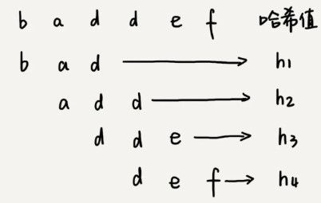
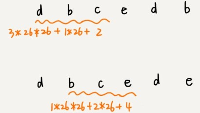

### RK算法

假设需要匹配的模式串度为3,我们就将主串按照每三个字符取出来转换为哈希值,然后只需要对比哈希值即可.

假设要匹配的字符串的字符集中只包含 K 个字符，我们可以用一个 K 进制数来表示一个子串，这个 K 进制数转化成十进制数，作为子串的哈希值。

比如要处理的字符串只包含 a～z 这 26 个小写字母，那我们就用二十六进制来表示一个字符串。我们把 a～z 这 26 个字符映射到 0～25 这 26 个数字，a 就表示 0，b 就表示 1，以此类推，z 表示 25。

然后将每个用来匹配的子串转换为一个十进制数字

因为每次只向后滑动一位,在计算每个子串哈希值时,相邻子串的交集转换计算结果可以复用
$$
哈希值:h[i]=\underbrace{26^{m-1}\times(|s[i]|)+\dots+26^1\times(|s[i+m-2]|)}_{B部分} +26^0\times(|s[i+m-1]|)\\
哈希值:h[i-1]=26^{m-1}\times(|s[i-1]|)+\underbrace{6^{m-2}\times(|s[i]|)+\dots+26^0\times(|s[i+m-2]|)}_{A部分} \\
可看出B=A*26\\
h[i]=\underbrace{(h[i-1]-26^{m-1}\times |s[i-1]|)}_{用h[i-1]减去首字母哈希值得到A部分}\times26+26^0\times(|s[i+m-1]|)
$$
上式中,h[i]表示主串中起始位置i,长度m的字符串的哈希值,h[i-1]就是起始位置为(i-1)长度m的字符串的哈希值;

s[i] 表示主串中第i位置的字符，子串的长度都为 m,子串尾字符就表示为s[i+m-1];|s[i]|表示这个字符映射的数字,如a=0,b=1;

**注意细节**:26^(m-1) 这部分的计算，我们可以通过查表的方法来提高效率。我们事先计算好 26^0、26^1、26^2……26^(m-1)，并且存储在一个长度为 m 的数组中，公式中的“次方”就对应数组的下标。当我们需要计算 26 的 x 次方的时候，就可以从数组的下标为 x 的位置取值，直接使用，省去了计算的时间。

### 复杂度

整个 RK 算法包含两部分，计算子串哈希值和模式串哈希值与子串哈希值之间的比较。

第一部分，只需要扫描一遍主串就能计算出所有子串的哈希值了，所以这部分的时间复杂度是 O(n)。

第二部分 模式串哈希值与每个子串哈希值之间的比较的时间复杂度是 O(1)，总共需要比较 n-m+1 个子串的哈希值，所以，这部分的时间复杂度也是 O(n)。所以，RK 算法整体的时间复杂度就是 O(n)。

---

### 缺陷

在字符足够多情况下,会有哈希冲突,也就是一个子串的哈希值跟模式串的哈希值相等,但是字符串本身不同,这时候我们只需要再对比一下子串和模式串本身就好了.

如果存在大量冲突，就会导致 RK 算法的时间复杂度退化，效率下降。极端情况下，时间复杂度就会退化成 O(n*m)。但一般不会出现.