# 33高级字符串匹配算法（bm）

### BM 算法的核心思想

模式串和主串的匹配过程，看作模式串在主串中不停地往后滑动,

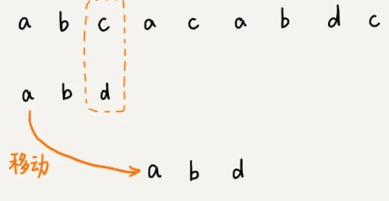

**主串中的 c，在模式串中是不存在的**，所以，模式串向后滑动的时候，只要 c 与模式串没有重合，**肯定无法匹配**。所以，我们可以一次性把模式串往后多滑动几位，把模式串移动到 c 的后面。

### 1.坏字符规则

BM 算法的匹配顺序比较特别，它是按照模式串下标从大到小的顺序，倒着匹配的。

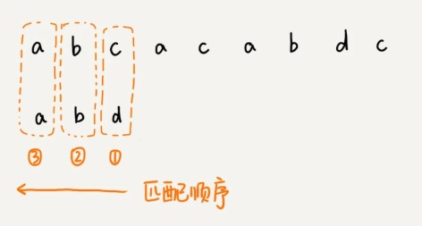

从模式串的末尾往前倒着匹配，当发现某个字符没法匹配的时候，我们把这个没有匹配的字符叫作坏字符（主串中的字符）。

这里会有两种情况：

### 情况1 ：模式串不存在坏字符

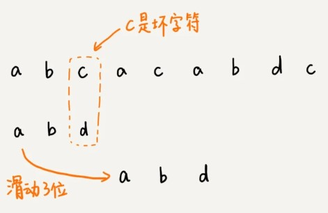

拿坏字符 c 在模式串中**从后往前查找**查找，发现模式串中并不存在这个字符。这个时候，我们可以将模式串直接往后滑动三位，将模式串滑动到 c 后面的位置，再从模式串的末尾字符开始比较。

### 情况2：模式串存在坏字符

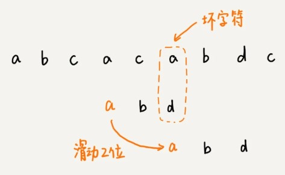

这次坏字符为a，拿a在模式串中从后往前查找，但坏字符a在模式串存在，这次只能将模式串向后滑动两位，再尝试匹配。

### 规律总结

第一次不匹配的时候，我们滑动了三位，第二次不匹配的时候，我们将模式串后移两位，那具体滑动多少位，到底有没有规律呢？

当发生不匹配的时候，我们把坏字符对应的模式串中的字符下标记作 si。如果坏字符在模式串中存在，我们把这个坏字符在模式串中的下标记作 xi。如果不存在，我们把 xi 记作 -1。那模式串往后移动的位数就等于 si-xi。（注意，我这里说的下标，都是字符在模式串的下标）。


如果坏字符在模式串里多处出现，那我们在计算 xi 的时候，选择最靠后的那个，也就是**在模式串中从后往前匹配上坏字符的第一个字符下标**

因为这样不会让模式串滑动过多，导致本来可能匹配的情况被滑动略过。

利用坏字符规则，BM 算法在最好情况下的时间复杂度非常低，是 O(n/m)。比如，主串是 aaabaaabaaabaaab，模式串是 aaaa。每次比对，模式串都可以直接后移四位，所以，匹配具有类似特点的模式串和主串的时候，BM 算法非常高效。

但存在一个**问题**，因为根据 si-xi 计算出来的移动位数，有可能是负数，比如主串是 aaaaaaaaaaaaaaaa，模式串是 baaa（si=0，坏字符a匹配到模式串末尾第一个字符xi=3）。

所以，BM 算法还需要用到“好后缀规则”。

### 好后缀规则

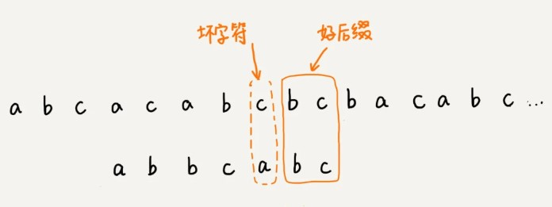

当模式串滑动到图中的位置的时候，模式串和主串有 2 个字符是匹配的，倒数第 3 个字符发生了不匹配的情况。

把已经匹配的 bc 叫作好后缀，记作{u}。我们拿它在模式串中查找，如果找到了另一个跟{u}相匹配的子串{u\*}，那我们就将模式串滑动到子串{u\*}与主串中{u}对齐的位置。

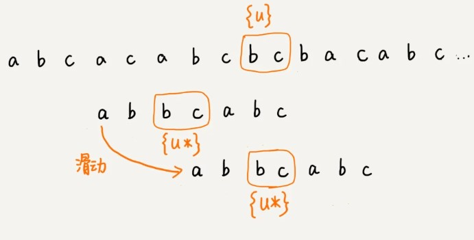

如果在模式串中找不到另一个等于{u}的子串，我们就尝试直接将模式串，滑动到主串中{u}的后面，

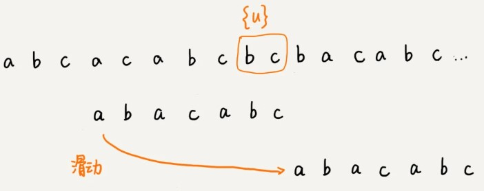

不过，这里存在一个问题。

当模式串前缀与主串中{u}的后缀仅有部分匹配，也有可能会存在完全匹配的情况(如下图)。

这里面 bc 是好后缀，尽管在模式串中没有另外一个相匹配的子串{u*}，但是如果我们将模式串移动到好后缀的后面，如图所示，那就会错过模式串和主串可以匹配的情况。

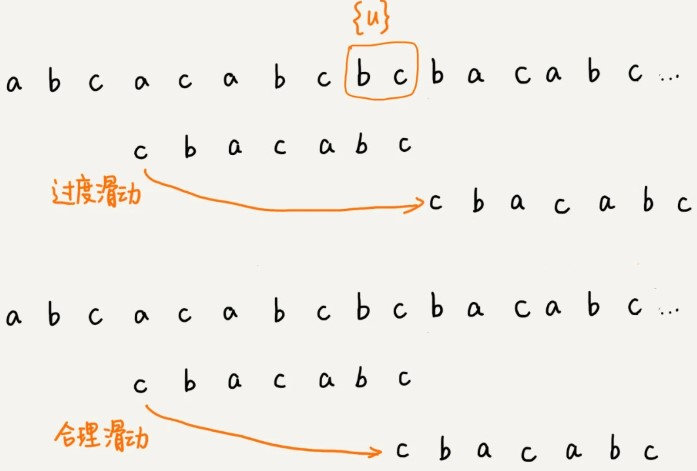

所以，针对这种情况，我们不仅要看好后缀在模式串中，是否有另一个匹配的子串，我们还要考察好后缀的后缀子串，是否存在跟模式串的前缀子串匹配的。

我们从好后缀的后缀子串中，找一个最长的并且能跟模式串的前缀子串匹配的，假设是{v}，然后将模式串滑动到如图所示的位置。

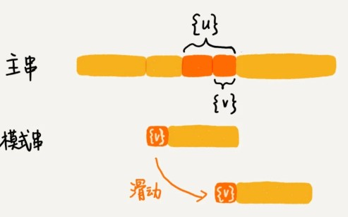

我们可以**分别计算好后缀和坏字符往后滑动的位数**，然后**取两个数中最大**的，作为**模式串往后滑动的位数**。这种处理方法还可以避免我们前面提到的，根据坏字符规则，计算得到的往后滑动的位数，有可能是负数的情况。

## BM 算法代码实现

如果我们拿坏字符，在模式串中顺序遍历查找，这样就会比较低效，势必影响这个算法的性能。有没有更加高效的方式呢？我们之前学的散列表，这里可以派上用场了。我们可以将模式串中的每个字符及其下标都存到散列表中。这样就可以快速找到坏字符在模式串的位置下标了。

关于这个散列表，我们只实现一种最简单的情况，假设字符串的字符集不是很大，每个字符长度是 1 字节，我们用大小为 256 的数组，来记录每个字符在模式串中出现的位置。数组的下标对应字符的 ASCII 码值，数组中存储这个字符在模式串中出现的位置。**遇到重复的储存的是靠后位置的那个值**，比如下面的a

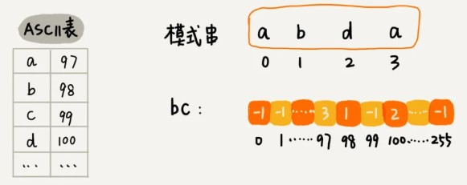

如果将上面的过程翻译成代码，就是下面这个样子。其中，变量 b 是模式串，m 是模式串的长度，**bc** 表示刚刚讲的散列表。

```
private static final int SIZE = 256; // 全局变量或成员变量
private void generateBC(char[] b, int m, int[] bc) {//bc散列表记录模式串对应字符最后出现的位置
  for (int i = 0; i < SIZE; ++i) {
    bc[i] = -1; // 初始化bc
  }
  for (int i = 0; i < m; ++i) {
    int ascii = (int)b[i]; // 计算b[i]的ASCII值
    bc[ascii] = i;
  }
}
```

先把 BM 算法代码的大框架写好，先不考虑好后缀规则，仅用坏字符规则，并且不考虑 si-xi 计算得到的移动位数可能会出现负数的情况。

```
public int bm(char[] a, int n, char[] b, int m) {//n为主串长度，m为模式串长度，a为主串，b为模式串
  int[] bc = new int[SIZE]; // 记录模式串中每个字符最后出现的位置(SIZE参考上一个代码段的全局变量)
  generateBC(b, m, bc); // 构建坏字符哈希表
  int i = 0; // i表示当前模式串与主串对齐的第一个字符的下标位置（如开始时模式串首字母对齐主串第一个字母，也就是在主串下标为0的位置，然后模式串逐渐往后移动）
  while (i <= n - m) {//模式串从与主串头部对齐开始，进行匹配
    int j;
    for (j = m - 1; j >= 0; --j) { // 模式串从后往前匹配
      if (a[i+j] != b[j]) break; // 坏字符对应模式串中的下标是j
    }
    if (j < 0) {
      return i; // 匹配成功，返回主串与模式串第一个匹配的字符的位置
    }
    // 散列表查询坏字符a[i+j]在主串中最后出现的位置，即bc[(int)a[i+j]]，将模式串往后滑动j-bc[(int)a[i+j]]位
    i = i + (j - bc[(int)a[i+j]]); 
  }
  return -1;
}
```

将其中的一些关键变量标注在上面了，结合着图，代码应该更好理解。

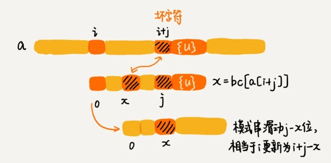

只剩下往框架代码中填充好后缀规则了。现在，我们就来看看，如何实现好后缀规则。它的实现要比坏字符规则复杂一些。

**好后缀**的处理规则中最核心的内容：

* 在模式串中，查找跟好后缀匹配的另一个子串；
* 在好后缀的后缀子串中，查找最长的、能跟模式串前缀子串匹配的后缀子串；

在不考虑效率的情况下，这两个操作都可以用很“暴力”的匹配查找方式解决。但是，如果想要 BM 算法的效率很高，这部分就不能太低效。

因为**好后缀也是模式串本身的后缀子串**，所以，我们可以在模式串和主串正式匹配之前，通过预处理模式串，预先计算好**模式串的每个后缀子串，对应的另一个可匹配子串的位置**。这个预处理过程比较有技巧，很不好懂，应该是这节最难懂的内容了，你要认真多读几遍。

**如何表示模式串中不同的后缀子串呢**？因为后缀子串的最后一个字符的位置是固定的，下标为 m-1，我们只需要记录长度就可以了。通过长度，我们可以确定一个唯一的后缀子串。

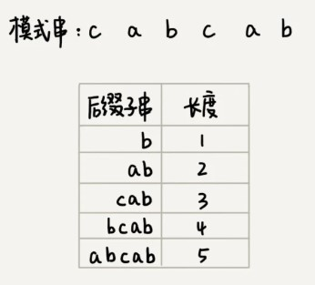

我们要引入最关键的变量 suffix 数组。suffix 数组的下标 k，表示后缀子串的长度，下标对应的数组值存储的是，**在模式串中跟好后缀{u}相匹配的子串{u*}的起始下标值。**(笔记：此处后缀子串{u*}都是计算的模式串中的。 后缀子串b在模式串中另一个匹配开始位置为2 后缀子串ab在模式串中另一个匹配开始位置为1 后缀子串cab在模式串中另一个匹配开始位置为0 后缀子串bcab在模式串中只出现了一次，所以没有另一个匹配位置，定为-1)

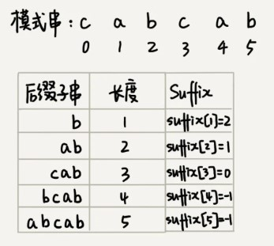

但是，如果模式串中有多个（大于 1 个）子串跟后缀子串{u}匹配，那 suffix 数组中该存储哪一个子串的起始位置呢？**为了避免模式串往后滑动得过头了，我们肯定要存储模式串中最靠后的那个子串的起始位置**，也就是下标最大的那个子串的起始位置。不过，这样处理就足够了吗？

我们不仅要在模式串中，查找跟好后缀匹配的另一个子串，还要在好后缀的后缀子串中，查找最长的能跟模式串前缀子串匹配的后缀子串。（笔记：也就是找到好后缀的尾巴与模式串头部尽可能长的相同的匹配部分，因为好后缀同样也是模式串的尾巴，所以这里同样拿模式串的尾部跟其头部匹配来预处理）

所以，除了 suffix 数组之外，我们还需要另外一个 boolean 类型的 prefix 数组，来记录**模式串的后缀子串是否能匹配模式串的前缀子串**（因为匹配的好后缀也是模式串的后缀子串，如下图后缀cab能与前缀cab匹配，所以对应prefix值为true）。

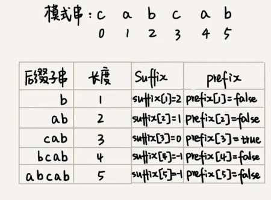

我们拿下标从 0 到 i 的子串（i 可以是 0 到 m-2）与整个模式串，求公共后缀子串。如果公共后缀子串的长度是 k，那我们就记录 suffix[k]=j（j 表示公共后缀子串的起始下标）。如果 j 等于 0，也就是说，公共后缀子串也是模式串的前缀子串，我们就记录 prefix[k]=true。

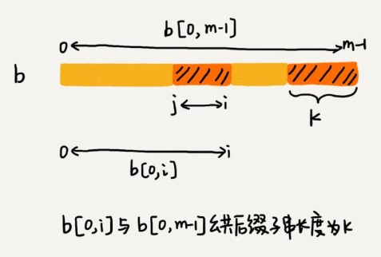

我们把 suffix 数组和 prefix 数组的计算过程，用代码实现出来，就是下面这个样子：

```
// b表示模式串，m表示长度，suffix，prefix数组事先申请好了
private void generateGS(char[] b, int m, int[] suffix, boolean[] prefix) {
  for (int i = 0; i < m; ++i) { // 初始化
    suffix[i] = -1;
    prefix[i] = false;
  }
  for (int i = 0; i < m - 1; ++i) { // b[0, i]
    int j = i;
    int k = 0; // 公共后缀子串长度
    while (j >= 0 && b[j] == b[m-1-k]) { // 与b[0, m-1]求公共后缀子串
      --j;
      ++k;
      suffix[k] = j+1; //赋值公共后缀子串在b[0, i]中所匹配的子串的起始下标，随着循环的变化，将匹配更长的后缀子串，同时也会找到b中处于更后面位置的较短的子串，更新到suffix中，例如第一个for循环之后匹配长度为1的子串，即用b的尾部一个字母匹配b首部的第一个字母，而随着循环i的增大，匹配子串边长，如i=j=5时，将会用长度为5的后缀，按从后往前的顺序，依次与b的首部5个字母从后往前进行匹配，期间，k为0-4，期间匹配到的更短的后缀，也将同步覆盖suffix中先前赋值的更短的匹配，这表示在b的更靠后的位置找到了同样能匹配的子串，我们将保留更靠后的子串，如i=j=5时，k=0，我们在b[5]位置同样匹配到了b尾部长度为1的子串，我们将更新suffix[0]赋值一个更靠后的公共后缀子串匹配下标
    }
    if (j == -1) prefix[k] = true; //该for循环完全匹配上了，则公共后缀子串也是模式串的前缀子串，
  }
}
```

有了这两个数组之后，我们现在来看，**在模式串跟主串匹配的过程中，遇到不能匹配的字符时，如何根据好后缀规则，计算模式串往后滑动的位数？**

假设好后缀的长度是 k。我们先拿好后缀，在 suffix 数组中查找其匹配的子串。如果 suffix[k]不等于 -1（-1 表示不存在匹配的子串），那我们就将模式串往后移动 j-suffix[k]+1 位（j 表示坏字符对应的模式串中的字符下标）。如果 suffix[k]等于 -1，表示模式串中不存在另一个跟好后缀匹配的子串片段。我们可以用下面这条规则来处理。

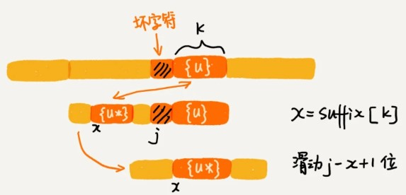

好后缀的后缀子串 b[r, m-1]（其中，r 取值从 j+2 到 m-1，j 表示坏字符对应的模式串中的字符下标）的长度 k=m-r，如果 prefix[k]等于 true，表示长度为 k 的后缀子串，有可匹配的前缀子串，这样我们可以把模式串后移 r 位（已知k，m，求r）。

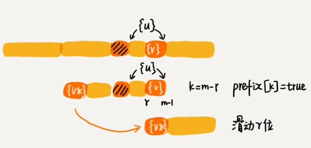

如果两条规则都没有找到可以匹配好后缀及其后缀子串的子串，我们就将整个模式串后移 m 位。

我们把好后缀规则加到前面的代码框架里，就可以得到 BM 算法的完整版代码实现。

```
// a,b表示主串和模式串；n，m表示主串和模式串的长度。
public int bm(char[] a, int n, char[] b, int m) {
  int[] bc = new int[SIZE]; // 记录模式串中每个字符最后出现的位置
  generateBC(b, m, bc); // 构建坏字符哈希表
  int[] suffix = new int[m];
  boolean[] prefix = new boolean[m];
  generateGS(b, m, suffix, prefix);
  int i = 0; // j表示主串与模式串匹配的第一个字符
  while (i <= n - m) {
    int j;
    for (j = m - 1; j >= 0; --j) { // 模式串从后往前匹配
      if (a[i+j] != b[j]) break; // 坏字符对应模式串中的下标是j
    }
    if (j < 0) {
      return i; // 匹配成功，返回主串与模式串第一个匹配的字符的位置
    }
    int x = j - bc[(int)a[i+j]];//坏字符计算出的滑动位数
    int y = 0;//好后缀计算的滑动位数
    if (j < m-1) { // 如果有好后缀的话
      y = moveByGS(j, m, suffix, prefix);
    }
    i = i + Math.max(x, y);//好后缀，坏字符两者取大的那个值，向后滑动
  }
  return -1;
}

// j表示坏字符对应的模式串中的字符下标; m表示模式串长度
private int moveByGS(int j, int m, int[] suffix, boolean[] prefix) {
  int k = m - 1 - j; // 好后缀长度
  if (suffix[k] != -1) return j - suffix[k] +1;
  for (int r = j+2; r <= m-1; ++r) {
    if (prefix[m-r] == true) {
      return r;
    }
  }
  return m;
}
```

### BM 算法的性能分析及优化

们先来分析 BM 算法的内存消耗。整个算法用到了额外的 3 个数组，其中 bc 数组的大小跟字符集大小有关，suffix 数组和 prefix 数组的大小跟模式串长度 m 有关。

如果我们处理字符集很大的字符串匹配问题，bc 数组对内存的消耗就会比较多。因为好后缀和坏字符规则是独立的，如果我们运行的环境对内存要求苛刻，可以只使用好后缀规则，不使用坏字符规则，这样就可以避免 bc 数组过多的内存消耗。不过，单纯使用好后缀规则的 BM 算法效率就会下降一些了。

对于执行效率来说，我们可以先从时间复杂度的角度来分析。

实际上，我前面讲的 BM 算法是个初级版本。为了让你能更容易理解，有些复杂的优化我没有讲。基于我目前讲的这个版本，在极端情况下，预处理计算 suffix 数组、prefix 数组的性能会比较差。

比如模式串是 aaaaaaa 这种包含很多重复的字符的模式串，预处理的时间复杂度就是 O(m^2)。当然，大部分情况下，时间复杂度不会这么差。关于如何优化这种极端情况下的时间复杂度退化，如果感兴趣，你可以自己研究一下。

实际上，BM 算法的时间复杂度分析起来是非常复杂，这篇论文 [A new proof of the linearity of the Boyer-Moore string searching algorithm](https://dl.acm.org/doi/10.1109/SFCS.1977.3) 证明了在最坏情况下，BM 算法的比较次数上限是 5n。这篇论文“[Tight bounds on the complexity of the Boyer-Moore string matching algorithm](https://dl.acm.org/doi/10.5555/127787.127830)”证明了在最坏情况下，BM 算法的比较次数上限是 3n。你可以自己阅读看看。

### 内容小结

BM 算法核心思想是，利用模式串本身的特点，在模式串中某个字符与主串不能匹配的时候，将模式串往后多滑动几位，以此来减少不必要的字符比较，提高匹配的效率。BM 算法构建的规则有两类，坏字符规则和好后缀规则。好后缀规则可以独立于坏字符规则使用。因为坏字符规则的实现比较耗内存，为了节省内存，我们可以只用好后缀规则来实现 BM 算法。
