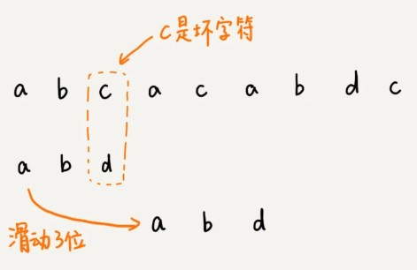
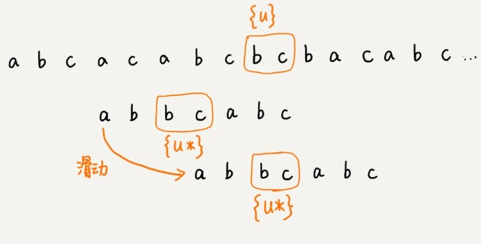

1. **坏字符规则**

按照从后向前的顺序匹配模式串与主串字符;

把匹配过程遇到的主串中第一个匹配不上的字符称为**坏字符**(如这里的c);

这时会有两种情况:

1. 模式串不存在坏字符

直接向后滑动三位继续比较

2. 模式串存在坏字符

这次坏字符为a，拿a在模式串中从后往前查找，坏字符a在模式串从后往前数第3个位置，这次只能将模式串向后滑动两位，再尝试匹配。

总结

我们把模式串中遇到的首个不能匹配的字符下表记作si,将模式串中从后往前查找遇到的第一个与坏字符匹配的字符下标记作xi(若不存在xi=-1)

也就是说坏字符在模式串里多处出现，那我们在计算 xi 的时候，选择最靠后的那个，也就是**在模式串中从后往前匹配上坏字符的第一个字符下标**,这样不会让模式串滑动过多，导致本来可能匹配的情况被滑动略过。

但存在一个**问题**，因为根据 si-xi 计算出来的移动位数，有可能是负数，比如主串是 aaaaaaaaaaaaaaaa，模式串是 baaa（si=0，坏字符a匹配到模式串末尾第一个字符xi=3）。

所以，BM 算法还需要用到“好后缀规则”。

2. **好后缀规则**

当模式串滑动到图中的位置的时候，模式串和主串有 2 个字符是匹配的，倒数第 3 个字符发生了不匹配的情况。

把已经匹配的 bc 叫作好后缀，记作{u}。我们拿它在模式串中查找，如果找到了另一个跟{u}相匹配的子串{u\*}，那我们就将模式串滑动到子串{u\*}与主串中{u}对齐的位置。

如果在模式串中找不到另一个等于{u}的子串，我们就尝试直接将模式串，滑动到主串中{u}的后面，

不过，这里存在一个问题。

这里面 bc 是好后缀，尽管在模式串中没有另外一个相匹配的子串{u*}，但是如果我们将模式串移动到好后缀的后面，如图所示，那就会错过模式串和主串可以匹配的情况。

所以,我们还要考察好后缀的后缀子串，是否存在跟模式串的前缀子串匹配的。

我们可以分别计算好后缀和坏字符往后滑动的位数，然后**取两个数中最大**的，作为**模式串往后滑动的位数**。

思考:直接能否通过筛选si小于xi,我们能否继续向前查找筛选一个si大于xi的字符下标进行滑动?