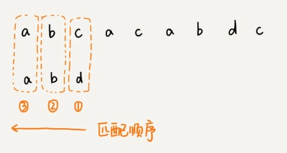
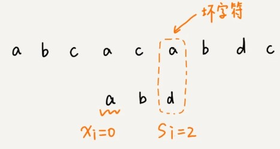
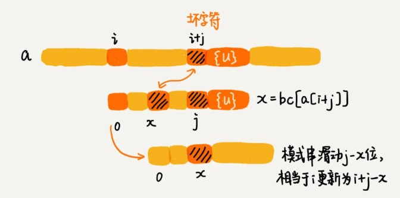
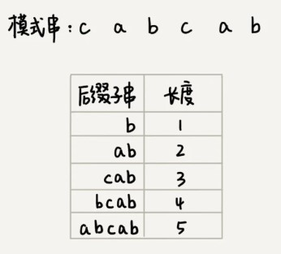
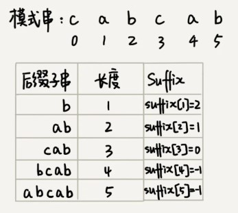
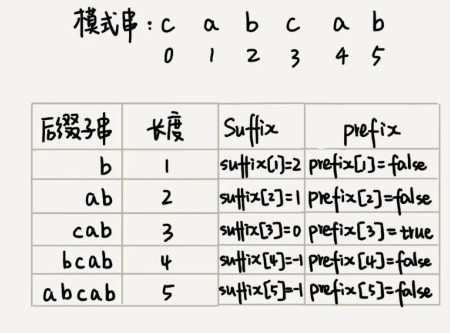

1. **坏字符规则**



按照从后向前的顺序匹配模式串与主串字符;

把匹配过程遇到的主串中第一个匹配不上的字符称为**坏字符**(如这里的c);


这时会有两种情况:

1. 模式串不存在坏字符


直接向后滑动三位继续比较

2. 模式串存在坏字符


这次坏字符为a，拿a在模式串中从后往前查找，坏字符a在模式串从后往前数第3个位置，这次只能将模式串向后滑动两位，再尝试匹配。

总结



我们把模式串中遇到的首个不能匹配的字符下表记作si,将模式串中从后往前查找遇到的第一个与坏字符匹配的字符下标记作xi(若不存在xi=-1)

也就是说坏字符在模式串里多处出现，那我们在计算 xi 的时候，选择最靠后的那个，也就是**在模式串中从后往前匹配上坏字符的第一个字符下标**,这样不会让模式串滑动过多，导致本来可能匹配的情况被滑动略过。

但存在一个**问题**，因为根据 si-xi 计算出来的移动位数，有可能是负数，比如主串是 aaaaaaaaaaaaaaaa，模式串是 baaa（si=0，坏字符a匹配到模式串末尾第一个字符xi=3）。

所以，BM 算法还需要用到“好后缀规则”。

2. **好后缀规则**


当模式串滑动到图中的位置的时候，模式串和主串有 2 个字符是匹配的，倒数第 3 个字符发生了不匹配的情况。

把已经匹配的 bc 叫作好后缀，记作{u}。我们拿它在模式串中查找，如果找到了另一个跟{u}相匹配的子串{u\*}，那我们就将模式串滑动到子串{u\*}与主串中{u}对齐的位置。


如果在模式串中找不到另一个等于{u}的子串，我们就尝试直接将模式串，滑动到主串中{u}的后面，

不过，这里存在一个问题。

这里面 bc 是好后缀，尽管在模式串中没有另外一个相匹配的子串{u*}，但是如果我们将模式串移动到好后缀的后面，如图所示，那就会错过模式串和主串可以匹配的情况。


所以,我们还要考察好后缀的后缀子串，是否存在跟模式串的前缀子串匹配的。

我们可以分别计算好后缀和坏字符往后滑动的位数，然后**取两个数中最大**的，作为**模式串往后滑动的位数**。


思考:直接能否通过筛选si小于xi,我们能否继续向前查找筛选一个si大于xi的字符下标进行滑动?

### 代码实现

#### 坏字符实现

假设字符集不大,每个字符长度为一字节.我们可以运用散列表,创建一个大小256的数组(bc),下标为对应字符ascll码,如字符a的ascll码是97,遍历模式串,找到a在模式串最后出现的位置为3号位,将这个位置记录下来,bc[97]=3,一次类推,记录模式串所有字符最后出现的位置.


```
private static final int SIZE = 256; 
private void generateBC(char[] b, int m, int[] bc) {//b 是模式串，m 是模式串的长度
  for (int i = 0; i < SIZE; ++i) {
    bc[i] = -1; // 初始化bc
  }
  for (int i = 0; i < m; ++i) {
    int ascii = (int)b[i]; // 计算b[i]的ASCII值
    bc[ascii] = i;
  }
}
```

把 BM 算法代码的大框架写好，先不考虑好后缀规则，仅用坏字符规则，并且不考虑 si-xi 计算得到的移动位数可能会出现负数的情况。

```
public int bm(char[] a, int n, char[] b, int m) {//n为主串长度，m为模式串长度，a为主串，b为模式串
  int[] bc = new int[SIZE];
  generateBC(b, m, bc); // 构建坏字符散列表
  int i = 0; // i表示当前模式串与主串对齐的第一个字符的下标位置（如开始时模式串首字母对齐主串第一个字母，也就是在主串下标为0的位置，然后模式串逐渐往后移动）
  while (i <= n - m) {//模式串从与主串头部对齐开始，进行匹配
    int j;
    for (j = m - 1; j >= 0; --j) { // 模式串从后往前匹配
      if (a[i+j] != b[j]) break; // 匹配到坏字符,在模式串中的下标是j
    }
    if (j < 0) {
      return i; // 匹配成功，返回主串与模式串第一个匹配的字符的位置
    }
    //i是当前模式串首字符,对齐主串对应字符的下标,j是模式串最后匹配失败的字符下标,所以a[i+j]等价于主串坏字符下标,散列表查询坏字符在模式串中最后出现的位置，即bc[(int)a[i+j]]，将模式串往后滑动j-bc[(int)a[i+j]]位
    i = i + (j - bc[(int)a[i+j]]); 
  }
  return -1;
}
```



#### 好后缀实现

**好后缀**的处理规则中最核心的内容：

* 在模式串中，查找跟好后缀匹配的另一个子串；
* 在好后缀的后缀子串中，查找最长的、能跟模式串前缀子串匹配的后缀子串；

想要 BM 算法的效率很高,就要预先计算好**模式串的每个后缀子串，对应的另一个可匹配子串的位置**.

因为后缀子串的最后一个字符的位置是固定的，下标为 m-1，我们只需要记录长度就可以了。通过长度，我们可以确定一个唯一的后缀子串。



引入最关键的变量 suffix 数组。suffix 数组的下标 k,对应上面的后缀子串长度,它的值表示**在模式串中跟好后缀{u}相匹配的子串{u*}的起始下标**(如这里后缀子串'ab',长度是2,对应suffix[2]位置,在模式串起始位置1能匹配上,所以suffix[2]=1,如果没匹配上就赋值-1)



有多个可匹配子串时,为了避免模式串往后滑动得过头了，我们肯定要选择模式串中最靠后的那个.

我们还要在好后缀的后缀子串中，查找最长的能跟模式串前缀子串匹配的后缀子串。

这里创建prefix 数组,记录**模式串的后缀子串是否能匹配模式串的前缀子串**



如上图,我们只需要拿模式串的后缀子串一次与前缀比较是否匹配即可.在实际使用时,假设此刻匹配上了好后缀"bcab",我们就要从prefix数组长度4的位置,查找一个比它长度更小的且能与前缀匹配的后缀子串,(**这个匹配的后缀子串同样也就是好后缀的子串**),这里我们可以看出是"cab"这个后缀子串,这时我们就要滑动模式串使其前缀对齐滑动之前前模式串后缀的这个位置.


我们把 suffix 数组和 prefix 数组的计算过程，用代码实现出来，就是下面这个样子：

```
// b表示模式串，m表示长度，suffix，prefix数组事先申请好了
private void generateGS(char[] b, int m, int[] suffix, boolean[] prefix) {
  for (int i = 0; i < m; ++i) { // 初始化
    suffix[i] = -1;
    prefix[i] = false;
  }
  for (int i = 0; i < m - 1; ++i) { //suffix匹配实现,预计算模式串的每个后缀子串，对应的另一个可匹配子串的位置
    int j = i;
    int k = 0; // 公共后缀子串长度
    while (j >= 0 && b[j] == b[m-1-k]) { 
      --j;
      ++k;
      suffix[k] = j+1; 
    }
    if (j == -1) prefix[k] = true; //该for循环完全匹配上了，则公共后缀子串也是模式串的前缀子串，
  }
}
```

我们把好后缀规则加到前面的代码框架里，就可以得到 BM 算法的完整版代码实现。

```
// a,b表示主串和模式串；n，m表示主串和模式串的长度。
public int bm(char[] a, int n, char[] b, int m) {
  int[] bc = new int[SIZE]; // 记录模式串中每个字符最后出现的位置
  generateBC(b, m, bc); // 构建坏字符哈希表
  int[] suffix = new int[m];
  boolean[] prefix = new boolean[m];
  generateGS(b, m, suffix, prefix);
  int i = 0; // j表示主串与模式串匹配的第一个字符
  while (i <= n - m) {
    int j;
    for (j = m - 1; j >= 0; --j) { // 模式串从后往前匹配
      if (a[i+j] != b[j]) break; // 坏字符对应模式串中的下标是j
    }
    if (j < 0) {
      return i; // 匹配成功，返回主串与模式串第一个匹配的字符的位置
    }
    int x = j - bc[(int)a[i+j]];//坏字符计算出的滑动位数
    int y = 0;//好后缀计算的滑动位数
    if (j < m-1) { // 如果有好后缀的话
      y = moveByGS(j, m, suffix, prefix);
    }
    i = i + Math.max(x, y);//好后缀，坏字符两者取大的那个值，向后滑动
  }
  return -1;
}

// j表示坏字符对应的模式串中的字符下标; m表示模式串长度
private int moveByGS(int j, int m, int[] suffix, boolean[] prefix) {
  int k = m - 1 - j; // 好后缀长度
  if (suffix[k] != -1) return j - suffix[k] +1;
  for (int r = j+2; r <= m-1; ++r) {
    if (prefix[m-r] == true) {
      return r;
    }
  }
  return m;
}
```

