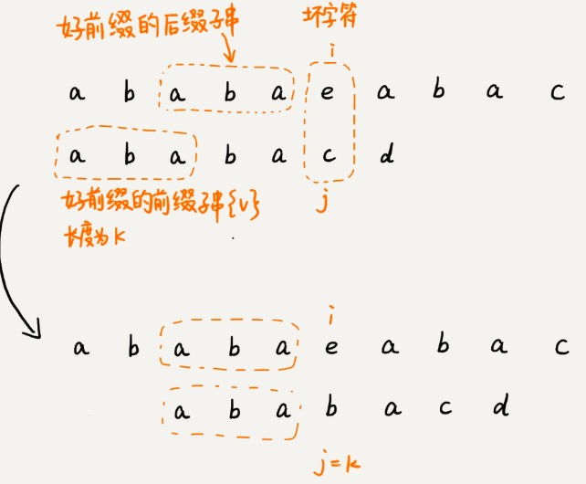
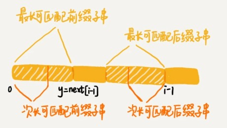

# 字符串匹配KMP算法

BM 算法，尽管它很复杂，也不好理解，但却是工程中非常常用的一种高效字符串匹配算法。有统计说，它是最高效、最常用的字符串匹配算法。不过，在所有的字符串匹配算法里，要说最知名的一种的话，那就非 KMP 算法莫属。

尽管在实际的开发中，我们几乎不大可能自己亲手实现一个 KMP 算法。但是，学习这个算法的思想，作为让你开拓眼界、锻炼下逻辑思维，也是极好的，所以我觉得有必要拿出来给你讲一讲。不过，KMP 算法是出了名的不好懂。我会尽力把它讲清楚，但是你自己也要多动动脑子。

KMP 算法是根据三位作者（D.E.Knuth，J.H.Morris 和 V.R.Pratt）的名字来命名的，算法的全称是 Knuth Morris Pratt 算法，简称为 KMP 算法。

### KMP 算法基本原理

与BM 算法非常相近,我们假设主串是 a，模式串是 b。在模式串与主串匹配的过程中，当遇到不可匹配的字符的时候，我们希望找到一些规律，可以将模式串往后多滑动几位，跳过那些肯定不会匹配的情况。

在模式串和主串匹配的过程中，把不能匹配的那个字符仍然叫作**坏字符**，把已经匹配的那段字符串叫作**好前缀**。


当遇到坏字符的时候，我们就要把模式串往后滑动，在滑动的过程中，只要模式串和好前缀有上下重合，前面几个字符的比较，就相当于拿好前缀的后缀子串，跟模式串的前缀子串在比较。这个比较的过程能否更高效了呢？可以不用一个字符一个字符地比较了吗？


KMP 算法就是在试图寻找一种规律：在模式串和主串匹配的过程中，当遇到坏字符后，对于已经比对过的好前缀，能否找到一种规律，将模式串一次性滑动很多位？

我们只需要拿好前缀本身，在它的后缀子串中，查找最长的那个可以跟好前缀的前缀子串匹配的。假设最长的可匹配的那部分前缀子串是{v}，长度是 k。我们把模式串一次性往后滑动 j-k 位，相当于，每次遇到坏字符的时候，我们就把 j 更新为 k，i 不变，然后继续比较。



为了表述起来方便，我把好前缀的所有后缀子串中，最长的可匹配前缀子串的那个后缀子串，叫作最长可匹配后缀子串；对应的前缀子串，叫作最长可匹配前缀子串。


如何来求好前缀的最长可匹配前缀和后缀子串呢？我发现，这个问题其实不涉及主串，只需要通过模式串本身就能求解。所以，我就在想，能不能事先预处理计算好，在模式串和主串匹配的过程中，直接拿过来就用呢？

类似 BM 算法中的 bc、suffix、prefix 数组，KMP 算法也可以提前构建一个数组，用来存储模式串中每个前缀的最长可匹配前缀子串的结尾字符下标。我们把这个数组定义为 next 数组，很多书中还给这个数组起了一个名字，叫失效函数（failure function）。

数组的下标是每个前缀结尾字符下标，数组的值是这个前缀的最长(与前缀的后缀子串)可以匹配前缀子串的结尾字符下标。如下图，数组下标为4的模式串前缀（ababa）,最长可匹配后缀子串为aba，可以匹配前缀子串aba，所以得到结尾下标为2.


有了 next 数组，我们很容易就可以实现 KMP 算法了。我先假设 next 数组已经计算好了，先给出 KMP 算法的框架代码。

```
// a, b分别是主串和模式串；n, m分别是主串和模式串的长度。
public static int kmp(char[] a, int n, char[] b, int m) {
  int[] next = getNexts(b, m);//计算获取next数组
  int j = 0;
  for (int i = 0; i < n; ++i) {
    while (j > 0 && a[i] != b[j]) { // 一直找到a[i]和b[j]
      j = next[j - 1] + 1;//查询模式串前后缀匹配，跳过匹配的字符进行接下来比较，等价于模式串向后滑动
    }
    if (a[i] == b[j]) {
      ++j;
    }
    if (j == m) { // 找到匹配模式串的了
      return i - m + 1;
    }
  }
  return -1;
}
```

### 失效函数计算方法

KMP 算法的基本原理讲完了，我们现在来看最复杂的部分，也就是 next 数组是如何计算出来的？

我们按照下标从小到大，依次计算 next 数组的值。当我们要计算 next[i]的时候，前面的 next[0]，next[1]，……，next[i-1]应该已经计算出来了。利用已经计算出来的 next 值，我们是否可以快速推导出 next[i]的值呢？

如图代表整个模式串，设此时预处理的假定好前缀子串为b[0,i-1]，如果 next[i-1]=k-1，也就是说，子串 b[0, k-1]是 b[0, i-1]的最长可匹配前缀子串。如果子串 b[0, k-1]的下一个字符 b[k]，与 b[0, i-1]的下一个字符 b[i]匹配，那子串 b[0, k]就是 b[0, i]的最长可匹配前缀子串。所以，next[i]等于 k。但是，如果 b[0, k-1]的下一字符 b[k]跟 b[0, i-1]的下一个字符 b[i]不相等呢？这个时候就不能简单地通过 next[i-1]得到 next[i]了。


我们假设 b[0, i]的最长可匹配后缀子串是 b[r, i]。如果我们把最后一个字符去掉，那 b[r, i-1]肯定是 b[0, i-1]的可匹配后缀子串，但不一定是最长可匹配后缀子串（如:abaabab,去掉结尾b，可匹配前后缀反倒变长了）；也就是说， b[0, i-1]最长可匹配后缀子串对应的模式串的前缀子串的下一个字符并不等于 b[i]，那么我们就可以考察 b[0, i-1]的次长可匹配后缀子串 b[x, i-1]对应的可匹配前缀子串 b[0, i-1-x]的下一个字符 b[i-x]是否等于 b[i]。如果等于，那 b[x, i]就是 b[0, i]的最长可匹配后缀子串。


可是，如何求得 b[0, i-1]的次长可匹配后缀子串呢？次长可匹配后缀子串肯定被包含在最长可匹配后缀子串中，而最长可匹配后缀子串又对应最长可匹配前缀子串 b[0, y]。于是，查找 b[0, i-1]的次长可匹配后缀子串，这个问题就变成，查找 b[0, y]的最长匹配后缀子串的问题了。**如**，此时b[0,i-1]为"ababa",最长可匹配**前缀子串**，**后缀子串**均为"aba"，那么要找到次长可匹配后缀字串，只需要查找“aba”的最长可匹配前后缀子串，这里就是“a”；



按照这个思路，我们可以考察完所有的 b[0, i-1]的可匹配后缀子串 b[y, i-1]，直到找到一个可匹配的后缀子串，它对应的前缀子串的下一个字符等于 b[i]，那这个 b[y, i]就是 b[0, i]的最长可匹配后缀子串。

```
// b表示模式串，m表示模式串的长度
private static int[] getNexts(char[] b, int m) {
  int[] next = new int[m];
  next[0] = -1;
  int k = -1;
  for (int i = 1; i < m; ++i) {
    while (k != -1 && b[k + 1] != b[i]) {//（1）
      k = next[k];
    }
    if (b[k + 1] == b[i]) {//（2）
      ++k;
    }
    next[i] = k;//当前可选前缀长度下，最长可匹配前缀结尾下标值（-1表示不存在）
  }
  return next;
}
```

从模式串（ababacd）中依次递增取候选好前缀，每轮循环增加一位好前缀候选进行匹配；

首轮for循环比较时直接取的两位前缀候选，跳过了while循环，也就是b【0】跟b【1】比较，由于不相等k就不会自加1，这里next【1】=-1；

i=2时，k=-1参考上面模式串取aba，从最短的前后缀逐渐累加进行匹配（直到找到最长可匹配前缀），第一轮while匹配的前后缀都为a，跳出while，++k；next【2】=0；

i=3时，k=0，模式串取前四位为可选前缀（abab），进入循环（1），k！=-1，表示上一轮循环有可用的匹配前缀子串，且此时k表示这个可用前缀子串结尾的下标，直接判定b【k+1】！=b【i】，也就是b【1】！=b【3】，但这里是相等的，跳出while循环，++k,(k=1)，next【i(3)】=k(1)；这里按照正常逻辑应该先比较最短的前后缀，也就是b【0】与b【3】，但由于k！=-1，**表示上一轮for循环存在可匹配前后缀**，所以这一轮先直接拿上一轮的匹配前缀末端的下标k之后的字母b[1]，与增加一位的候选好前缀的末端字母,b[3] 开始进行尝试匹配，如果相等，就等于找到了新的更长的可匹配前缀。

i=4时，k=1，模式串取前四位为可选前缀（ababa），进入循环（1），k！=-1，表示上一轮循环有可用的匹配前缀子串，且此时k表示这个可用前缀子串结尾的下标，直接判定b【k+1】！=b【i】，也就是b【2】！=b【4】，但这里是相等的，跳出while循环，++k,(k=2)，next【i(=4)】=k(=2)；这里按照正常逻辑应该先比较最短的前后缀，也就是b【0】与b【4】，但由于k！=-1，**表示上一轮for循环存在可匹配前后缀**，所以这一轮先直接拿上一轮的匹配前缀末端的下标k之后的字母b[2]，与增加一位的候选好前缀的末端字母 ,b[4]开始进行尝试匹配，如果相等，就等于找到了新的更长的可匹配前缀。

i=5时，k=2，模式串取前四位为可选前缀（ababac），进入循环（1），k！=-1，表示上一轮循环有可用的匹配前缀子串，且此时k表示这个可用前缀子串结尾的下标，直接判定b【k+1】！=b【i】，也就是b【3】！=b【5】，这里是不相等的，则选择查找“i-1”轮的次长可匹配前缀子串，因为此时k=2，表示的是上一轮（i-1轮）候选好前缀预处理得到的最长可匹配前缀子串的下标，所以取k=next[k(=2)]，即表示上一轮（i-1轮）的次长可匹配前缀子串结束下标，如果b【k+1】！=b【i】继续循环查找，如果b【k+1】==b【i】，则表示找到当前轮候选好前缀的最长可匹配子串。
