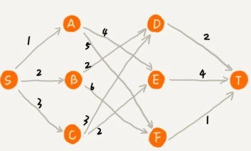
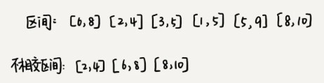
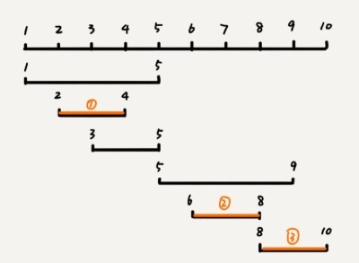
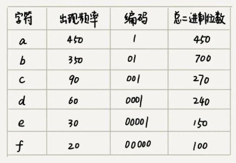
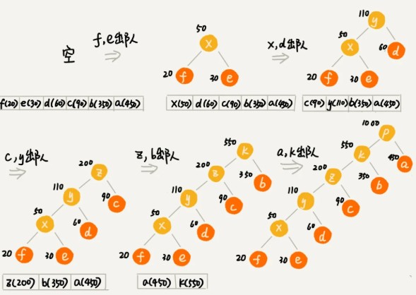
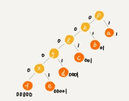
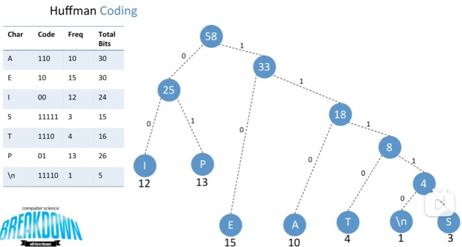

# 贪心算法(如何用贪心算法实现Huffman压缩编码)

贪心算法有很多经典的应用，比如霍夫曼编码（Huffman Coding）、Prim 和 Kruskal 最小生成树算法、还有 Dijkstra 单源最短路径算法。最小生成树算法和最短路径算法我们后面会讲到，所以我们今天讲下霍夫曼编码，看看它是如何利用贪心算法来实现对数据压缩编码，有效节省数据存储空间的。

举一个例子.在一个有权图中，S点到T点之间每条连线代表不同路径，连线上数字代表路径不同长度（权值），我们从顶点 S 开始，找一条到顶点 T 的最短路径（路径中边的权值和最小）。贪心算法的解决思路是，每次都选择一条跟当前顶点相连的权最小的边，直到找到顶点 T。按照这种思路，我们求出的最短路径是 S->A->E->T，路径长度是 1+4+4=9。

但是，这种贪心的选择方式，最终求的路径并不是最短路径，因为路径 S->B->D->T 才是最短路径，因为这条路径的长度是 2+2+2=6。为什么贪心算法在这个问题上不工作了呢？

在这个问题上，贪心算法不工作的主要原因是，前面的选择，会影响后面的选择。如果我们第一步从顶点 S 走到顶点 A，那接下来面对的顶点和边，跟第一步从顶点 S 走到顶点 B，是完全不同的。所以，即便我们第一步选择最优的走法（边最短），但有可能因为这一步选择，导致后面每一步的选择都很糟糕，最终也就无缘全局最优解了。（只选当前对自己最有利的条件 没有长远思路，只看眼前，所以取名为贪心算法，很贴切）

## 贪心算法实战分析基础版

1. 分糖果

   我们有 m 个糖果和 n 个孩子。我们现在要把糖果分给这些孩子吃，但是糖果少，孩子多（m<n），所以糖果只能分配给一部分孩子。

   每个糖果的大小不等，这 m 个糖果的大小分别是 s1，s2，s3，……，sm。除此之外，每个孩子对糖果大小的需求也是不一样的，只有糖果的大小大于等于孩子的对糖果大小的需求的时候，孩子才得到满足。假设这 n 个孩子对糖果大小的需求分别是 g1，g2，g3，……，gn。

   我的问题是，如何分配糖果，能尽可能满足最多数量的孩子？

   我们可以把这个问题抽象成，从 n 个孩子中，抽取一部分孩子分配糖果，让满足的孩子的个数（期望值）是最大的。这个问题的限制值就是糖果个数 m。

   我们现在来看看如何用贪心算法来解决。对于一个孩子来说，如果小的糖果可以满足，我们就没必要用更大的糖果，这样更大的就可以留给其他对糖果大小需求更大的孩子。另一方面，对糖果大小需求小的孩子更容易被满足，所以，我们可以从需求小的孩子开始分配糖果。因为满足一个需求大的孩子跟满足一个需求小的孩子，对我们期望值的贡献是一样的。

   我们每次从剩下的孩子中，找出对糖果大小需求最小的，然后发给他剩下的糖果中能满足他的最小的糖果，这样得到的分配方案，也就是满足的孩子个数最多的方案。

## 基本步骤总结

第一步，**当我们看到这类问题的时候，首先要联想到贪心算法**：针对一组数据，我们定义了限制值和期望值，希望从中选出几个数据，在满足限制值的情况下，期望值最大。

第二步，**我们尝试看下这个问题是否可以用贪心算法解决**：每次选择当前情况下，在对限制值消耗尽可能小的情况下，对期望值贡献最大的数据。(限制值/贡献值比值尽可能小)

比如前面分糖果的例子，我们给需求小的孩子分配对应小的糖果(限制值),跟对其分配大的糖果,对期望值的贡献一样的(都满足了一个小孩)

第三步，**我们举几个例子看下贪心算法产生的结果是否是最优的**。大部分情况下，举几个例子验证一下就可以了。严格地证明贪心算法的正确性，是非常复杂的，需要涉及比较多的数学推理。而且，从实践的角度来说，大部分能用贪心算法解决的问题，贪心算法的正确性都是显而易见的，也不需要严格的数学推导证明。

实际上，用贪心算法解决问题的思路，并不总能给出最优解。(如前面的权图最短路径规划)

## 贪心算法实战分析进阶(区间覆盖)

假设我们有 n 个区间，区间的起始端点和结束端点分别是[l1, r1]，[l2, r2]，[l3, r3]，……，[ln, rn]。我们从这 n 个区间中选出一部分区间，这部分区间满足两两不相交（端点相交的情况不算相交），最多能选出多少个区间呢？

这个问题的处理思路稍微不是那么好懂，不过，我建议你最好能弄懂，因为这个处理思想在很多贪心算法问题中都有用到，比如任务调度、教师排课等等问题。

这个问题的解决思路是这样的：我们假设这 n 个区间中最左端点是 lmin，最右端点是 rmax。这个问题就相当于，我们选择几个不相交的区间，从左到右将[lmin, rmax]覆盖上。我们按照起始端点从小到大的顺序对这 n 个区间排序。

我们每次选择的时候，左端点跟前面的已经覆盖的区间不重合的，右端点又尽量小的，这样可以让剩下的未覆盖区间尽可能的大，就可以放置更多的区间。这实际上就是一种贪心的选择方法。

## 贪心算法实现霍夫曼编码

假设我有一个包含 1000 个字符的文件，每个字符占 1 个 byte（1byte=8bits），存储这 1000 个字符就一共需要 8000bits，那有没有更加节省空间的存储方式呢？

假设我们通过统计分析发现，这 1000 个字符中只包含 6 种不同字符，假设它们分别是 a、b、c、d、e、f。而 3 个二进制位（bit）就可以表示 8 个不同的字符，所以，为了尽量减少存储空间，每个字符我们用 3 个二进制位来表示。那存储这 1000 个字符只需要 3000bits 就可以了，比原来的存储方式节省了很多空间。不过，还有没有更加节省空间的存储方式呢？

霍夫曼编码就要登场了。霍夫曼编码是一种十分有效的编码方法，广泛用于数据压缩中，其压缩率通常在 20%～90% 之间。

根据贪心的思想，我们可以把出现频率比较多的字符，用稍微短一些的编码；出现频率比较少的字符，用稍微长一些的编码。

由于霍夫曼编码是不等长的，每次应该读取 1 位还是 2 位、3 位等等来解压缩呢？这个问题就导致霍夫曼编码解压缩起来比较复杂。为了避免解压缩过程中的歧义，霍夫曼编码要求各个字符的编码之间，不会出现某个编码是另一个编码前缀的情况。

假设这 6 个字符出现的频率从高到低依次是 a、b、c、d、e、f。我们把它们编码下面这个样子，任何一个字符的编码都不是另一个的前缀，在解压缩的时候，我们每次会读取尽可能长的可解压的二进制串，所以在解压缩的时候也不会歧义。经过这种编码压缩之后，这 1000 个字符只需要 2100bits 就可以了。

尽管霍夫曼编码的思想并不难理解，但是如何根据字符出现频率的不同，给不同的字符进行不同长度的编码呢？这里的处理稍微有些技巧。

我们从队列中取出频率最小的两个节点 A(f)、B(e)，然后新建一个节点 C(x)，把频率设置为两个节点的频率之和，并把这个新节点 C 作为节点 A、B 的父节点。最后再把 C 节点放入到优先级队列中。重复这个过程，直到队列中没有数据。

最后我们给每一条边加上画一个权值，指向左子节点的边我们统统标记为 0，指向右子节点的边，我们统统标记为 1，那从根节点到叶节点的路径就是叶节点对应字符的霍夫曼编码。(只要字符都在叶子节点,就能避免某一编码是另一个编码的前缀)

上面给出的例子过于简单了,我们不妨来看看下面的例子

当18入队的时候,要排在队列12,13之后,导致下次出队的是12,13,新建根节点25(入队),然后15,18出队,新建根节点33(入队),最后25,33出队...

### 总结

霍夫曼编码的本质其实就是,只利用每个叶子节点来对应每个字符,这样就能保证每条路径到叶子节点,途中都不会经过其他字符节点,也就是说,每个字符路径都不会是另一个字符路径的前缀!!!这样在压缩编码时就不会产生歧义~
