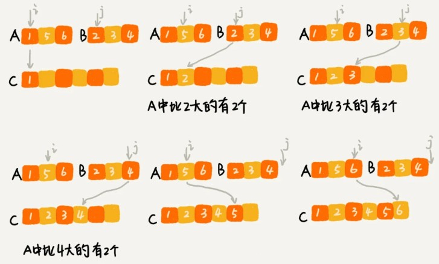

分治算法（divide and conquer）的核心思想其实就是四个字，分而治之 ，也就是将原问题划分成 n 个规模较小，并且结构与原问题相似的子问题，递归地解决这些子问题，然后再合并其结果，就得到原问题的解。

这个定义看起来有点类似递归的定义。关于分治和递归的区别，我们在排序（下）的时候讲过，分治算法是一种处理问题的思想，递归是一种编程技巧。实际上，分治算法一般都比较适合用递归来实现。分治算法的递归实现中，每一层递归都会涉及这样三个操作：

* 分解：将原问题分解成一系列子问题；
* 解决：递归地求解各个子问题，若子问题足够小，则直接求解；
* 合并：将子问题的结果合并成原问题。

分治算法能解决的问题，一般需要满足下面这几个条件：

* 原问题与分解成的小问题具有相同的模式；
* 原问题分解成的子问题可以独立求解，子问题之间没有相关性，这一点是分治算法跟动态规划的明显区别，等我们讲到动态规划的时候，会详细对比这两种算法；
* 具有分解终止条件，也就是说，当问题足够小时，可以直接求解；
* 可以将子问题合并成原问题，而这个合并操作的复杂度不能太高，否则就起不到减小算法总体复杂度的效果了。

###  分治算法应用举例分析

首先我们需要回忆排序算法里讲的数据的有序度、逆序度的概念(排序第一章节).我们用有序度来表示一组数据的有序程度，用逆序度表示一组数据的无序程度.

假设我们有 n 个数据，我们期望数据从小到大排列，那完全有序的数据的有序度就是 n(n-1)/2，逆序度等于 0；相反，倒序排列的数据的有序度就是 0，逆序度是 n(n-1)/2。除了这两种极端情况外，我们通过计算有序对或者逆序对的个数，来表示数据的有序度或逆序度。

**如何编程求出一组数据的有序对个数或者逆序对个数呢**？

笨的方法是，拿每个数字跟它后面的数字比较，看有几个比它小的。

不过，这样操作的时间复杂度是 O(n^2),效率很低。

我们套用分治的思想来求数组 A 的逆序对个数。我们可以将数组分成前后两半 A1 和 A2，分别计算 A1 和 A2 的逆序对个数 K1 和 K2，然后再计算 A1 与 A2 之间的逆序对个数 K3。那数组 A 的逆序对个数就等于 K1+K2+K3。

如何快速计算出两个子问题 A1 与 A2 之间的逆序对个数呢？这里就要借助归并排序算法.

归并排序中有一个非常关键的操作，就是将两个有序的小数组，合并成一个有序的大数组。在这个合并的过程中，我们就可以计算这两个小数组的逆序对个数了。每次合并操作，我们都计算逆序对个数，把这些计算出来的逆序对个数求和，就是这个数组的逆序对个数了。



两个有序小数组AB,都从下标0(i=0,j=0)开始比较,较小的数添加到C,下标+1,如碰上A[i]>B[j]的,根据当前下标位置记录逆序数(如第二步A中5大于B中2,因为是有序小数组,所以A后面的数都大于2,根据下标和数组大小就能之前得到A比2大的数有2个),以此类推...

也许你会问,AB为什么是排好顺序的,这还符合题目求逆序数的要求吗?

但实际上,这是一个递归操作,实际上AB数组也是分为两个更小的数组比较排序后合并来的,这是时候就以及记录了他们之间的逆序数并进行了排序,此图仅仅是展现了归并的其中一步罢了.

具体过程请参照下面的代码:

```
private int num = 0; // 全局变量或者成员变量

public int count(int[] a, int n) {
  num = 0;
  mergeSortCounting(a, 0, n-1);
  return num;
}

//假设此时p=0,r=2
private void mergeSortCounting(int[] a, int p, int r) {
  if (p >= r) return;
  int q = (p+r)/2;
  mergeSortCounting(a, p, q);//求0-1
  mergeSortCounting(a, q+1, r);//求2-2,执行会在第一句话直接返回
  merge(a, p, q, r);//比较记录他们之间的逆序数,并排序
}

private void merge(int[] a, int p, int q, int r) {
  int i = p, j = q+1, k = 0;
  int[] tmp = new int[r-p+1];
  while (i<=q && j<=r) {
    if (a[i] <= a[j]) {
      tmp[k++] = a[i++];
    } else {
      num += (q-i+1); // 统计p-q之间，比a[j]大的元素个数
      tmp[k++] = a[j++];
    }
  }
  while (i <= q) { // 处理剩下的
    tmp[k++] = a[i++];
  }
  while (j <= r) { // 处理剩下的
    tmp[k++] = a[j++];
  }
  for (i = 0; i <= r-p; ++i) { // 从tmp拷贝回a
    a[p+i] = tmp[i];
  }
}
```

### 分治思想在海量数据处理中的应用

分治算法思想的应用是非常广泛的，并不仅限于指导编程和算法设计。它还经常用在海量数据处理的场景中。我们前面讲的数据结构和算法，大部分都是基于内存存储和单机处理。但是，如果要处理的数据量非常大，没法一次性放到内存中，这个时候，这些数据结构和算法就无法工作了。

比如，给 10GB 的订单文件按照金额排序这样一个需求，看似是一个简单的排序问题，但是因为数据量大，有 10GB，而我们的机器的内存可能只有 2、3GB 这样子，无法一次性加载到内存，也就无法通过单纯地使用快排、归并等基础算法来解决了。

要解决这种数据量大到内存装不下的问题，我们就可以利用分治的思想。我们可以将海量的数据集合根据某种方法，划分为几个小的数据集合，每个小的数据集合单独加载到内存来解决，然后再将小数据集合合并成大数据集合。实际上，利用这种分治的处理思路，不仅仅能克服内存的限制，还能利用多线程或者多机处理，加快处理的速度。

比如刚刚举的那个例子，给 10GB 的订单排序，我们就可以先扫描一遍订单，根据订单的金额，将 10GB 的文件划分为几个金额区间。比如订单金额为 1 到 100 元的放到一个小文件，101 到 200 之间的放到另一个文件，以此类推。这样每个小文件都可以单独加载到内存排序，最后将这些有序的小文件合并，就是最终有序的 10GB 订单数据了。

们刚刚举的订单的例子，数据有 10GB 大小，可能给你的感受还不强烈。那如果我们要处理的数据是 1T、10T、100T 这样子的，那一台机器处理的效率肯定是非常低的。而对于谷歌搜索引擎来说，网页爬取、清洗、分析、分词、计算权重、倒排索引等等各个环节中，都会面对如此海量的数据（比如网页）。所以，利用集群并行处理显然是大势所趋。

一台机器过于低效，那我们就把任务拆分到多台机器上来处理。如果拆分之后的小任务之间互不干扰，独立计算，最后再将结果合并。这不就是分治思想吗？

实际上，MapReduce 框架只是一个任务调度器，底层依赖 GFS 来存储数据，依赖 Borg 管理机器。它从 GFS 中拿数据，交给 Borg 中的机器执行，并且时刻监控机器执行的进度，一旦出现机器宕机、进度卡壳等，就重新从 Borg 中调度一台机器执行。

尽管 MapReduce 的模型非常简单，但是在 Google 内部应用非常广泛。它除了可以用来处理这种数据与数据之间存在关系的任务，比如 MapReduce 的经典例子，统计文件中单词出现的频率。除此之外，它还可以用来处理数据与数据之间没有关系的任务，比如对网页分析、分词等，每个网页可以独立的分析、分词，而这两个网页之间并没有关系。网页几十亿、上百亿，如果单机处理，效率低下，我们就可以利用 MapReduce 提供的高可靠、高性能、高容错的并行计算框架，并行地处理这几十亿、上百亿的网页。