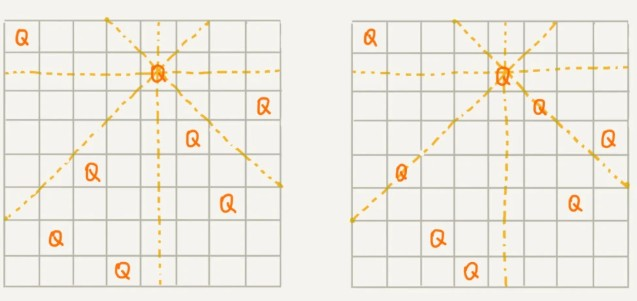

前面提到过,深度优先搜索算法利用的是回溯算法思想。这个算法思想非常简单，但是应用却非常广泛。它除了用来指导像深度优先搜索这种经典的算法设计之外，还可以用在很多实际的软件开发场景中，比如正则表达式匹配、编译原理中的语法分析等。

除此之外，很多经典的数学问题都可以用回溯算法解决，比如数独、八皇后、0-1 背包、图的着色、旅行商问题、全排列等等。

---

### 理解回溯算法

在我们的一生中，会遇到很多重要的岔路口。在岔路口上，每个选择都会影响我们今后的人生。有的人在每个岔路口都能做出最正确的选择，最后生活、事业都达到了一个很高的高度；而有的人一路选错，最后碌碌无为。如果人生可以量化，那如何才能在岔路口做出最正确的选择，让自己的人生“最优”呢？

回溯的处理思想，有点类似枚举搜索。我们枚举所有的解，找到满足期望的解。为了有规律地枚举所有可能的解，避免遗漏和重复，我们把问题求解的过程分为多个阶段。每个阶段，我们都会面对一个岔路口，我们先随意选一条路走，当发现这条路走不通的时候（不符合期望的解），就回退到上一个岔路口，另选一种走法继续走。

笼统地讲，回溯算法很多时候都应用在“搜索”这类问题上。不过这里说的搜索，并不是狭义的指我们前面讲过的图的搜索算法，而是在一组可能的解中，搜索满足期望的解。

现在有一个 8x8 的棋盘，希望往里放 8 个棋子（皇后），每个棋子所在的行、列、对角线都不能有另一个棋子。你可以看我画的图，第一幅图是满足条件的一种方法，第二幅图是不满足条件的。八皇后问题就是期望找到所有满足这种要求的放棋子方式。



我们把这个问题划分成 8 个阶段,首先8个棋子要在一个8x8的棋盘里不能同行同列,那么**必然每行会有一个棋子**，所以我们依次将 8 个棋子放到第一行、第二行、第三行……第八行。在放置的过程中，我们不停地检查当前放法，是否满足要求。如果满足，则跳到下一行继续放置棋子；如果不满足，那就再换一种放法，继续尝试。

回溯算法非常适合用递归代码实现，所以，我把八皇后的算法翻译成代码。我在代码里添加了详细的注释，你可以对比着看下。如果你之前没有接触过八皇后问题，建议你自己用熟悉的编程语言实现一遍，这对你理解回溯思想非常有帮助。

```
int[] result = new int[8];//全局或成员变量,下标表示行,值表示queen存储在哪一列
public void cal8queens(int row) { // 调用方式：cal8queens(0);
  if (row == 8) { // 8个棋子都放置好了，打印结果
    printQueens(result);
    return; // 8行棋子都放好了，已经没法再往下递归了，所以就return
  }
  for (int column = 0; column < 8; ++column) { // 每一行都有8中放法
    if (isOk(row, column)) { //考察是否满足要求,满足就放入
      result[row] = column; // 第row行的棋子放到了column列
      cal8queens(row+1); // 考察下一行
    }
  }
}

private boolean isOk(int row, int column) {//判断row行column列放置是否合适
  int leftup = column - 1, rightup = column + 1;
  for (int i = row-1; i >= 0; --i) { // 逐行往上考察每一行
    if (result[i] == column) return false; // 第i行的column列有棋子吗？
    if (leftup >= 0) { // 考察左上对角线：第i行leftup列有棋子吗？
      if (result[i] == leftup) return false;
    }
    if (rightup < 8) { // 考察右上对角线：第i行rightup列有棋子吗？
      if (result[i] == rightup) return false;
    }
    --leftup; ++rightup;
  }
  return true;
}

private void printQueens(int[] result) { // 打印出一个二维矩阵
  for (int row = 0; row < 8; ++row) {
    for (int column = 0; column < 8; ++column) {
      if (result[row] == column) System.out.print("Q ");
      else System.out.print("* ");
    }
    System.out.println();
  }
  System.out.println();
}
```

---

### 0-1背包案例

0-1 背包是非常经典的算法问题，很多场景都可以抽象成这个问题模型。这个问题的经典解法是动态规划，不过还有一种简单但没有那么高效的解法，那就是今天讲的回溯算法。

我们有一个背包，背包总的承载重量是 W kg。现在我们有 n 个物品，每个物品的重量不等，并且不可分割。我们现在期望选择几件物品，装载到背包中。在不超过背包所能装载重量的前提下，如何让背包中物品的总重量最大？

实际上，背包问题我们在贪心算法那一节，已经讲过一个了，不过那里讲的物品是可以分割的，我可以装某个物品的一部分到背包里面。今天讲的这个背包问题，物品是不可分割的，要么装要么不装，所以叫 0-1 背包问题。

对于每个物品来说，都有两种选择，装进背包或者不装进背包。对于 n 个物品来说，总的装法就有 2^n 种，去掉总重量超过 Wkg 的，从剩下的装法中选择总重量最接近 Wkg 的。不过，我们如何才能不重复地穷举出这 2^n 种装法呢？

我们可以把物品依次排列，整个问题就分解为了 n 个阶段，每个阶段对应一个物品怎么选择。先对第一个物品进行处理，选择装进去或者不装进去，然后再递归地处理剩下的物品。

```
public int maxW = Integer.MIN_VALUE; //存储背包中物品总重量的最大值
// cw表示当前已经装进去的物品的重量和；i表示考察到哪个物品了；
// w背包重量；items表示每个物品的重量；n表示物品个数
// 假设背包可承受重量100，物品个数10，物品重量存储在数组a中，那可以这样调用函数：
// f(0, 0, a, 10, 100)
public void f(int i, int cw, int[] items, int n, int w) {
  if (cw == w || i == n) { // cw==w表示装满了;i==n表示已经考察完所有的物品
    if (cw > maxW) maxW = cw;
    return;
  }
  f(i+1, cw, items, n, w);
  if (cw + items[i] <= w) {// 已经超过可以背包承受的重量的时候，就不要再装了
    f(i+1,cw + items[i], items, n, w);
  }
}
```

