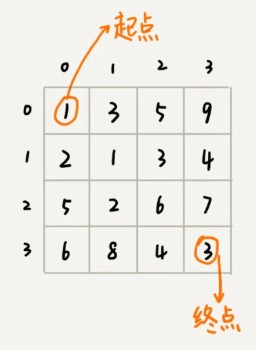
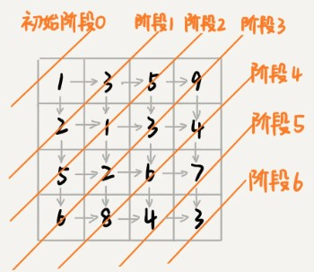
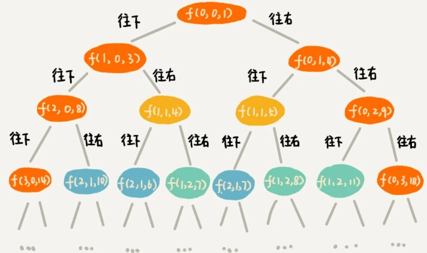
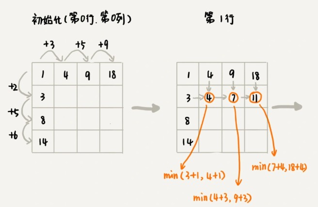
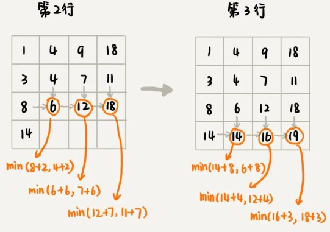

本节主要讲动态规划的一些理论知识。学完这节内容，可以帮你解决这样几个问题：什么样的问题可以用动态规划解决？解决动态规划问题的一般思考过程是什么样的？贪心、分治、回溯、动态规划这四种算法思想又有什么区别和联系？

###  “一个模型三个特征”理论讲解

什么样的问题适合用动态规划来解决呢？换句话说，动态规划能解决的问题有什么规律可循呢？实际上，动态规划作为一个非常成熟的算法思想，很多人对此已经做了非常全面的总结。我把这部分理论总结为“一个模型三个特征”。

所谓“**一个模型**”？它指的是动态规划适合解决的问题的模型。我把这个模型定义为“多阶段决策最优解模型”。

我们一般是用动态规划来解决最优问题。而解决问题的过程，需要经历多个决策阶段。每个决策阶段都对应着一组状态。然后我们寻找一组决策序列，经过这组决策序列，能够产生最终期望求解的最优值。

而“**三个特征**”,它们分别是最优子结构、无后效性和重复子问题。这三个概念比较抽象，我来逐一详细解释一下。

1. 最优子结构

   最优子结构指的是，问题的最优解包含子问题的最优解。反过来说就是，我们可以通过子问题的最优解，推导出问题的最优解。如果我们把最优子结构，对应到我们前面定义的动态规划问题模型上，那我们也可以理解为，后面阶段的状态可以通过前面阶段的状态推导出来。

2. 无后效性

   无后效性有两层含义，第一层含义是，在推导后面阶段的状态的时候，我们只关心前面阶段的状态值，不关心这个状态是怎么一步一步推导出来的。第二层含义是，某阶段状态一旦确定，就不受之后阶段的决策影响。无后效性是一个非常“宽松”的要求。只要满足前面提到的动态规划问题模型，其实基本上都会满足无后效性。

3. 重复子问题

   不同的决策序列，到达某个相同的阶段时，可能会产生重复的状态。

### 实例剖析

假设我们有一个 n 乘以 n 的矩阵 w[n] [n]。矩阵存储的都是正整数。棋子起始位置在左上角，终止位置在右下角。我们将棋子从左上角移动到右下角。每次只能向右或者向下移动一位。从左上角到右下角，会有很多不同的路径可以走。我们**把每条路径经过的数字加起来看作路径的长度**。那从左上角移动到右下角的最短路径长度是多少呢？



我们先看看，这个问题是否符合“一个模型”？

从 (0, 0) 走到 (n-1, n-1)，总共要走 2*(n-1) 步，也就对应着 2*(n-1) 个阶段。每个阶段都有向右走或者向下走两种决策，并且每个阶段都会对应一个状态集合。

我们把状态定义为 min_dist(i, j)，其中 i 表示行，j 表示列。min_dist 表达式的值表示从 (0, 0) 到达 (i, j) 的最短路径长度。所以，这个问题是一个多阶段决策最优解问题，符合动态规划的模型。



再来看，这个问题是否符合“三个特征”？

如果你自己写一下代码，画一下递归树，就会发现，递归树中有重复的节点。重复的节点表示，从左上角到节点对应的位置，有多种路线，这也能说明这个问题中存在重复子问题。如这里从节点[0] [0]到[2] [2]可以有多条路线,尽管每种走法长度不同,但根据题意只需要取最短那一条路线即可完成合并该子问题.


如果我们走到 (i, j) 这个位置，我们只能通过 (i-1, j)，(i, j-1) 这两个位置移动过来，也就是说，我们想要计算 (i, j) 位置对应的状态，只需要关心 (i-1, j)，(i, j-1) 两个位置对应的状态，并不关心棋子是通过什么样的路线到达这两个位置的。而且，我们仅仅允许往下和往右移动，不允许后退，所以，前面阶段的状态确定之后，不会被后面阶段的决策所改变，所以，这个问题符合“**无后效性**”这一特征。

刚刚定义状态的时候，我们把从起始位置 (0, 0) 到 (i, j) 的最小路径，记作 min_dist(i, j)。因为我们只能往右或往下移动，所以，我们只有可能从 (i, j-1) 或者 (i-1, j) 两个位置到达 (i, j)。也就是说，到达 (i, j) 的最短路径要么经过 (i, j-1)，要么经过 (i-1, j)，而且到达 (i, j) 的最短路径肯定包含到达这两个位置的最短路径之一。换句话说就是，min_dist(i, j) 可以通过 min_dist(i, j-1) 和 min_dist(i-1, j) 两个状态推导出来。这就说明，这个问题符合“最优子结构”。

### 两种动态规划解题思路总结

解决动态规划问题，一般总结两种思路。我把它们分别叫作，**状态转移表法**和**状态转移方程法**。

1. 状态转移表法

   一般能用动态规划解决的问题，都可以使用回溯算法的暴力搜索解决。所以，当我们拿到问题的时候，我们可以先用简单的回溯算法解决，然后定义状态，每个状态表示一个节点，然后对应画出递归树。从递归树中，我们很容易可以看出来，是否存在重复子问题，以及重复子问题是如何产生的。以此来寻找规律，看是否能用动态规划解决。

   找到重复子问题之后，接下来，我们有两种处理思路:

   第一种是直接用回溯加“备忘录”的方法，来避免重复子问题(参考上一节)。从执行效率上来讲，这跟动态规划的解决思路没有差别。

   第二种是使用动态规划的解决方法，状态转移表法。通过画出一个状态表(一般是二维)。每个状态包含三个变量，行、列、数组值。我们根据决策的先后过程，从前往后，根据递推关系，分阶段填充状态表中的每个状态。最后，我们将这个递推填表的过程，翻译成代码，就是动态规划代码了。**注意**:如果问题的状态比较复杂，需要很多变量，那对应的状态表可能是高维的，比如三维、四维。那这个时候，我们就不适合用状态转移表法来解决了.一方面是因为高维状态转移表不好画图表示，另一方面是因为人脑确实很不擅长思考高维的东西。

   现在，我们来看一下，如何套用这个状态转移表法，来解决之前那个矩阵最短路径的问题？

   首先,我们穷举所有走法，然后对比找出一个最短走法。这里可以用回溯算法这个比较有规律的穷举算法.

   回溯算法的代码实现如下:

   ```
   private int minDist = Integer.MAX_VALUE; // 全局变量或者成员变量
   // 初次调用方式：minDistBT(0, 0, 0, w, n);
   public void minDistBT(int i, int j, int dist, int[][] w, int n) {
     // 到达了n-1, n-1位置(终点)，对比记录一个最短距离
     if (i == n && j == n) {
       if (dist < minDist) minDist = dist;
       return;
     }
     if (i < n) { // 往下走，更新i=i+1, j=j
       minDistBT(i + 1, j, dist+w[i][j], w, n);
     }
     if (j < n) { // 往右走，更新i=i, j=j+1
       minDistBT(i, j+1, dist+w[i][j], w, n);
     }
   }
   ```

   接下来，我们要画出递归树，以此来寻找重复子问题

   

   一个状态（也就是一个节点）包含三个变量 (i, j, dist)，其中 i，j 分别表示行和列，dist 表示从起点到达 (i, j) 的路径长度。尽管 (i, j, dist) 不存在重复的，但是 (i, j) 重复的有很多。**对于 (i, j) 重复的节点，我们只需要选择 dist 最小的节点**，继续递归求解，其他节点就可以舍弃了。

   既然存在重复子问题，接下来尝试看下，是否可以用动态规划来解决:

   我们画出一个二维状态表，表中的行、列表示棋子所在的位置，**表中的数值表示从起点到这个位置的最短路径**。为了方便代码实现，我们按行来进行依次填充。(如 [2] [2] 格的路径值为1,我们就用上方和左边计算的累计最短路径长度与本格值相加并比较出最小值,赋值到本格 )

   

   

   代码实现:

   ```
   public int minDistDP(int[][] matrix, int n) {
     int[][] states = new int[n][n];
     int sum = 0;
     for (int j = 0; j < n; ++j) { // 初始化states的第一行数据
       sum += matrix[0][j];
       states[0][j] = sum;
     }
     sum = 0;
     for (int i = 0; i < n; ++i) { // 初始化states的第一列数据
       sum += matrix[i][0];
       states[i][0] = sum;
     }
     for (int i = 1; i < n; ++i) {
       for (int j = 1; j < n; ++j) {
         states[i][j] = 
               matrix[i][j] + Math.min(states[i][j-1], states[i-1][j]);
       }
     }
     return states[n-1][n-1];
   }
   ```

   

2. 状态转移方程法

   状态转移方程法有点类似递归的解题思路。我们需要分析，某个问题如何通过子问题来递归求解，也就是所谓的**最优子结构**。根据最优子结构，写出递归公式，也就是所谓的状态转移方程。然后根据方程实现即可.一般情况下，我们有两种代码实现方法，一种是递归加“备忘录”，另一种是迭代递推。

   最优子结构前面已经分析过了,直接给出状态转移方程

   ```
   min_dist(i, j) = w[i][j] + min(min_dist(i, j-1), min_dist(i-1, j))
   ```

   强调一下，**状态转移方程是解决动态规划的关键**。如果我们能写出状态转移方程，那动态规划问题基本上就解决一大半了，而翻译成代码非常简单。但是很多动态规划问题的状态本身就不好定义，状态转移方程也就更不好想到。

   下面我用递归加“备忘录”的方式，将状态转移方程翻译成来代码。对于另一种实现方式，跟状态转移表法的代码实现是一样的，只是思路不同。

   ```
   private int[][] matrix = 
            {{1，3，5，9}, {2，1，3，4}，{5，2，6，7}，{6，8，4，3}};
   private int n = 4;
   private int[][] mem = new int[4][4];
   public int minDist(int i, int j) { // 初始调用minDist(n-1, n-1);从终点向前回溯
     if (i == 0 && j == 0) return matrix[0][0];
     if (mem[i][j] > 0) return mem[i][j];
     int minLeft = Integer.MAX_VALUE;//记录到达该位置左边节点的最短路径(也就是之前一步)
     if (j-1 >= 0) {
       minLeft = minDist(i, j-1);
     }
     int minUp = Integer.MAX_VALUE;//记录到达该位置上边节点的最短路径(也就是之前一步)
     if (i-1 >= 0) {
       minUp = minDist(i-1, j);
     }
     
     int currMinDist = matrix[i][j] + Math.min(minLeft, minUp);
     mem[i][j] = currMinDist;
     return currMinDist;
   }
   ```

### 四种算法思想比较分析

我们已经学习了四种算法思想，贪心、分治、回溯和动态规划。

如果我们将这四种算法思想分一下类，那贪心、回溯、动态规划可以归为一类，而分治单独可以作为一类,前三个算法解决问题的模型，都可以抽象成我们今天讲的那个多阶段决策最优解模型，而分治算法解决的问题尽管大部分也是最优解问题，但是，大部分都不能抽象成多阶段决策模型。

回溯算法是个“万金油”。基本上能用的动态规划、贪心解决的问题，我们都可以用回溯算法解决。回溯算法相当于穷举搜索。穷举所有的情况，然后对比得到最优解。不过，回溯算法的时间复杂度非常高，是指数级别的，只能用来解决小规模数据的问题。对于大规模数据的问题，用回溯算法解决的执行效率就很低了。

动态规划比回溯算法高效，但是，并不是所有问题，都可以用动态规划来解决。需要满足三个特征，最优子结构、无后效性和重复子问题。在重复子问题这一点上，动态规划和分治算法的区分非常明显。分治算法要求分割成的子问题，不能有重复子问题，而动态规划正好相反，动态规划之所以高效，就是因为回溯算法实现中存在大量的重复子问题。

贪心算法实际上是动态规划算法的一种特殊情况。它解决问题起来更加高效，代码实现也更加简洁。不过，它可以解决的问题也更加有限。它能解决的问题需要满足三个条件，最优子结构、无后效性和贪心选择性（不怎么强调重复子问题）。

其中，最优子结构、无后效性跟动态规划中的无异。“贪心选择性”的意思是，通过局部最优的选择，能产生全局的最优选择。每一个阶段，我们都选择当前看起来最优的决策，所有阶段的决策完成之后，最终由这些局部最优解构成全局最优解。