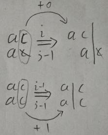

### 如何编程计算最长公共子串长度？

最长公共子串作为编辑距离中的一种，**只允许增加、删除字符两种编辑操作**。从本质上来说，它表征的也是两个字符串之间的相似程度。解决思路跟莱文斯坦距离的解决思路非常相似，也可以用动态规划解决。

首先定义状态:每个状态还是包括三个变量 (i, j, max_lcs)，max_lcs 表示 a[0...i]和 b[0...j]的最长公共子串长度。那 (i, j) 这个状态都是由哪些状态转移过来的呢？

先来看回溯的处理思路。我们从 a[0]和 b[0]开始，依次考察两个字符串中的字符是否匹配。

* 如果 a[i]与 b[j]互相匹配，我们将最大**公共子串长度加一**，并且继续考察 a[i+1]和 b[j+1]

* 如果 a[i]与 b[j]不匹配，最长公共子串长度不变，这个时候，有两个不同的决策路线:

  1.删除 a[i]，或者在 b[j]前面加上一个字符 a[i]，然后继续考察 a[i+1]和 b[j];

  2.删除 b[j]，或者在 a[i]前面加上一个字符 b[j]，然后继续考察 a[i]和 b[j+1];

  

反过来也就是说，如果我们要求 a[0...i]和 b[0...j]的最长公共长度 max_lcs(i, j)，我们只有可能通过下面三个状态转移过来：

* (i-1, j-1, max_lcs)，其中 max_lcs 表示 a[0...i-1]和 b[0...j-1]的最长公共子串长度;
* (i-1, j, max_lcs)，其中 max_lcs 表示 a[0...i-1]和 b[0...j]的最长公共子串长度;
* (i, j-1, max_lcs)，其中 max_lcs 表示 a[0...i]和 b[0...j-1]的最长公共子串长度;

以此为依据,写出状态转移方程

```
如果：a[i]==b[j]，那么：max_lcs(i, j)就等于：
max(max_lcs(i-1,j-1)+1, max_lcs(i-1, j), max_lcs(i, j-1))；

如果：a[i]!=b[j]，那么：max_lcs(i, j)就等于：
max(max_lcs(i-1,j-1), max_lcs(i-1, j), max_lcs(i, j-1))；

其中max表示求三数中的最大值。
```

这里也简单解释下,设字符串A="ac",字符串B="ac",现在我们从后往前比较,如果我们忽略了A[i],B[j]的相同字符c,而是选择走(i,j-1)决策,也就是删除B[j]的c进而考察(i,j-1),公共子串长度就不会+1,即max_lcs(i, j)=max_lcs(i, j-1);而很显然,max_lcs(i, j-1)=1=max_lcs(i, j);

如果我们匹配了A[i],B[j],公共子串就会+1,那么max_lcs(i, j)+1=max_lcs(i-1, j-1);此时max_lcs(i-1, j-1)=1;

那么显然,最后的max(max_lcs(i-1,j-1)+1, max_lcs(i-1, j), max_lcs(i, j-1)),最大值肯定是max_lcs(i-1,j-1)+1=2;



而当 a[i]!=b[j] 时,同样可以来到max_lcs(i-1,j-1),其实可以将其理解为两步,先删除B[j]来到(i,j-1),再删除A[i],来到(i-1,j-1);

其实原本的从前往后比较也是同样的思路,先比较了A[0],B[0],然后i+1只需要在计算剩下的 A[1.....i]与B[0....j]的公共子串长度亦或者j+1,亦或 i+1,j+1;

有了状态转移方程，代码实现就简单多了:

```
public int lcs(char[] a, int n, char[] b, int m) {
  int[][] maxlcs = new int[n][m];
  for (int j = 0; j < m; ++j) {//初始化第0行：a[0..0]与b[0..j]的maxlcs
    if (a[0] == b[j]) maxlcs[0][j] = 1;
    else if (j != 0) maxlcs[0][j] = maxlcs[0][j-1];
    else maxlcs[0][j] = 0;
  }
  for (int i = 0; i < n; ++i) {//初始化第0列：a[0..i]与b[0..0]的maxlcs
    if (a[i] == b[0]) maxlcs[i][0] = 1;
    else if (i != 0) maxlcs[i][0] = maxlcs[i-1][0];
    else maxlcs[i][0] = 0;
  }
  for (int i = 1; i < n; ++i) { // 填表
    for (int j = 1; j < m; ++j) {
      if (a[i] == b[j]) maxlcs[i][j] = max(
          maxlcs[i-1][j], maxlcs[i][j-1], maxlcs[i-1][j-1]+1);
      else maxlcs[i][j] = max(
          maxlcs[i-1][j], maxlcs[i][j-1], maxlcs[i-1][j-1]);
    }
  }
  return maxlcs[n-1][m-1];
}

private int max(int x, int y, int z) {
  int maxv = Integer.MIN_VALUE;
  if (x > maxv) maxv = x;
  if (y > maxv) maxv = y;
  if (z > maxv) maxv = z;
  return maxv;
}
```

