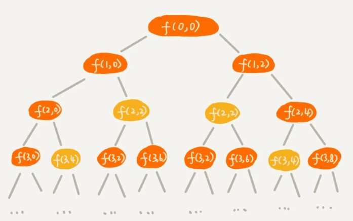
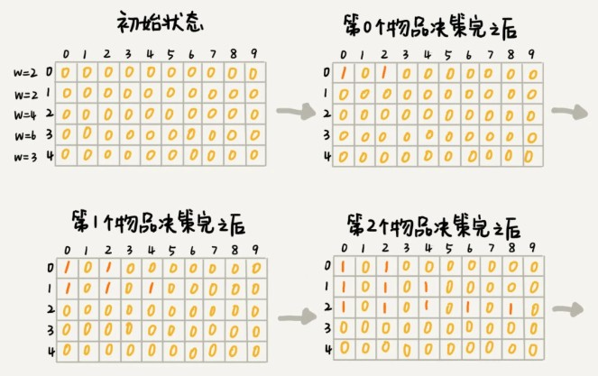
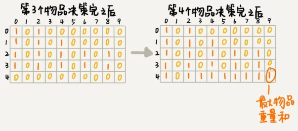
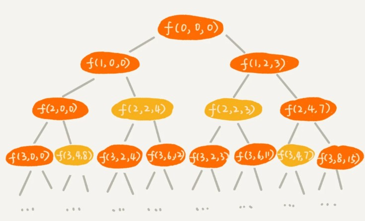

淘宝的“双十一”购物节有各种促销活动，比如“满 200 元减 50 元”。假设你女朋友的购物车中有 n 个（n>100）想买的商品，她希望从里面选几个，在凑够满减条件的前提下，让选出来的商品价格总和最大程度贴近200元整，这样就可以极大限度地“薅羊毛”。作为程序员的你，能不能编个代码来帮她搞定呢？

###  动态规划学习路线

动态规划比较适合用来求解最优问题，比如求最大值、最小值等等。它可以非常显著地降低时间复杂度，提高代码的执行效率。不过，它也是出了名的难学。它的主要学习难点跟递归类似，那就是，求解问题的过程不太符合人类常规的思维方式。

##### 0-1 背包问题

对于一组不同重量、不可分割的物品，我们需要选择一些装入背包，在满足背包最大重量限制的前提下，背包中物品总重量的最大值是多少呢？

关于这个问题，之前我们用回溯的解决方法，不过，回溯算法的复杂度比较高，是指数级别的。

那有没有什么规律可以降低复杂度呢?

现在,我们假设背包的最大承载重量是 9。我们有 5 个不同的物品，每个物品的重量分别是 2，2，4，6，3。如果我们把这个例子的回溯求解过程，用递归树画出来，就是下面这个样子：



递归树中的每个节点表示一种状态，我们用（i, cw）来表示。其中，i 表示将要决策第几个物品是否装入背包，cw 表示当前背包中物品的总重量。比如，（2，2）表示我们将要决策第 2 个物品是否装入背包，在决策前，背包中物品的总重量是 2。

从递归树中，你应该能会发现，有些子问题的求解是重复的，比如图中 f(2, 2) 和 f(3,4) 都被重复计算了两次。我们可以借助递归那一节讲的“备忘录”的解决方式，记录已经计算好的 f(i, cw)，当再次计算到重复的 f(i, cw) 的时候，可以直接从备忘录中取出来用，就不用再递归计算了，这样就可以避免冗余计算。

```
private int maxW = Integer.MIN_VALUE; // 结果放到maxW中
private int[] weight = {2，2，4，6，3};  // 物品重量
private int n = 5; // 物品个数
private int w = 9; // 背包承受的最大重量
private boolean[][] mem = new boolean[5][10]; // 备忘录，默认值false
public void f(int i, int cw) { // 调用f(0, 0)
  if (cw == w || i == n) { // cw==w表示装满了，i==n表示物品都考察完了
    if (cw > maxW) maxW = cw;
    return;
  }
  if (mem[i][cw]) return; // 重复状态
  mem[i][cw] = true; // 记录(i, cw)这个状态
  f(i+1, cw); // 选择不装第i个物品
  if (cw + weight[i] <= w) {
    f(i+1,cw + weight[i]); // 选择装第i个物品
  }
}
```

这种解决方法非常好。实际上，它已经跟动态规划的执行效率基本上没有差别。但是，多一种方法就多一种解决思路.

现在来看看**动态规划**是怎么做的:

我们把整个求解过程分为 n 个阶段，每个阶段会决策一个物品是否放到背包中。每个物品决策（放入或者不放入背包）完之后，背包中的物品的重量会有多种情况，也就是说，会达到多种不同的状态，对应到递归树中，就是有很多不同的节点。

我们把每一层重复的状态（节点）合并，只记录不同的状态，然后基于上一层的状态集合，来推导下一层的状态集合。我们可以通过合并每一层重复的状态，这样就保证每一层不同状态的个数都不会超过 w 个（w 表示背包的承载重量），也就是例子中的 9。于是，我们就成功避免了每层状态个数的指数级增长。

我们用一个二维数组 states [n] [w+1]，来记录每层可以达到的不同状态。

第 0 个（下标从 0 开始编号）物品的重量是 2，要么装入背包，要么不装入背包，决策完之后，会对应背包的两种状态，背包中物品的总重量是 0 或者 2。我们用 states[0] [0]=true 和 states [0] [2]=true 来表示这两种状态。

第 1 个物品的重量也是 2，基于之前的背包状态，在这个物品决策完之后，不同的状态有 3 个，背包中物品总重量分别是 0(0+0)，2(0+2 or 2+0)，4(2+2)。我们用 states[1] [0]=true，states[1] [2]=true，states[1] [4]=true 来表示这三种状态。

以此类推，直到考察完所有的物品后，整个 states 状态数组就都计算好了。我把整个计算的过程画了出来，你可以看看。图中 0 表示 false，1 表示 true。我们只需要在最后一层，找一个值为 true 的最接近 w（这里是 9）的值，就是背包中物品总重量的最大值。





如图,横向表示当前决策后背包总重量,纵轴表示第几步骤(初始状态最左侧标记了每步添加的物品的重量);

```
weight:物品重量，n:物品个数，w:背包可承载重量
public int knapsack(int[] weight, int n, int w) {
  boolean[][] states = new boolean[n][w+1]; // 默认值false
  states[0][0] = true;  // 第一行的数据要特殊处理，可以利用哨兵优化
  if (weight[0] <= w) {
    states[0][weight[0]] = true;
  }
  for (int i = 1; i < n; ++i) { // 动态规划状态转移
    for (int j = 0; j <= w; ++j) {// 不把第i个物品放入背包
      if (states[i-1][j] == true) states[i][j] = states[i-1][j];//检查上一步存在的结果,将其给到这一步(参照上图,每一层的1,都代表每层决策存在的结果,而本步的决策就需要在上一步(上一层)这些结果上累加)
    }
    for (int j = 0; j <= w-weight[i]; ++j) {//把第i个物品放入背包
      if (states[i-1][j]==true) states[i][j+weight[i]] = true;
    }
  }
  for (int i = w; i >= 0; --i) { // 输出结果
    if (states[n-1][i] == true) return i;
  }
  return 0;
}
```

这就是一种用动态规划解决问题的思路。我们把问题分解为多个阶段，每个阶段对应一个决策。我们记录每一个阶段可达的状态集合（去掉重复的），然后通过当前阶段的状态集合，来推导下一个阶段的状态集合，动态地往前推进。这也是动态规划这个名字的由来.

这个代码的时间复杂度非常好分析，耗时最多的部分就是代码中的两层 for 循环，所以时间复杂度是 O(n*w)。n 表示物品个数，w 表示背包可以承载的总重量。这比之前指数级的复杂度($2^n$)要好很多

为了有更加深刻的感受，来举一个例子比较一下。

我们假设有 10000 个物品，重量分布在 1 到 15000 之间，背包可以承载的总重量是 30000。如果我们用回溯算法解决，用具体的数值表示出时间复杂度，就是 $2^{10000}$，这是一个相当大的一个数字。如果我们用动态规划解决，用具体的数值表示出时间复杂度，就是 10000*30000。虽然看起来也很大，但是和$2^{10000}$比起来，要小太多了。

尽管动态规划的执行效率比较高，但是就刚刚的代码实现来说，我们需要额外申请一个 n 乘以 w+1 的二维数组，对空间的消耗比较多。所以，有时候，我们会说，**动态规划是一种空间换时间的解决思路**。

那么有方法降低空间消耗吗?

实际上，我们只需要一个大小为 w+1 的一维数组就可以解决这个问题。动态规划状态转移的过程，都可以基于这个一维数组来操作。

```
public static int knapsack2(int[] items, int n, int w) {
  boolean[] states = new boolean[w+1]; // 默认值false
  states[0] = true;  // 第一行的数据要特殊处理，可以利用哨兵优化
  if (items[0] <= w) {
    states[items[0]] = true;
  }
  for (int i = 1; i < n; ++i) { // 动态规划
    for (int j = w-items[i]; j >= 0; --j) {//把第i个物品放入背包
      if (states[j]==true) states[j+items[i]] = true;
    }
  }
  for (int i = w; i >= 0; --i) { // 输出结果
    if (states[i] == true) return i;
  }
  return 0;
}
```

主要解释下嵌套的for循环,我们遍历i个物体,尝试放入背包,尝试放入第一个物品(i=1),从w-items[i]向前遍历,直到找到一个为true的位置(表示上一次决策背包的重量),当然我们只能找到state[0]=true,因此在此基础上放入$物品_{i=1}$( states[0+items[1]] = true),现在我们的state[]就有了两个状态为true的位置(state[0]和states[0+items[1]] ),state[0]就代表这次决策没有放入物品,states[0+items[1]]表示这次决策放入了物品1(items[1]),再放入第二个物品(i=2),这次我们就能遍历到两个结果为true的状态(放入物品1和没放入物品1),再分别在两个状态上叠加第二个物品,这样就会有四种结果,分别是:

states [0] (两次都没放入物品);

states[0+items[1]] (放入第一个物品,没放入第二个物品,);

states[0+items[2]] (没放入第一个物品,放入第二个物品,);

states[0+items[1]+items[2]] (放入第一个物品,放入第二个物品,)

其中states[0+items[1]] ,states[0+items[2]]可能因为两个物品重量相等,指向同一个结果;

这就是此结构的精妙之处,注意到了吗?在下一次添加物品时,每个之前为true的状态,都代表之前的某组决策的组合,在本轮决策后,又会在所有这些之前的决策组合上,增加新的物品,更新出新的状态,而原本那些状态在本轮决策之后,既表示为了[**以前的组合与本轮决策不放入物品的组合**],也有一些表示为了[**以前的组合与本轮决策放入物品的组合**],只是由于以前的组合结果,涵盖了某些本轮决策之后的组合结果(如,[第一次添加1g重物品,第二次添加2g重物品]与[第一次不添加物品,第二次不添加物品,第三次添加3g物品],其组合的重量结果是一致的);

如此循环往复,这样整个state数组就能涵盖所有放入背包物品的组合的结果!

另外需要注意的是,我们为什么每轮决策都要从(j=w-items[i])开始向前遍历?那是因为,就算这后面的[states[j]==true],但在本轮决策添加新物品后,就超出限定的重量范围,因此结果没有意义.我们需要的组合要么重量小于w,要么等于w(毕竟背包不能超出承载的总重量)

---

### 0-1 背包问题升级版

现在加大点儿难度,现在引入物品价值这一变量。对于一组不同重量、不同价值、不可分割的物品，我们选择将某些物品装入背包，在满足背包最大重量限制的前提下，背包中可装入物品的总价值最大是多少呢？

这个问题并不复杂，依旧可以用回溯算法来解决:

```
private int maxV = Integer.MIN_VALUE; // 结果放到maxV中
private int[] items = {2，2，4，6，3};  // 物品的重量
private int[] value = {3，4，8，9，6}; // 物品的价值
private int n = 5; // 物品个数
private int w = 9; // 背包承受的最大重量
public void f(int i, int cw, int cv) { // 调用f(0, 0, 0)
  if (cw == w || i == n) { // cw==w表示装满了，i==n表示物品都考察完了
    if (cv > maxV) maxV = cv;
    return;
  }
  f(i+1, cw, cv); // 选择不装第i个物品
  if (cw + weight[i] <= w) {
    f(i+1,cw+weight[i], cv+value[i]); // 选择装第i个物品
  }
}
```

针对上面的代码，照例画出递归树。在递归树中，每个节点表示一个状态。现在我们需要 3 个变量（i, cw, cv）来表示一个状态。其中，i 表示即将要决策第 i 个物品是否装入背包，cw 表示当前背包中物品的总重量，cv 表示当前背包中物品的总价值。



我们发现，在递归树中，有几个节点的 i 和 cw 是完全相同的，比如 f(2,2,4) 和 f(2,2,3)。在背包中物品总重量一样的情况下，f(2,2,4) 这种状态对应的物品总价值更大，我们可以舍弃 f(2,2,3) 这种状态，只需要沿着 f(2,2,4) 这条决策路线继续往下决策就可以。

也就是说，对于 (i, cw) 相同的不同状态，那我们只需要保留 cv 值最大的那个，继续递归处理，其他状态不予考虑。

如果用回溯算法，这个问题就没法再用“备忘录”解决了。所以，我们就需要换一种思路，看看动态规划是不是更容易解决这个问题？

我们还是把整个求解过程分为 n 个阶段，每个阶段会决策一个物品是否放到背包中。每个阶段决策完之后，背包中的物品的总重量以及总价值，会有多种情况，也就是会达到多种不同的状态。

我们用一个二维数组 states[n] [w+1]，来记录每层可以达到的不同状态。不过这里数组存储的值不再是 boolean 类型的了，而是当前状态对应的最大总价值。我们把每一层中 (i, cw) 重复的状态（节点）合并，只记录 cv 值最大的那个状态，然后基于这些状态来推导下一层的状态。

```
public static int knapsack3(int[] weight, int[] value, int n, int w) {
  int[][] states = new int[n][w+1];
  for (int i = 0; i < n; ++i) { // 初始化states
    for (int j = 0; j < w+1; ++j) {
      states[i][j] = -1;
    }
  }
  states[0][0] = 0;
  if (weight[0] <= w) {
    states[0][weight[0]] = value[0];
  }
  for (int i = 1; i < n; ++i) { //动态规划，状态转移
    for (int j = 0; j <= w; ++j) { // 不选择第i个物品
      if (states[i-1][j] >= 0) states[i][j] = states[i-1][j];
    }
    for (int j = 0; j <= w-weight[i]; ++j) { // 选择第i个物品
      if (states[i-1][j] >= 0) {
        int v = states[i-1][j] + value[i];
        if (v > states[i][j+weight[i]]) {
          states[i][j+weight[i]] = v;
        }
      }
    }
  }
  // 找出最大值
  int maxvalue = -1;
  for (int j = 0; j <= w; ++j) {
    if (states[n-1][j] > maxvalue) maxvalue = states[n-1][j];
  }
  return maxvalue;
}
```

其时间、空间复杂度，跟上一个例子大同小异，时间复杂度是 O(n*w)，空间复杂度也是 O(n*w)。跟上一个例子类似，空间复杂度也是可以优化的，你可以自己写一下。

---

### 双11购物清单

对于这个问题，你当然可以利用回溯算法，穷举所有的排列组合，看大于等于 200 并且最接近 200 的组合是哪一个？但是，这样效率太低了点，时间复杂度非常高，是指数级的。

实际上，它跟第一个例子中讲的 0-1 背包问题很像，只不过是把“重量”换成了“价格”而已。购物车中有 n 个商品。我们针对每个商品都决策是否购买。每次决策之后，对应不同的状态集合。我们还是用一个二维数组 states[n][x]，来记录每次决策之后所有可达的状态。不过，这里的 x 值是多少呢？

0-1 背包问题中，我们找的是小于等于 w 的最大值，x 就是背包的最大承载重量 w+1。对于这个问题来说，我们要找的是大于等于 200（满减条件）的值中最小的，所以就不能设置为 200 加 1 了。就这个实际的问题而言，如果要购买的物品的总价格超过 200 太多，比如 1000，那这个羊毛“薅”得就没有太大意义了。所以，我们可以限定 x 值为 1001。

不过，这个问题不仅要求大于等于 200 的总价格中的最小的，我们还要找出这个最小总价格对应都要购买哪些商品。实际上，我们可以利用 states 数组，倒推出这个被选择的商品序列。我先把代码写出来，待会再照着代码给你解释。

```
// items商品价格，n商品个数, w表示满减条件，比如200
public static void double11advance(int[] items, int n, int w) {
  boolean[][] states = new boolean[n][3*w+1];//超过3倍就没有薅羊毛的价值了
  states[0][0] = true;  // 第一行的数据要特殊处理
  if (items[0] <= 3*w) {
    states[0][items[0]] = true;
  }
  for (int i = 1; i < n; ++i) { // 动态规划
    for (int j = 0; j <= 3*w; ++j) {// 不购买第i个商品
      if (states[i-1][j] == true) states[i][j] = states[i-1][j];
    }
    for (int j = 0; j <= 3*w-items[i]; ++j) {//购买第i个商品
      if (states[i-1][j]==true) states[i][j+items[i]] = true;
    }
  }

  int j;
  for (j = w; j < 3*w+1; ++j) { 
    if (states[n-1][j] == true) break; // 输出结果大于等于w的最小值
  }
  if (j == 3*w+1) return; // 没有可行解
  for (int i = n-1; i >= 1; --i) { // i表示二维数组中的行，j表示列
    if(j-items[i] >= 0 && states[i-1][j-items[i]] == true) {
      System.out.print(items[i] + " "); // 购买这个商品
      j = j - items[i];
    } // else 没有购买这个商品，j不变。
  }
  if (j != 0) System.out.print(items[0]);
}
```

代码的前半部分跟 0-1 背包问题没有什么不同，我们着重看后半部分，看它是如何打印出选择购买哪些商品的。

状态 (i, j) 只有可能从 (i-1, j) 或者 (i-1, j-value[i]) 两个状态推导过来。所以，我们就检查这两个状态是否是可达的，也就是 states[i-1] [j]或者 states[i-1] [j-value[i]]是否是 true。

如果 states[i-1] [j]可达，就说明我们没有选择购买第 i 个商品，如果 states[i-1] [j-value[i]]可达，那就说明我们选择了购买第 i 个商品。我们从中选择一个可达的状态（如果两个都可达，就随意选择一个），然后，继续迭代地考察其他商品是否有选择购买。

---

### 小结

目前的内容不涉及动态规划的理论，我通过两个例子，给你展示了动态规划是如何解决问题的，并且一点一点详细给你讲解了动态规划解决问题的思路。这两个例子都是非常经典的动态规划问题，只要你真正搞懂这两个问题，基本上动态规划已经入门一半了。

大部分动态规划能解决的问题，都可以通过回溯算法来解决，只不过回溯算法解决起来效率比较低，时间复杂度是指数级的。动态规划算法，在执行效率方面，要高很多。尽管执行效率提高了，但是动态规划的空间复杂度也提高了，所以，很多时候，我们会说，动态规划是一种空间换时间的算法思想。

这两个例子的分析过程，我并没有涉及任何高深的理论方面的东西。而且，我个人觉得，贪心、分治、回溯、动态规划，这四个算法思想有关的理论知识，大部分都是“后验性”的，也就是说，在解决问题的过程中，我们往往是先想到如何用某个算法思想解决问题，然后才用算法理论知识，去验证这个算法思想解决问题的正确性。所以，你大可不必过于急于寻求动态规划的理论知识。
