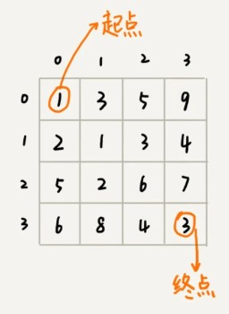
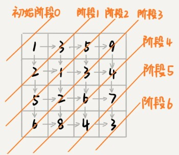
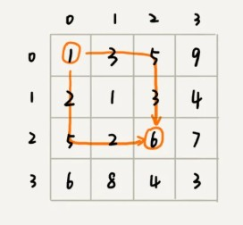

本节主要讲动态规划的一些理论知识。学完这节内容，可以帮你解决这样几个问题：什么样的问题可以用动态规划解决？解决动态规划问题的一般思考过程是什么样的？贪心、分治、回溯、动态规划这四种算法思想又有什么区别和联系？

###  “一个模型三个特征”理论讲解

什么样的问题适合用动态规划来解决呢？换句话说，动态规划能解决的问题有什么规律可循呢？实际上，动态规划作为一个非常成熟的算法思想，很多人对此已经做了非常全面的总结。我把这部分理论总结为“一个模型三个特征”。

所谓“**一个模型**”？它指的是动态规划适合解决的问题的模型。我把这个模型定义为“多阶段决策最优解模型”。

我们一般是用动态规划来解决最优问题。而解决问题的过程，需要经历多个决策阶段。每个决策阶段都对应着一组状态。然后我们寻找一组决策序列，经过这组决策序列，能够产生最终期望求解的最优值。

而“**三个特征**”,它们分别是最优子结构、无后效性和重复子问题。这三个概念比较抽象，我来逐一详细解释一下。

1. 最优子结构

   最优子结构指的是，问题的最优解包含子问题的最优解。反过来说就是，我们可以通过子问题的最优解，推导出问题的最优解。如果我们把最优子结构，对应到我们前面定义的动态规划问题模型上，那我们也可以理解为，后面阶段的状态可以通过前面阶段的状态推导出来。

2. 无后效性

   无后效性有两层含义，第一层含义是，在推导后面阶段的状态的时候，我们只关心前面阶段的状态值，不关心这个状态是怎么一步一步推导出来的。第二层含义是，某阶段状态一旦确定，就不受之后阶段的决策影响。无后效性是一个非常“宽松”的要求。只要满足前面提到的动态规划问题模型，其实基本上都会满足无后效性。

3. 重复子问题

   不同的决策序列，到达某个相同的阶段时，可能会产生重复的状态。

### 实例剖析

假设我们有一个 n 乘以 n 的矩阵 w[n][n]。矩阵存储的都是正整数。棋子起始位置在左上角，终止位置在右下角。我们将棋子从左上角移动到右下角。每次只能向右或者向下移动一位。从左上角到右下角，会有很多不同的路径可以走。我们把每条路径经过的数字加起来看作路径的长度。那从左上角移动到右下角的最短路径长度是多少呢？

我们先看看，这个问题是否符合“一个模型”？

从 (0, 0) 走到 (n-1, n-1)，总共要走 2*(n-1) 步，也就对应着 2*(n-1) 个阶段。每个阶段都有向右走或者向下走两种决策，并且每个阶段都会对应一个状态集合。

我们把状态定义为 min_dist(i, j)，其中 i 表示行，j 表示列。min_dist 表达式的值表示从 (0, 0) 到达 (i, j) 的最短路径长度。所以，这个问题是一个多阶段决策最优解问题，符合动态规划的模型。

再来看，这个问题是否符合“三个特征”？

如果你自己写一下代码，画一下递归树，就会发现，递归树中有重复的节点。重复的节点表示，从左上角到节点对应的位置，有多种路线，这也能说明这个问题中存在重复子问题。

如果我们走到 (i, j) 这个位置，我们只能通过 (i-1, j)，(i, j-1) 这两个位置移动过来，也就是说，我们想要计算 (i, j) 位置对应的状态，只需要关心 (i-1, j)，(i, j-1) 两个位置对应的状态，并不关心棋子是通过什么样的路线到达这两个位置的。而且，我们仅仅允许往下和往右移动，不允许后退，所以，前面阶段的状态确定之后，不会被后面阶段的决策所改变，所以，这个问题符合“**无后效性**”这一特征。

刚刚定义状态的时候，我们把从起始位置 (0, 0) 到 (i, j) 的最小路径，记作 min_dist(i, j)。因为我们只能往右或往下移动，所以，我们只有可能从 (i, j-1) 或者 (i-1, j) 两个位置到达 (i, j)。也就是说，到达 (i, j) 的最短路径要么经过 (i, j-1)，要么经过 (i-1, j)，而且到达 (i, j) 的最短路径肯定包含到达这两个位置的最短路径之一。换句话说就是，min_dist(i, j) 可以通过 min_dist(i, j-1) 和 min_dist(i-1, j) 两个状态推导出来。这就说明，这个问题符合“最优子结构”。

### 两种动态规划解题思路总结

解决动态规划问题，一般总结两种思路。我把它们分别叫作，状态转移表法和状态转移方程法。

1. 状态转移表法

   一般能用动态规划解决的问题，都可以使用回溯算法的暴力搜索解决。所以，当我们拿到问题的时候，我们可以先用简单的回溯算法解决，然后定义状态，每个状态表示一个节点，然后对应画出递归树。从递归树中，我们很容易可以看出来，是否存在重复子问题，以及重复子问题是如何产生的。以此来寻找规律，看是否能用动态规划解决。

   

2. 