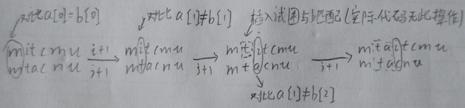
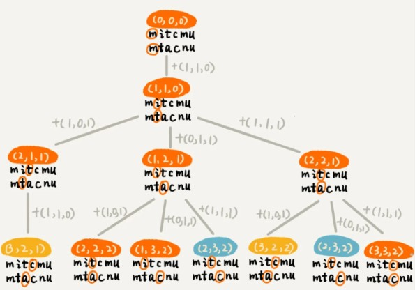
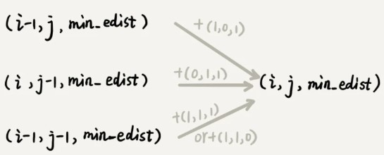
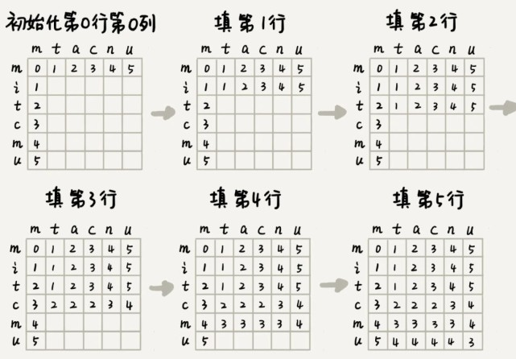

当你在搜索引擎输入搜索内容时，一不小心输错单词时，搜索引擎会非常智能地检测出你的拼写错误，并且用对应的正确单词来进行搜索.作为一名软件开发工程师，你是否想过，这个功能是怎么实现的呢？

### 量化两个字符串的相似度

计算机只认识数字,所以要量化两个字符串之间的相似程度,有一个非常著名的量化方法，那就是编辑距离（Edit Distance）。

编辑距离指的就是，将一个字符串转化成另一个字符串，需要的最少编辑操作次数（比如增加一个字符、删除一个字符、替换一个字符）。编辑距离越大，说明两个字符串的相似程度越小；

编辑距离有多种不同的计算方式.比较著名的有莱文斯坦距离（Levenshtein distance）和最长公共子串长度（Longest common substring length）。其中，莱文斯坦距离允许增加、删除、替换字符这三个操作，最长公共子串长度只允许增加、删除字符这两个操作。

两种方法从两个截然不同的角度,分析字符串相似度.莱文斯坦距离的大小，表示两个字符串差异的大小(找不同)；而最长公共子串的大小，表示两个字符串相似程度的大小(找相同)。

比如,两个字符串 mitcmu 和 mtacnu 的莱文斯坦距离是 3(删i,增a,m换n)，最长公共子串长度是 4(相似字符 m ,t,c,u)。


### 编程计算莱文斯坦距离

首先思考问题,把一个字符串变成另一个字符串，需要的最少编辑次数.整个求解过程，涉及多个决策阶段，我们需要依次考察一个字符串中的每个字符，跟另一个字符串中的字符是否匹配，匹配的话如何处理，不匹配的话又如何处理。所以，这个问题符合多阶段决策最优解模型。

前面讲了，贪心、回溯、动态规划可以解决的问题，都可以抽象成这样一个模型。要解决这个问题，我们可以先看一看，用最简单的回溯算法，该如何来解决。

回溯是一个递归处理的过程。如果 a[i]与 b[j]匹配，我们递归考察 a[i+1]和 b[j+1]。如果 a[i]与 b[j]不匹配，那我们有多种处理方式可选：

* 可以删除 a[i]，然后递归考察 a[i+1]和 b[j]；
* 可以删除 b[j]，然后递归考察 a[i]和 b[j+1];
* 可以在 a[i]前面添加一个跟 b[j]相同的字符，然后递归考察 a[i]和 b[j+1];
* 可以在 b[j]前面添加一个跟 a[i]相同的字符，然后递归考察 a[i+1]和 b[j]；
* 可以将 a[i]替换成 b[j]，或者将 b[j]替换成 a[i]，然后递归考察 a[i+1]和 b[j+1]。

注意这里的添加只是假设,在代码没有实际操作,因为我们的目的只是对比两字符串的差异程度,并不修改字符串



```
private char[] a = "mitcmu".toCharArray();
private char[] b = "mtacnu".toCharArray();
private int n = 6;
private int m = 6;
private int minDist = Integer.MAX_VALUE; // 存储结果
// 调用方式 lwstBT(0, 0, 0);
public lwstBT(int i, int j, int edist) {
  if (i == n || j == m) {//当任意一字符串索引到末尾,编辑距离要加上末尾未被考察的字符数,并对比获得最小编辑距离
    if (i < n) edist += (n-i);
    if (j < m) edist += (m - j);
    if (edist < minDist) minDist = edist;
    return;
  }
  if (a[i] == b[j]) { // 两个字符匹配
    lwstBT(i+1, j+1, edist);
  } else { // 两个字符不匹配
    lwstBT(i + 1, j, edist + 1); // 删除a[i]或者b[j]前添加一个字符
    lwstBT(i, j + 1, edist + 1); // 删除b[j]或者a[i]前添加一个字符
    lwstBT(i + 1, j + 1, edist + 1); // 将a[i]和b[j]替换为相同字符
  }
}
```

根据回溯算法的代码实现，我们可以画出递归树，看是否存在重复子问题。如果存在重复子问题，那我们就可以考虑能否用动态规划来解决；如果不存在重复子问题，那回溯就是最好的解决方法。



在递归树中，每个节点代表一个状态，状态包含三个变量 (i, j, edist)，其中，**edist 表示处理到 a[i]和 b[j]时，已经执行的编辑操作的次数,注意这是指将要处理但还并未处理a[i]和b[j]。edist并不包括对a[i]和[j]的编辑操作。**

在递归树中，(i, j) 两个变量重复的节点很多，比如 (3, 2) 和 (2, 3)。对于 (i, j) 相同的节点，我们只需要保留 edist 最小的，继续递归处理就可以了，剩下的节点都可以舍弃。所以，状态就从 (i, j, edist) 变成了 (i, j, min_edist)，其中 min_edist 表示处理到 a[i]和 b[j]，已经执行的最少编辑次数。

看到这里，你有没有觉得，这个问题跟上两节讲的动态规划例子非常相似？不过，这个问题的状态转移方式，要比之前两节课中讲到的例子都要复杂很多。上一节我们讲的矩阵最短路径问题中，到达状态 (i, j) 只能通过 (i-1, j) 或 (i, j-1) 两个状态转移过来，而今天这个问题，状态 (i, j) 可能从 (i-1, j)，(i, j-1)，(i-1, j-1) 三个状态中的任意一个转移过来。



基于刚刚的分析，我们可以尝试着将把状态转移的过程，用公式写出来。这就是我们前面讲的状态转移方程。

```
如果：a[i]!=b[j]，那么：min_edist(i, j)就等于：
min(min_edist(i-1,j)+1, min_edist(i,j-1)+1, min_edist(i-1,j-1)+1)

如果：a[i]==b[j]，那么：min_edist(i, j)就等于：
min(min_edist(i-1,j)+1, min_edist(i,j-1)+1，min_edist(i-1,j-1))

其中，min表示求三数中的最小值。     
```

**注意**:**这里的min_edist(i, j)表示的是处理完i,j时的编辑距离即包括对a[i]和b[j]的编辑操作。**!!!!!!!文章有很多上下不统一的情况,仔细辨别!!!!!!!

**补充1:**这里细想有点不太好理解(脑子转不过来的情况下),最初我的思考方式是：根据【回溯代码】实现看（因为我们最先写出的是这个算法的实现，所以肯定先从这个算法逻辑思考出发），min_edist(i, j)表示的是已经包含了(i,j)阶段这次编辑，所以a[i]!=b[j]时，这+1次的编辑次数应该算在(i,j)阶段上，所以同理，(i-1,j)阶段的编辑次数要算在(i-1,j)阶段上，但是a[i]==a[j]情况下，(i,j)阶段其实不需要+1，那就直接取上一阶段的值min_edist(i-1, j)，状态转移方程应当是min_edist(i,j)=min(min_edist(i-1,j), min_edist(i,j-1)，min_edist(i-1,j-1))啊。所以这样的思考方式让我一直认为作者文中的公式是不是写错了？

这里必须跳出这个思考方式,首先我们必须强调min_edist表示的是当前字符串已经**完全匹配**的**最小编辑**次数,如字符串a1:"ab",字符串b1:"ac",长度i=j=2,他们的最小编辑距离(只需修改b匹配c即可),min_edist(a1,b1)=1.那如果变成 字符串a2:"abc",字符串b2:"ac",长度变为i=3,j=2,因为 min_edist(a1,b1)=1,在这个编辑距离上a1,b1已经完全匹配,而a2在此基础上增加了一个字符c,所以无论如何,必须在此基础编辑次数+1,才能让a2,b2匹配(要么删除c,要么b2末尾添加c),此时min_edist(i-1,j)就是min_edist(a1,b1),min_edist(i,j)就是min_edist(a2,b2),即min_edist(i-1,j)+1=min_edist(i,j);

如果 a2:"abc",字符串b2:"acb"呢?同样在min_edist(a1,b1)的基础上,同样必然编辑次数+1(a2的c替换为b),此时min_edist(i-1,j-1)就是min_edist(a1,b1),min_edist(i,j)就是min_edist(a2,b2),即min_edist(i-1,j-1)+1=min_edist(i,j);

如果 a2:"abc",字符串b2:"acc"呢?同样在min_edist(a1,b1)的基础上,多了一对相同字符,此时就无需再次编辑,此时min_edist(i-1,j-1)就是min_edist(a1,b1),min_edist(i,j)就是min_edist(a2,b2),即a2[i]=b2[j]时,min_edist(i-1,j-1)=min_edist(i,j);

也可以看下leetcode的思考思路,其实只需要想成从字符串末尾开始匹配(a长度为i,b长度为j),if(a[i]==b[j]),那么就不需要编辑操作+1,然后来到a[i-1],b[j-1]继续比较,否则,其余情况a[i],b[j]均需要进行一步操作来完成当前阶段字符串匹配,如替换a[i]或b[j]来使其相等,然后比较a[i-1],b[j-1],或者在a[i]之后插入与b[j]相同的字符(注意这里的所有操作都是虚拟的,实际实现只是下标前移),完成匹配,然后继续比较a[i],b[j-1],其余情况以此类推,这样就能合理得到公式(https://leetcode-cn.com/problems/edit-distance/solution/bian-ji-ju-chi-by-leetcode-solution/)

其实只要仔细思考,从后往前匹配,跟从前往后匹配是一个道理,这只是为了方便写状态转移方程罢了.

```
if word1[i]==word2[j]
{
op [i] [j]=op [i-1] [j-1]
} 
else 
{op [i] [j]=1+min(op [i] [j-1],op[i-1] [j],op[i-1] [j-1])}
```


接下来画出一个二维的状态表，按行依次来填充状态表中的每个值。



这里简单解释下,[0] [0]格,表示 m与m的最小编辑距离(莱文斯坦距离),即min_edist(m,m),两对应字符相等,因此编辑距离为0,

 如[1] [0]格表示m与mi的最小编辑距离(莱文斯坦距离),即min_edist(m,mi),它只能由[0] [0]格通过i+1到达,相比[0] [0]格(也就是m,m的编辑距离 )上多出了一个i,因此编辑距离+1为1;以此类推,初始列元素分别相当于:[2] [0]为mit与m的最小编辑距离,因为即min_edist(m,mi)=1,现在多了个t,要想使其相互匹配必然需要编辑,最简单的就是删除这个t,因此编辑距离至少+1,即min_edist(m,mit)=2;[3] [0]为mitc与m的编辑距离,相比min_edist(m,mit)多了个c,需要编辑处理,因此同样需要+1,min_edist(m,mitc)=3;[4] [0]为mitcm与m的编辑距离,相比min_edist(m,mitc)有多了个m需要编辑,尽管与另一字符串首字母相同都是m,但是其是多出来的,要想m,mitcm匹配,最简单的在字符串m后面依次增加"itcm",或者将"mitcm"的"itcm"删除不管怎样最小编辑距离为4;

以此类推,初始行类似,同样为0,1,2,3,4,5;

再看[3] [1]格,表示mitc与mt的最小编辑距离(莱文斯坦距离),即min_edist(mt,mitc),可由左侧min_edist(m,mitc)+1,左上min_edist(m,mit)+1,以及上min_edist(mt,mit)+1到达,可以看出最小值为min_edist(mt,mit)+1,因此min_edist(mt,mitc)=2.

再看[3] [3]格,可以明显看出其左上min_edist(mta,mit) _(即min_edist(i-1,j-1)) 到达 min_edist(mtac,mitc) _(即min_edist(i,j))为其最小编辑距离,因为两字符串新增的相同字符c,编辑距离+0,因此min_edist(mtac,mitc)=2;

现在既有状态转移方程，又理清了完整的填表过程，代码实现就非常简单了

```
public int lwstDP(char[] a, int n, char[] b, int m) {
  int[][] minDist = new int[n][m];
  for (int j = 0; j < m; ++j) { // 初始化第0行:a[0..0]与b[0..j]的编辑距离
    if (a[0] == b[j]) minDist[0][j] = j;
    else if (j != 0) minDist[0][j] = minDist[0][j-1]+1;
    else minDist[0][j] = 1;
  }
  for (int i = 0; i < n; ++i) { // 初始化第0列:a[0..i]与b[0..0]的编辑距离
    if (a[i] == b[0]) minDist[i][0] = i;
    else if (i != 0) minDist[i][0] = minDist[i-1][0]+1;
    else minDist[i][0] = 1;
  }
  for (int i = 1; i < n; ++i) { // 按行填表
    for (int j = 1; j < m; ++j) {
      if (a[i] == b[j]) minDist[i][j] = min(
          minDist[i-1][j]+1, minDist[i][j-1]+1, minDist[i-1][j-1]);
      else minDist[i][j] = min(
          minDist[i-1][j]+1, minDist[i][j-1]+1, minDist[i-1][j-1]+1);
    }
  }
  return minDist[n-1][m-1];
}

private int min(int x, int y, int z) {
  int minv = Integer.MAX_VALUE;
  if (x < minv) minv = x;
  if (y < minv) minv = y;
  if (z < minv) minv = z;
  return minv;
}
```

你可能会说，我虽然能看懂你讲的思路，但是遇到新的问题的时候，我还是会感觉到无从下手。这种感觉是非常正常的。关于复杂算法问题的解决思路，我还有一些经验、小技巧，可以分享给你。

当我们拿到一个问题的时候，我们可以先不思考，计算机会如何实现这个问题，而是单纯考虑“人脑”会如何去解决这个问题。人脑比较倾向于思考具象化的、摸得着看得见的东西，不适合思考过于抽象的问题。所以，我们需要把抽象问题具象化。那如何具象化呢？我们可以实例化几个测试数据，通过人脑去分析具体实例的解，然后总结规律，再尝试套用学过的算法，看是否能够解决。

最后就是多练。实际上，等你做多了题目之后，自然就会有感觉，看到问题，立马就能想到能否用动态规划解决，然后直接就可以寻找最优子结构，写出动态规划方程，然后将状态转移方程翻译成代码。

---

