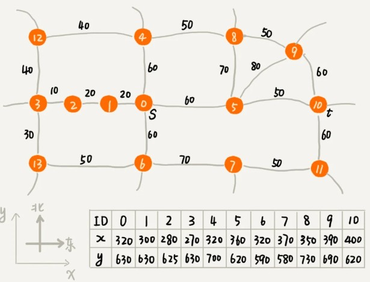
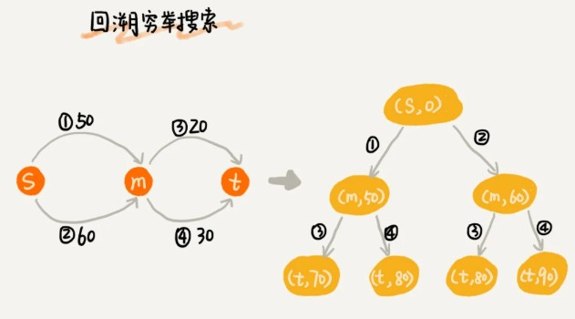
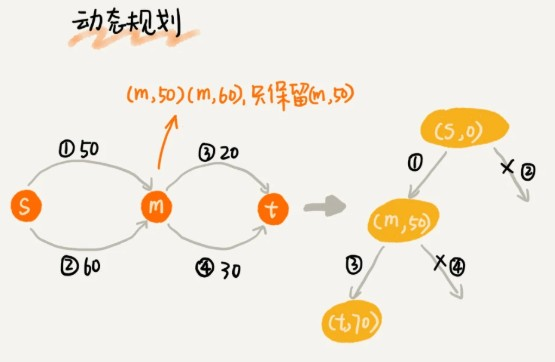

仙剑奇侠传这类 MMRPG 游戏中，有一个非常重要的功能，那就是人物角色自动寻路。当人物处于游戏地图中的某个位置的时候,用鼠标点击另外一个较远的位置,会自动地绕过障碍物走过去。

### 算法解析

游戏寻路不需要非得求最优解（也就是最短路径）。在权衡路线规划质量和执行效率的情况下，我们只需要寻求一个次优解,来保证走的路不能太绕就行。

A* 算法实际是对 Dijkstra 算法的优化和改造。你可以先温习下第 44 节中的 Dijkstra 算法的实现原理。

#### dijkstra回顾



在 Dijkstra 算法的实现思路中，我们用一个优先级队列，来记录遍历的相邻顶点以及这个顶点与起点的路径长度。顶点与起点路径长度越小，就越先被从优先级队列中取出来扩展，从图中举的例子可以看出，尽管我们找的是从 s 到 t 的路线，但是最先被搜索到的顶点依次是 1，2，3。通过肉眼来观察，这个搜索方向跟我们期望的路线方向（s 到 t 是从西向东）是反着的，路线搜索的方向明显“跑偏”了。

之所以会“跑偏”，那是因为我们是按照顶点与起点的路径长度的大小，来安排出队列顺序的。与起点越近的顶点，就会越早出队列。我们并没有考虑到这个顶点到终点的距离，所以，在地图中，尽管 1，2，3 三个顶点离起始顶点最近，但离终点却越来越远。

---

#### A*

我们可以通过这个顶点跟终点之间的直线距离，也就是**欧几里得距离**，来近似地估计这个顶点跟终点的路径长度（注意：路径长度跟直线距离是两个概念）。我们把这个距离记作 h(i)（i 表示这个顶点的编号），专业的叫法是启发函数（heuristic function）。因为欧几里得距离的计算公式，会涉及比较耗时的开根号计算，所以，我们一般通过另外一个更加简单的距离计算公式，那就是**曼哈顿距离**（Manhattan distance）。曼哈顿距离是两点之间横纵坐标的距离之和。计算的过程只涉及加减法、符号位反转，所以比欧几里得距离更加高效。

```
int hManhattan(Vertex v1, Vertex v2) { // Vertex表示顶点，后面有定义
  return Math.abs(v1.x - v2.x) + Math.abs(v1.y - v2.y);
}
```

原来只是单纯地通过顶点与起点之间的路径长度 g(i)，来判断谁先出队列，现在有了顶点到终点的路径长度估计值，我们通过两者之和 f(i)=g(i)+h(i)，来判断哪个顶点该最先出队列。综合两部分，我们就能有效避免刚刚讲的“跑偏”。这里 f(i) 的专业叫法是估价函数（evaluation function）。

其实，A* 算法就是对 Dijkstra 算法的简单改造（**请参照 44.Dijkstra章节细致理解，大部分疑问迎刃而解**）。代码实现方面，稍微改动几行代码，就能把 Dijkstra 算法改成 A* 算法。

在 A* 算法的代码实现中，顶点 Vertex 类的定义，跟 Dijkstra 算法中的定义，稍微有点儿区别，多了 x，y 坐标，以及刚刚提到的 f(i) 值。

```java
private class Vertex {
  public int id; // 顶点编号ID
  public int dist; // 从起始顶点，到这个顶点的距离，也就是g(i)
  public int f; // 新增：f(i)=g(i)+h(i)
  public int x, y; // 新增：顶点在地图中的坐标（x, y）
  public Vertex(int id, int x, int y) {
    this.id = id;
    this.x = x;
    this.y = y;
    this.f = Integer.MAX_VALUE;//初始化无穷大
    this.dist = Integer.MAX_VALUE;//初始化无穷大
  }
}
// Graph类的成员变量，在构造函数中初始化
Vertex[] vertexes = new Vertex[this.v];
// 新增一个方法，添加顶点的坐标
public void addVetex(int id, int x, int y) {
  vertexes[id] = new Vertex(id, x, y)
}
```

图 Graph 类的定义跟 Dijkstra 算法中的定义一样。

```java
public class Graph { // 有向有权图的邻接表表示
  private LinkedList<Edge> adj[]; //记录每个顶点的边 邻接表
  private int v; // 顶点个数

  public Graph(int v) {
    this.v = v;
    this.adj = new LinkedList[v];
    for (int i = 0; i < v; ++i) {
      this.adj[i] = new LinkedList<>();
    }
  }

  public void addEdge(int s, int t, int w) { // 添加一条边
    this.adj[s].add(new Edge(s, t, w));
  }

  private class Edge {
    public int sid; // 边的起始顶点编号
    public int tid; // 边的终止顶点编号
    public int w; // 权重（边长度）
    public Edge(int sid, int tid, int w) {
      this.sid = sid;
      this.tid = tid;
      this.w = w;
    }
  }
  // 下面这个类是为了dijkstra实现用的
  private class Vertex {
    public int id; // 顶点编号ID
    public int dist; // 从起始顶点到这个顶点的距离
    public Vertex(int id, int dist) {
      this.id = id;
      this.dist = dist;
    }
  }
}
```

####  首先进行初始化

* 与Dijkstra类似， 每个顶点定义一个dist字段（用于记录起始点到这个顶点的距离）
* 定义一个vertexes数组,保存所有顶点的信息。把所有顶点的 dist 都**初始化为无穷大**，新增f（dist+曼哈顿距离）初始化为无穷大。
* 起始顶点的 dist与f 值初始化为 0，然后将其放到**优先级队列**中。


A* 算法的代码实现的主要逻辑是下面这段代码。它跟 Dijkstra 算法的代码实现，主要有 3 点区别：

* 优先级队列构建的方式不同。A* 算法是根据 f 值（也就是刚刚讲到的 f(i)=g(i)+h(i)）来构建优先级队列，而 Dijkstra 算法是根据 dist 值（也就是刚刚讲到的 g(i)）来构建优先级队列；
* A* 算法在更新顶点 dist 值的时候，会同步更新 f 值；
* 循环结束的条件也不一样。Dijkstra 算法是在终点出队列的时候才结束，A* 算法是一旦遍历到终点就结束。

```java
// 因为Java提供的优先级队列（按定义的优先级排序），没有暴露更新数据的接口，所以我们需要重新实现一个
private class PriorityQueue { // 根据vertex.dist构建小顶堆
  private Vertex[] nodes;
  private int count;
  public PriorityQueue(int v) {
    this.nodes = new Vertex[v+1];
    this.count = v;
  }
  public Vertex poll() { // TODO: 留给读者实现... }
  public void add(Vertex vertex) { // TODO: 留给读者实现...}
  // 更新结点的值，并且从下往上堆化（按定义的优先级排序），重新符合堆的定义。时间复杂度O(logn)。
  public void update(Vertex vertex) { // TODO: 留给读者实现...} 
  public boolean isEmpty() { // TODO: 留给读者实现...}
}
```


```java
public void astar(int s, int t) { // 从顶点s到顶点t的路径
  int[] predecessor = new int[this.v]; // 用来还原路径
  // 按照vertex的f值构建的小顶堆，而不是按照dist
  PriorityQueue queue = new PriorityQueue(this.v);//优先级队列
  boolean[] inqueue = new boolean[this.v]; // 标记是否进入过队列
  vertexes[s].dist = 0;//起始顶点初始化为0
  vertexes[s].f = 0;
  queue.add(vertexes[s]);//加入优先级队列
  inqueue[s] = true;
  while (!queue.isEmpty()) {
    Vertex minVertex = queue.poll(); // 取堆顶元素并删除
    for (int i = 0; i < adj[minVertex.id].size(); ++i) {// 遍历顶点的边
      Edge e = adj[minVertex.id].get(i); // 取出一条minVetex相连的边
      Vertex nextVertex = vertexes[e.tid]; // minVertex-->nextVertex
      if (minVertex.dist + e.w < nextVertex.dist) { // 如果途径当前节点到next节点的dist要小于next节点保存的dist，说明有更更短的路径到next节点，更新next的dist,f（解释下这里比较为何不加曼哈顿距离，因为每个顶点的曼哈顿距离都是固定的，对比较结果没有影响）
        nextVertex.dist = minVertex.dist + e.w;
        nextVertex.f 
           = nextVertex.dist+hManhattan(nextVertex, vertexes[t]);//ji算f值
        predecessor[nextVertex.id] = minVertex.id;//记录下节点从哪个节点过来最短，可以最后逆推出路径
        if (inqueue[nextVertex.id] == true) {
          queue.update(nextVertex);
        } else {
          queue.add(nextVertex);
          inqueue[nextVertex.id] = true;
        }
      }
      if (nextVertex.id == t) { // 只要到达t就可以结束while了
        queue.clear(); // 清空queue，才能推出while循环
        break; 
      }
    }
  }
  // 输出路径
  System.out.print(s);
  print(s, t, predecessor); // print函数请参看Dijkstra算法的实现
}
```


---


**尽管 A* 算法可以更加快速地找到从起点到终点的路线，但是它并不能像 Dijkstra 算法那样，找到最短路线。这是为什么呢？**

要找出起点 s 到终点 t 的最短路径，最简单的方法是，通过回溯穷举所有从 s 到达 t 的不同路径，然后对比找出最短的那个。不过很显然，回溯算法的执行效率非常低，是指数级的。



Dijkstra 算法在此基础之上，利用动态规划的思想，对回溯搜索进行了剪枝，只保留起点到某个顶点的最短路径，继续往外扩展搜索。动态规划相较于回溯搜索，只是换了一个实现思路，但它实际上也考察到了所有从起点到终点的路线，所以才能得到最优解。



A* 算法之所以不能像 Dijkstra 算法那样，找到最短路径，主要原因是两者的 while 循环结束条件不一样。刚刚我们讲过，Dijkstra 算法是在终点出队列的时候才结束，A* 算法是一旦遍历到终点就结束。对于 Dijkstra 算法来说，当终点出队列的时候，终点的 dist 值是优先级队列中所有顶点的最小值，即便再运行下去，终点的 dist 值也不会再被更新了。对于 A* 算法来说，一旦遍历到终点，我们就结束 while 循环，这个时候，终点的 dist 值未必是最小值。

A* 算法利用贪心算法的思路，每次都找 f 值最小的顶点出队列，一旦搜索到终点就不在继续考察其他顶点和路线了。所以，它并没有考察所有的路线，也就不可能找出最短路径了。

