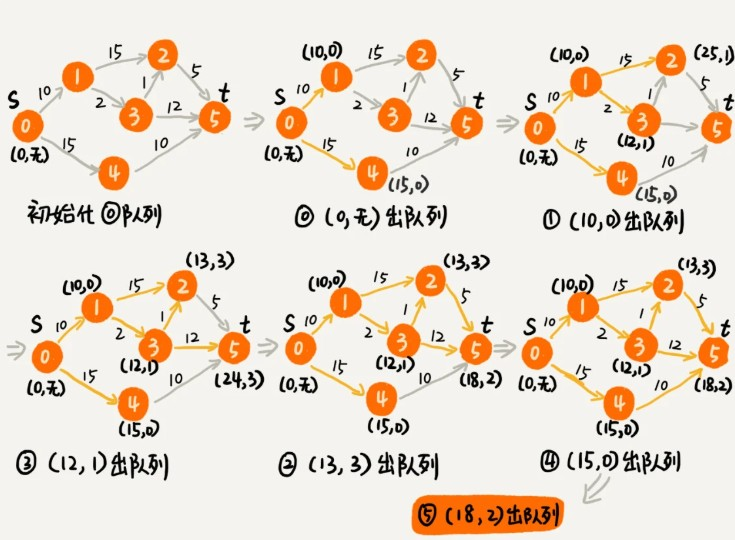

A*与Dijkstra算法其实是一个原理，只是 他们对于优先级队列的判定方式不同，且Dijkstra算的是最优路径，A*只是一个次优路径


首先来看Dijkstra



上图“(a,b)”的数字,分别表示为a:起点到达当前点最短距离**dist**,b:表示到达该顶点距离最短的前序节点

核心流程思路：存在一个有序队列，按照dist排序；

第一次我们从队列中只能提取出0号节点,分别遍历到1号和4号顶点,更新他们的到达距离(**dist**),将1，4点加入队列,排序得到dist最小顶点（minVertex）为顶点1;第二步就从队列出队距离最小1号顶点,遍历到2,3号节点,更新其到达距离,加入队列,并排序;此时队列会有3个顶点(2,3,4),3号点dist此时最小（12）,所以接下来会从队列提取到3号节点,遍历3号节点到2,5号节点,发现队列中存在2号点,且从3号到达2号点dist(13)小于当前2号dist(25),更新2号的dist=13,将节点5加入队列并排序(此时队列中存在2号点,因此只排序),然后继续出队...

先设计出数据结构：

```java
public class Graph { // 有向有权图的邻接表表示
  private LinkedList<Edge> adj[]; // 邻接表（存每个顶点的边）
  private int v; // 顶点个数

  public Graph(int v) {
    this.v = v;
    this.adj = new LinkedList[v];
    for (int i = 0; i < v; ++i) {
      this.adj[i] = new LinkedList<>();
    }
  }

  public void addEdge(int s, int t, int w) { // 添加一条边
    this.adj[s].add(new Edge(s, t, w));
  }

  private class Edge {
    public int sid; // 边的起始顶点编号
    public int tid; // 边的终止顶点编号
    public int w; // 权重
    public Edge(int sid, int tid, int w) {
      this.sid = sid;
      this.tid = tid;
      this.w = w;
    }
  }
  // 下面这个类是为了dijkstra实现用的
  private class Vertex {
    public int id; // 顶点编号ID
    public int dist; // 从起始顶点到这个顶点的距离
    public Vertex(int id, int dist) {
      this.id = id;
      this.dist = dist;
    }
  }
}
```

按照这个流程我们一步一步编写代码：

1. 为每个顶点定义一个dist字段（用于记录起始点到这个顶点的距离）；
2. 定义一个vertexes数组,保存所有顶点的信息。把所有顶点的 dist 都**初始化为无穷大**；、
3. 把起始顶点的 dist 值初始化为 0，然后将其放到**优先级队列**中。
4. 创建一个redecessor 数组，记录每个顶点的前驱顶点（dist更新也要同步更新）,用来还原最短路径.；
5. 一个inqueue 数组来避免将一个顶点多次添加到优先级队列中；
6. 从**优先级队列**中取出 dist 最小的顶点 minVertex，然后**遍历**考察这个顶点可达的所有顶点（ nextVertex）；
7. 如果 minVertex 的 dist 值加上 minVertex 与 nextVertex 之间边的权重 w 小于 nextVertex 当前的 dist 值，也就是说，当前经过 minVertex 到达 nextVertex的路径是一条更短的路径。那我们就把 nextVertex 的 dist 更新为更小的值；
8. nextVertex 加入到**优先级队列**中。重复这个过程，直到找到终止顶点 t 或者队列为空。

```java
// 因为Java提供的优先级队列（按定义的优先级排序），没有暴露更新数据的接口，所以我们需要重新实现一个
private class PriorityQueue { // 根据vertex.dist构建小顶堆（父节点小于子节点的堆结构，即弹出的的元素永远是最小的那个）
  private Vertex[] nodes;
  private int count;
  public PriorityQueue(int v) {
    this.nodes = new Vertex[v+1];
    this.count = v;
  }
  public Vertex poll() { // TODO: 留给读者实现... 出堆操作，取出dist最小的那个并删除元素}
  public void add(Vertex vertex) { // TODO: 留给读者实现...}
  // 更新结点的值，并且从下往上堆化（排序，父级永远小于子节点），重新符合堆的定义。时间复杂度O(logn)。
  public void update(Vertex vertex) { // TODO: 留给读者实现...} 
  public boolean isEmpty() { // TODO: 留给读者实现...}
}

public void dijkstra(int s, int t) { // 从顶点s到顶点t的最短路径
  int[] predecessor = new int[this.v]; // 用来还原最短路径
  Vertex[] vertexes = new Vertex[this.v];
  for (int i = 0; i < this.v; ++i) {
    vertexes[i] = new Vertex(i, Integer.MAX_VALUE);//初始化每个顶点，dist设置最大值
  }
  PriorityQueue queue = new PriorityQueue(this.v);// 小顶堆
  boolean[] inqueue = new boolean[this.v]; // 标记是否进入过队列
  vertexes[s].dist = 0;
  queue.add(vertexes[s]);//第一步添加起始点
  inqueue[s] = true;
  while (!queue.isEmpty()) {
    Vertex minVertex= queue.poll(); // 取堆顶元素并删除
    if (minVertex.id == t) break; // 最短路径产生了
    for (int i = 0; i < adj[minVertex.id].size(); ++i) {
      Edge e = adj[minVertex.id].get(i); // 取出一条minVetex相连的边
      Vertex nextVertex = vertexes[e.tid]; // minVertex-->nextVertex
      if (minVertex.dist + e.w < nextVertex.dist) {// 如果途径当前节点到next节点的dist要小于next节点保存的dist，说明有更更短的路径到next节点，更新next的dist
        nextVertex.dist = minVertex.dist + e.w;
        predecessor[nextVertex.id] = minVertex.id;//更新到nextVertex的最短前驱节点
        if (inqueue[nextVertex.id] == true) {//如果之前顶点已经入过堆，就不需要再添加进去了，因为入堆是为了排序再出堆，遍历图的所有节点，应该也不会出堆后再次要入堆的相同节点，因为先出堆的永远是dist更小的，如果后续从其它路径再次遍历到此节点，那肯定是距离更长的
          queue.update(nextVertex); // 更新顶点的的dist值，重新排序堆；（如果之前已被取出，则只需更新其dist即可）
        } else {
          queue.add(nextVertex);//新节点入堆
          inqueue[nextVertex.id] = true;
        }
      }
    }
  }
  // 输出最短路径
  System.out.print(s);
  print(s, t, predecessor);
}

private void print(int s, int t, int[] predecessor) {
  if (s == t) return;
  print(s, predecessor[t], predecessor);
  System.out.print("->" + t);
}
```

---

#### A*

区别于Dijkstra，A*的区别仅仅在于优先级队列的判定方式，具体改动请参考后续代码


我们可以通过这个顶点跟终点之间的直线距离，也就是**欧几里得距离**，来近似地估计这个顶点跟终点的路径长度（注意：路径长度跟直线距离是两个概念）。我们把这个距离记作 h(i)（i 表示这个顶点的编号），专业的叫法是启发函数（heuristic function）。因为欧几里得距离的计算公式，会涉及比较耗时的开根号计算，所以，我们一般通过另外一个更加简单的距离计算公式，那就是**曼哈顿距离**（Manhattan distance）。曼哈顿距离是两点之间横纵坐标的距离之和。计算的过程只涉及加减法、符号位反转，所以比欧几里得距离更加高效。

```
int hManhattan(Vertex v1, Vertex v2) { // Vertex表示顶点，后面有定义
  return Math.abs(v1.x - v2.x) + Math.abs(v1.y - v2.y);
}
```

原来只是单纯地通过顶点与起点之间的路径长度 g(i)，来判断谁先出队列，现在有了顶点到终点的路径长度估计值，我们通过两者之和 f(i)=g(i)+h(i)，来判断哪个顶点该最先出队列。综合两部分，我们就能有效避免刚刚讲的“跑偏”。这里 f(i) 的专业叫法是估价函数（evaluation function）。

```java
private class Vertex {
  public int id; // 顶点编号ID
  public int dist; // 从起始顶点，到这个顶点的距离，也就是g(i)
  public int f; // 新增：f(i)=g(i)+h(i)
  public int x, y; // 新增：顶点在地图中的坐标（x, y）
  public Vertex(int id, int x, int y) {
    this.id = id;
    this.x = x;
    this.y = y;
    this.f = Integer.MAX_VALUE;
    this.dist = Integer.MAX_VALUE;
  }
}
// Graph类的成员变量，在构造函数中初始化
Vertex[] vertexes = new Vertex[this.v];
// 新增一个方法，添加顶点的坐标
public void addVetex(int id, int x, int y) {
  vertexes[id] = new Vertex(id, x, y)
}
```

```java
// 因为Java提供的优先级队列（按定义的优先级排序），没有暴露更新数据的接口，所以我们需要重新实现一个
private class PriorityQueue { //修改：按照vertex的f值构建的小顶堆，而不是按照dist
  private Vertex[] nodes;
  private int count;
  public PriorityQueue(int v) {
    this.nodes = new Vertex[v+1];
    this.count = v;
  }
  public Vertex poll() { // TODO: 留给读者实现... }
  public void add(Vertex vertex) { // TODO: 留给读者实现...}
  // 更新结点的值，并且从下往上堆化（按定义的优先级排序），重新符合堆的定义。时间复杂度O(logn)。
  public void update(Vertex vertex) { // TODO: 留给读者实现...} 
  public boolean isEmpty() { // TODO: 留给读者实现...}
}
```


```java
public void astar(int s, int t) { // 从顶点s到顶点t的路径
  int[] predecessor = new int[this.v]; // 用来还原路径

  PriorityQueue queue = new PriorityQueue(this.v);//优先级队列
  boolean[] inqueue = new boolean[this.v]; // 标记是否进入过队列
  vertexes[s].dist = 0;//起始顶点初始化为0
  vertexes[s].f = 0;
  queue.add(vertexes[s]);//加入优先级队列
  inqueue[s] = true;
  while (!queue.isEmpty()) {
    Vertex minVertex = queue.poll(); // 取堆顶元素并删除
    for (int i = 0; i < adj[minVertex.id].size(); ++i) {// 遍历顶点的边
      Edge e = adj[minVertex.id].get(i); // 取出一条minVetex相连的边
      Vertex nextVertex = vertexes[e.tid]; // minVertex-->nextVertex
      if (minVertex.dist + e.w < nextVertex.dist) { // 如果途径当前节点到next节点的dist要小于next节点保存的dist，说明有更更短的路径到next节点，更新next的dist,f（解释下这里比较为何不加曼哈顿距离，因为每个顶点的曼哈顿距离都是固定的，对比较结果没有影响）
        nextVertex.dist = minVertex.dist + e.w;
        nextVertex.f 
           = nextVertex.dist+hManhattan(nextVertex, vertexes[t]);//ji算f值
        predecessor[nextVertex.id] = minVertex.id;//记录下节点从哪个节点过来最短，可以最后逆推出路径
        if (inqueue[nextVertex.id] == true) {
          queue.update(nextVertex);
        } else {
          queue.add(nextVertex);
          inqueue[nextVertex.id] = true;
        }
      }
      if (nextVertex.id == t) { // 只要到达t就可以结束while了
        queue.clear(); // 清空queue，才能推出while循环
        break; 
      }
    }
  }
  // 输出路径
  System.out.print(s);
  print(s, t, predecessor); // print函数请参看Dijkstra算法的实现
}
```

