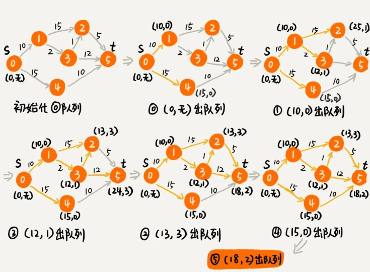

之前学习了图的两种搜索算法，深度优先搜索和广度优先搜索。这两种算法主要是针对无权图的搜索算法。针对有权图，我们该如何计算两点之间的最短路径（经过的边的权重和最小）呢？今天，我就以地图软件的路线规划案例，讲讲最短路径算法（Shortest Path Algorithm）。

像高德地图这样的地图软件，如果想从家开车到公司，你只需要输入起始、结束地址，地图就会给你规划一条最优出行路线。这里的最优，有很多种定义，比如**最短路线、最少用时路线、最少红绿灯**路线等等。

### 算法解析

先解决最简单的问题，最短路线:

解决软件开发中的实际问题，最重要的一点就是建模，也就是将复杂的场景抽象成具体的数据结构。

显然，把地图抽象成图最合适不过了。我们把每个岔路口看作一个顶点，岔路口与岔路口之间的路看作一条边，路的长度就是边的权重。如果路是单行道，我们就在两个顶点之间画一条有向边；如果路是双行道，我们就在两个顶点之间画两条方向不同的边。这样，整个地图就被抽象成一个有向有权图。

于是，我们要求解的问题就转化为，在一个有向有权图中，求两个顶点间的最短路径。

想要解决这个问题，有一个非常经典的算法，最短路径算法，更加准确地说，是单源最短路径算法（一个顶点到一个顶点）。提到最短路径算法，最出名的莫过于 Dijkstra 算法了。所以，我们现在来看，Dijkstra 算法是怎么工作的.

##### Dijkstra 算法思路

我们需要为每个顶点定义一个dist字段,记录从起始顶点到每个顶点的距离.

定义一个vertexes数组,保存所有顶点的信息。把所有顶点的 dist 都**初始化为无穷大**。

把起始顶点的 dist 值初始化为 0，然后将其放到**优先级队列**中。

从**优先级队列**中取出 dist 最小的顶点 minVertex，然后考察这个顶点可达的所有顶点（ nextVertex）。如果 minVertex 的 dist 值加上 minVertex 与 nextVertex 之间边的权重 w 小于 nextVertex 当前的 dist 值，也就是说，当前经过 minVertex 到达 nextVertex的路径是一条更短的路径。那我们就把 nextVertex 的 dist 更新为 minVertex 的 dist 值加上 w。然后，我们把 nextVertex 加入到**优先级队列**中。重复这个过程，直到找到终止顶点 t 或者队列为空。

然后用一个redecessor 数组，记录每个顶点的前驱顶点,用来还原最短路径.



流程如上图,其中(a,b)的数字,分别表示为a:到达当前点最短距离**dist**,b:表示到达该顶点距离最短的前序节点

第一次我们从队列中只能提取出0号节点,分别遍历到1号和4号顶点,更新他们的到达距离,并加入队列,排序;接下来从队列提取1号顶点(dist更短),遍历到2,3号节点,更新其到达距离,加入队列,并排序;此时队列会有3个顶点(2,3,4),3号点dist此时最小,所以接下来会从队列提取到3号节点,遍历3号节点到2,5号节点,此时会发现从3号到达2号点dist(13)小于当前2号dist(25),此时会更新2号的dist=13,加入队列并排序(此时队列中存在2号点,因此只排序),然后继续出队...

另外我们需要一个inqueue 数组来避免将一个顶点多次添加到优先级队列中。我们更新了某个顶点的 dist 值之后，如果这个顶点已经在优先级队列中了，就不要再将它重复添加进去了。

实现代码如下:

```
public class Graph { // 有向有权图的邻接表表示
  private LinkedList<Edge> adj[]; // 邻接表
  private int v; // 顶点个数

  public Graph(int v) {
    this.v = v;
    this.adj = new LinkedList[v];
    for (int i = 0; i < v; ++i) {
      this.adj[i] = new LinkedList<>();
    }
  }

  public void addEdge(int s, int t, int w) { // 添加一条边
    this.adj[s].add(new Edge(s, t, w));
  }

  private class Edge {
    public int sid; // 边的起始顶点编号
    public int tid; // 边的终止顶点编号
    public int w; // 权重
    public Edge(int sid, int tid, int w) {
      this.sid = sid;
      this.tid = tid;
      this.w = w;
    }
  }
  // 下面这个类是为了dijkstra实现用的
  private class Vertex {
    public int id; // 顶点编号ID
    public int dist; // 从起始顶点到这个顶点的距离
    public Vertex(int id, int dist) {
      this.id = id;
      this.dist = dist;
    }
  }
}
```

```
// 因为Java提供的优先级队列，没有暴露更新数据的接口，所以我们需要重新实现一个
private class PriorityQueue { // 根据vertex.dist构建小顶堆
  private Vertex[] nodes;
  private int count;
  public PriorityQueue(int v) {
    this.nodes = new Vertex[v+1];
    this.count = v;
  }
  public Vertex poll() { // TODO: 留给读者实现... }
  public void add(Vertex vertex) { // TODO: 留给读者实现...}
  // 更新结点的值，并且从下往上堆化，重新符合堆的定义。时间复杂度O(logn)。
  public void update(Vertex vertex) { // TODO: 留给读者实现...} 
  public boolean isEmpty() { // TODO: 留给读者实现...}
}

public void dijkstra(int s, int t) { // 从顶点s到顶点t的最短路径
  int[] predecessor = new int[this.v]; // 用来还原最短路径
  Vertex[] vertexes = new Vertex[this.v];
  for (int i = 0; i < this.v; ++i) {
    vertexes[i] = new Vertex(i, Integer.MAX_VALUE);
  }
  PriorityQueue queue = new PriorityQueue(this.v);// 小顶堆
  boolean[] inqueue = new boolean[this.v]; // 标记是否进入过队列
  vertexes[s].dist = 0;
  queue.add(vertexes[s]);
  inqueue[s] = true;
  while (!queue.isEmpty()) {
    Vertex minVertex= queue.poll(); // 取堆顶元素并删除
    if (minVertex.id == t) break; // 最短路径产生了
    for (int i = 0; i < adj[minVertex.id].size(); ++i) {
      Edge e = adj[minVertex.id].get(i); // 取出一条minVetex相连的边
      Vertex nextVertex = vertexes[e.tid]; // minVertex-->nextVertex
      if (minVertex.dist + e.w < nextVertex.dist) { // 更新next的dist
        nextVertex.dist = minVertex.dist + e.w;
        predecessor[nextVertex.id] = minVertex.id;
        if (inqueue[nextVertex.id] == true) {
          queue.update(nextVertex); // 更新队列中的dist值
        } else {
          queue.add(nextVertex);
          inqueue[nextVertex.id] = true;
        }
      }
    }
  }
  // 输出最短路径
  System.out.print(s);
  print(s, t, predecessor);
}

private void print(int s, int t, int[] predecessor) {
  if (s == t) return;
  print(s, predecessor[t], predecessor);
  System.out.print("->" + t);
}
```

---

### 算法优化

从理论上讲，用 Dijkstra 算法可以计算出两点之间的最短路径。但是，对于一个超级大地图来说，岔路口、道路都非常多，对应到图这种数据结构上来说，就有非常多的顶点和边。如果为了计算两点之间的最短路径，在一个超级大图上动用 Dijkstra 算法，遍历所有的顶点和边，显然会非常耗时。那我们有没有什么优化的方法呢？

坦白说,做工程不像做理论，一定要给出个最优解。理论上算法再好，如果执行效率太低，也无法应用到实际的工程中。对于软件开发工程师来说，我们经常要根据问题的实际背景，对解决方案权衡取舍。类似出行路线这种工程上的问题，我们没有必要非得求出个绝对最优解。很多时候，为了兼顾执行效率，我们只需要计算出一个可行的次优解就可以了。

虽然地图很大，但是两点之间的最短路径或者说较好的出行路径，并不会很“发散”，只会出现在两点之间和两点附近的区块内。所以我们可以在整个大地图上，划出一个小的区块，这个小区块恰好可以覆盖住两个点，但又不会很大。我们只需要在这个小区块内部运行 Dijkstra 算法，这样就可以避免遍历整个大图，也就大大提高了执行效率。

不过你可能会说了，如果两点距离比较远，从北京海淀区某个地点，到上海黄浦区某个地点，那上面的这种处理方法，显然就不工作了，毕竟覆盖北京和上海的区块并不小。

对于这样两点之间距离较远的路线规划，我们可以把北京海淀区或者北京看作一个顶点，把上海黄浦区或者上海看作一个顶点，先规划大的出行路线。比如，如何从北京到上海，必须要经过某几个顶点，或者某几条干道，然后再细化每个阶段的小路线。

这样，最短路径问题就解决了。我们再来看另外两个问题，最少时间和最少红绿灯。

---

### 最少时间

前面讲最短路径的时候，每条边的权重是路的长度。在计算最少时间的时候，算法还是不变，我们只需要把边的权重，从路的长度变成经过这段路所需要的时间。不过，这个时间会根据拥堵情况时刻变化。(如何计算车通过一段路的时间呢？这是一个蛮有意思的问题)

---

### 最少红绿灯

关于最少红绿灯的出行方案，实际上，我们只需要把每条边的权值改为 1 即可(每经过一条边,就有一个红绿灯)，算法还是不变，可以继续使用前面讲的 Dijkstra 算法。不过，边的权值为 1，也就相当于无权图了，我们还可以使用之前讲过的广度优先搜索算法。因为我们前面讲过，广度优先搜索算法计算出来的两点之间的路径，就是两点的最短路径。

这里给出的所有方案都非常粗糙，只是为了给你展示，如何结合实际的场景，灵活地应用算法，让算法为我们所用，真实的地图软件的路径规划，要比这个复杂很多。而且，比起 Dijkstra 算法，地图软件用的更多的是类似 A* 的启发式搜索算法，不过也是在 Dijkstra 算法上的优化罢了.

---

