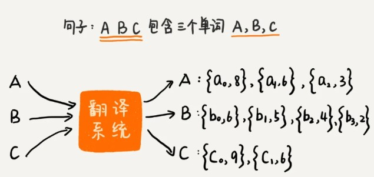
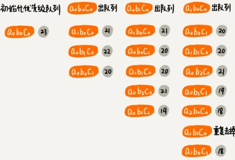

### 总结引申

最短路径算法还有很多，比如 Bellford 算法、Floyd 算法等等。

这些算法实现思路非常经典，掌握了这些思路，我们可以拿来指导、解决其他问题。比如 Dijkstra 这个算法的核心思想，就可以拿来解决下面这个看似完全不相关的问题。这个问题是我之前工作中遇到的真实的问题，为了在较短的篇幅里把问题介绍清楚，我对背景做了一些简化。

我们有一个翻译系统，只能针对单个词来做翻译。如果要翻译一整个句子，我们需要将句子拆成一个一个的单词，再丢给翻译系统。针对每个单词，翻译系统会返回一组可选的翻译列表，并且针对每个翻译打一个分，表示这个翻译的可信程度。

针对每个单词，我们从可选列表中，选择其中一个翻译，组合起来就是整个句子的翻译。每个单词的翻译的得分之和，就是整个句子的翻译得分。随意搭配单词的翻译，会得到一个句子的不同翻译。针对整个句子，**我们希望计算出得分最高的前 k 个翻译结果**，应该如何来实现？

最简单的办法还是借助回溯算法，穷举所有的排列组合情况，然后选出得分最高的前 k 个翻译结果。但是，这样做的时间复杂度会比较高，是 O(m^n)，其中，m 表示平均每个单词的可选翻译个数，n 表示一个句子中包含多少个单词。

实际上，这个问题可以借助 Dijkstra 算法的核心思想，非常高效地解决。每个单词的可选翻译是按照分数从大到小排列的，所以 a0b0c0 肯定是得分最高组合结果。我们把 a0b0c0 及得分作为一个对象，放入到优先级队列中。

我们每次从优先级队列中取出一个得分最高的组合，并基于这个组合进行扩展。扩展的策略是每个单词的翻译分别替换成下一个单词的翻译。比如 a0b0c0 扩展后，会得到三个组合，a1b0c0、a0b1c0、a0b0c1。我们把扩展之后的组合，加到优先级队列中。重复这个过程，直到获取到 k 个翻译组合或者队列为空。

我们来看，这种实现思路的时间复杂度是多少？

假设句子包含 n 个单词，每个单词平均有 m 个可选的翻译，我们求得分最高的前 k 个组合结果。每次一个组合出队列，就对应着一个组合结果，我们希望得到 k 个，那就对应着 k 次出队操作。每次有一个组合出队列，就有 n 个组合入队列。优先级队列中出队和入队操作的时间复杂度都是 O(logX)，X 表示队列中的组合个数。所以，总的时间复杂度就是 O(k * n * logX)。那 X 到底是多少呢？

k 次出入队列，队列中的总数据不会超过 k \* n，也就是说，出队、入队操作的时间复杂度是 O(log(k \* n))。所以，总的时间复杂度就是 O(k\*n\*log(k\*n))，比之前的指数级时间复杂度降低了很多。

